本文主要介绍RocksDB的读优化研究。

***酒得一口一口的喝，路得一步一步的走，步子迈大了容易扯着蛋*  — *汤大师***

### 初衷

- 目标：性能优化 & 可控迁移 & 负载均衡
- **第一大步：快**

- 问题：不能充分发挥NVMe性能
- 瓶颈：Ceph I/O路径 & Massage & Bluestore、Rocksdb & 不均衡（osd性能表现差别大）
- 思路：cache、优化rocksdb、简化流程、异步、优化多线程、负载均衡...
- **第一小步**：新瓶老酒—优化Rocksdb读性能

### 最新论文&方案分析

#### 1.	X-Engine: An Optimized Storage Engine for Large-scale E-commerce Transaction Processing   

- (阿里 ,sigmod'19)

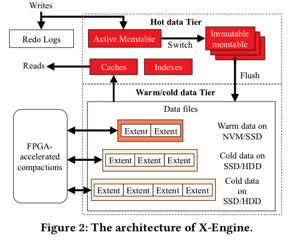

##### 整体架构（基于LSM）

- 优化技术

  - 改进的LSM结构，固定大小的Extent，无锁跳表，多版本元数据索引，Bloom Filter快速判定数据是否存在，Surf Filter判断范围数据是否存在，Row Cache缓存热点行，加速读取性能
  - 利用FPGA硬件加速Compaction过程，fast‘20
  - 使用多事务处理队列和流水线处理技术，减少线程上下文切换代价，并计算每个阶段任务量配比，使整个流水线充分流转，极大提升事务处理性能。相对于其他类似架构的存储引擎（例如RocksDB），X-Engine的事务处理性能有10倍以上提升
  - X-Engine使用的Copy-on-write技术，避免原地更新数据页，从而对只读数据页面进行编码压缩，相对于传统存储引擎（例如InnoDB），使用X-Engine可以将存储空间降低至10%~50%
  - 通过数据复用技术减少数据合并代价，同时减少缓存淘汰带来的性能抖动

  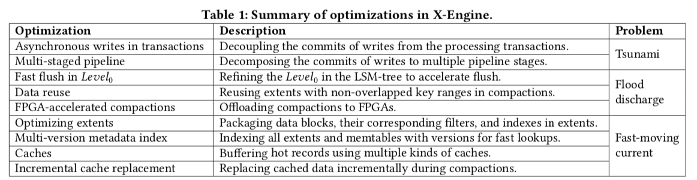

- 数据组织 & 多版本元数据索引

  - X-Engine的每层都划分成固定大小的Extent（默认2M，每个数据块16 KB），存放每个层次中的数据的一个连续片段（Key Range）。为了快速定位Extent，为每层Extents建立了一套索引（Meta Index），所有这些索引，加上所有的memory tables（active/immutable）一起组成了一个元数据树（Metadata Tree），root节点为Metadata Snapshot，这个树结构类似于B-Tree。

  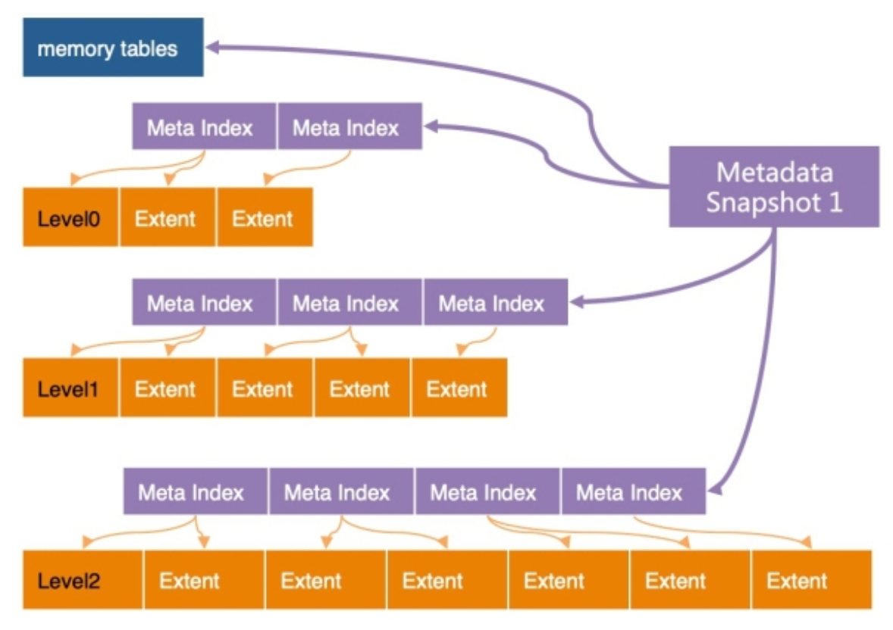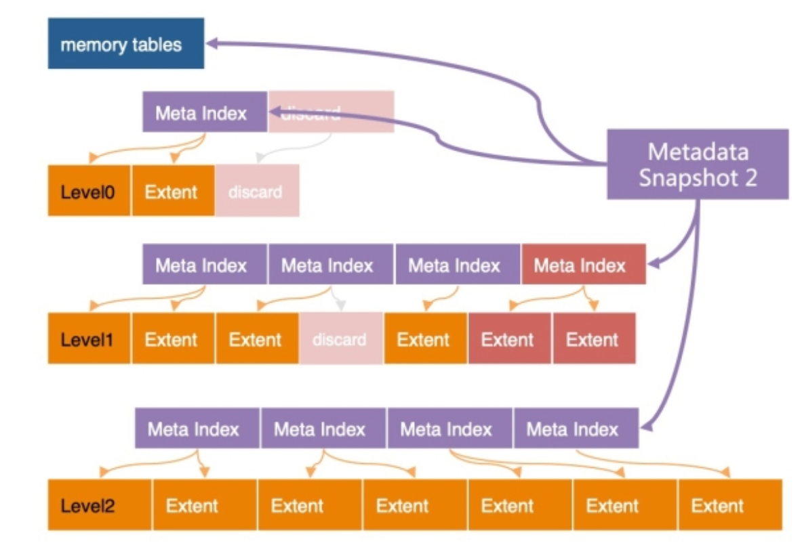

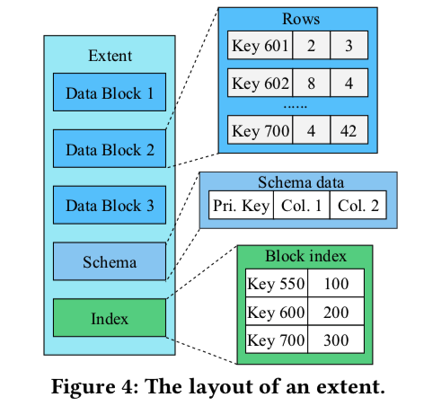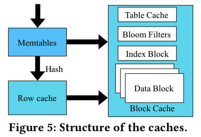

- compaction优化

  - 数据复用：如果compaction中涉及的Extent的key范围与其他Extent的key范围不重叠，可以通过简单地更新其相应的元数据索引来重用它，而无需在磁盘上实际移动它

    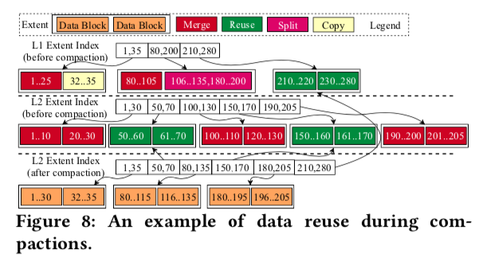

  - 硬件加速

  - 异步I/O。在Extent级别，compaction操作由三个不相交的阶段组成：(1)从存储中检索两个输入Extent，(2)合并它们，(3)将合并的Extent(一个或多个)写回存储。虽然第一和第三阶段是I/O阶段，但第二阶段是计算密集型阶段。我们在第一和第三阶段实现异步I/O请求，第二阶段被实现为第一阶段的回调功能。当多个压缩并行运行时，第二阶段的执行与其他阶段的执行重叠，以隐藏I/O。

- cache

  - Row cache：LRU缓存，在memory tables中没有命中的单行查询，查询的Key将被hash到Row Cache中的相应槽中以进行匹配。Row Cache需要保证缓存了所有持久化层次中最新版本的记录，而这个记录是可能发生变化 的，例如每次flush将只读的memory tables写入持久化层次时，就需要恰当的更新Row Cache中的缓存记录，这个操作比较微妙，需要精心的设计
  - Block Cache负责Row Cache的漏网之鱼， 也用来进行范围扫描
  - 当发生Compaction操作会一次更新大量的Data Block，导致Block Cache中大量数据短时间内失效，导致性能的急剧抖动
    - LSbM-Tree：buffer cache
    - 减少Compaction的粒度；减少Compaction过程中改动的数据；Compaction过程中针对已有的缓存数据做定点更新（增量替换）

  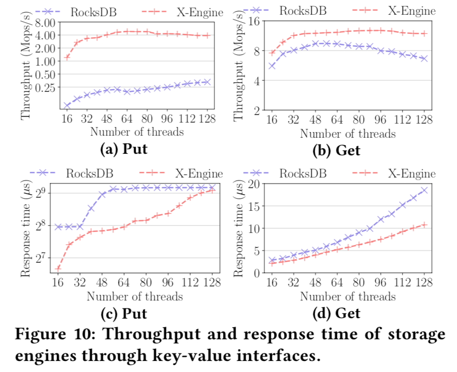

##### 读优化

https://developer.aliyun.com/article/766076

- X-Engine磁盘上的数据，在常态下只有两层（L1/L2），L0层是MemTable在compaction来不及的情况下暂存到磁盘上缓解内存压力时才启用的，正常情况下被冻结的MemTable可以直接和磁盘上的L1合并

  - MatrixKV: Reducing Write Stalls and Write Amplification in LSM-tree Based KV Stores with a Matrix Container in NVM

  - 在NVM（内存的补充）中构建L0层（特殊结构），有序、细分、容量大、减少写延迟和放大；其他层存在SSD，层次很少，可以在nvm/dram中构建索引加速读取

    

- 在L1/L2之间的compaction合并过程中，X-Engine的冷热合并算法倾向于将热点数据保留在L1层(基于访问频度），将访问较少的数据下刷到L2层并进行压缩存储。这是一个对数据在物理上进行冷热分离的过程， 其结果是L1存储的都是热点数据，L2存储的都是冷数据。对L1进行缓存时会有更高的内存利用率

- L1层数据组织和读取过程：X-Engine将数据划分成2MB大小的Extent，Extent内部会记录编码成16KB的Block，每个Extent内部包含一个IndexBlock以辅助定位DataBlock。整体看X-Engine中L1/L2层的数据组织是一个类似B+树的索引结构。如果所有操作都能命中内存，在Extent中读取一条key=X的记录，操作会按如下四个步骤执行：

  - ExtentMeta数组是这棵B+树的根节点，在其中二分查找定位出X所属的Extent

  - Extent可以理解为一棵子树，首先需要通过一次Hash查找（查询缓存）获取到该Extent的IndexBlock

  - 从IndexBlock中定位出X所属的DataBlock的Key， 并通过一次Hash查找定位到X所属的DataBlock

  - 在内存中的DataBlock中查找到该记录的实际内容，并返回对应的Value

- 最大化命中内存时的读取性能（内存能够缓存绝大数据，读性能受限于**CPU资源**，CPU bound）

  - 数据页的编码及查找指令优化 （Block编码及SIMD）
  - 降低BufferPool的管理开销（BP的代价及PointSwizzling）
  - 优化多核上的多线程运行的Cache冲刷问题（多核**Shared-nothing**架构）

- 提升读性能124%

#### 2.	KVell: the Design and Implementation of a Fast Persistent Key-Value Store 

- (悉尼大学，SOSP'19，cpu为瓶颈)
- 论文提到了一个比较犀利的观点：KV 存储（LSM and B tree KVs）不再像以往主要受限于存储设备，而是逐渐更多的受 CPU 的性能影响。即 storage device bound 转移到了 CPU bound。**存储设备的特性的变化和发展迫使 KVs 的设计思想和范式必须发生转变，需要更多地聚焦在 CPU 的流水线式的使用上**。

##### Share nothing

- 所有的数据结构都在 CPU 核之间分区，这样每个 core 几乎可以完全独立运行而不需要任何同步。比如内存的B-tree索引、IO队列、保存磁盘Free Blocks的List以及Page Cache等
- 无论是读还是写，工作线程处理请求时无需和其他线程进行同步，每一个线程处理给定子集的键，并在线程中维护一个私有的数据集合对应键子集。键的数据结构：
  - 一个轻量级的内存 B 树索引，用于跟踪键在持久存储中的位置
  - I/O 队列，负责高效地存储和检索来自持久化存储设备中的信息
  - 空闲列表，部分在内存中的磁盘块列表，其中包含用于存储 items 的空闲位置
  - 页缓存，KVell 使用自己的内部页面缓存，不依赖于 os 级结构
- Scan 是在内存中的 B 树索引上需要最小同步的唯一操作
- 与传统 KV 设计相比，这种无共享方法是一个关键的区别，在传统 KV 设计中，所有或大多数主要数据结构都由所有工作线程共享，传统的方法需要对每个请求进行同步，这是 KVell 完全避免的。分区请求可能会导致负载不平衡，但我们发现，如果使用合适的分区，这种影响很小

##### Do not sort on disk, but keep indexes in memory

- 数据直接按照写入的顺序写入磁盘，不对数据进行排序操作。索引都保存在内存中。这个实际上很常见，没什么特别的
- KVell 不会对工作线程的工作集中的数据进行排序，因此可以直接将数据存储在磁盘上，且该位置不会发生改变。因为不要求有序，插入 KV 对的开销相对减小，因为不需要找到对应的位置来执行插入操作，同时能消除为了维护磁盘上的数据结构有序对应的开销，对写操作的性能优化效果很好，实现了较低的尾延迟
- 在 scan 操作时，连续的 keys 可能不再位于同一个磁盘块中，scan 的性能似乎会有所下降。但实际上对于中等数目的负载，单个键值对较大的情况下，scan 的性能并未受到严重的影响

##### Aim for fewer syscalls, not for sequential I/O

- 不用强制顺序访问存储设备，但是 I/O 操作需要进行批处理来减小系统调用的次数。批处理同时为设备等待队列的提供了较好的控制，从而可以采用一些策略进行任务的调度来实现低延迟和高吞吐量
- 在 KVell 中所有操作包括 scan 都对磁盘执行随机访问，因为随机访问和顺序访问一样高效，KVell 不会浪费 CPU 周期来强制执行顺序 I/O。和 LSM 相似的是，KVell 将请求批处理写到磁盘，不同的是 LSM KVs 批量执行 I/O 且把 KV 对排序是为了利用顺序的磁盘访问能力，而 KVell 批量执行 I/O 的目的是为了减少系统调用的次数，从而减少 CPU 开销
- 批处理其实也是做了一种权衡，磁盘需要长时间的保持运行忙碌的状态以实现最大的 IOPS，但是只有在硬件队列中包含的请求少于给定数量时，才会以亚毫秒级的延迟响应（如 Optane 要求 256 个 I/O 请求）。一个高效的系统需要把足够的请求发送给磁盘以充分利用磁盘的带宽，但是不能超过队列的最大服务请求数太多，否则可能将导致较高的尾延迟。
- 在具有多个磁盘的配置中，每个 worker 只在一个磁盘上存储文件，这种设计决策对于限制每个磁盘挂起的请求数量非常关键。事实上，因为 worker 彼此之间不会进行通信，所以他们不知道其他 workers 已经发送给磁盘多少个请求。如果 workers 都在一个磁盘上存储数据，然后一个磁盘对应的请求数量将被限制为 （size * 每个磁盘的 workers 数量）。如果 workers 可以访问所有磁盘，然后一个磁盘可能最多处理 （size * 所有 workers 的数量）

- 因为请求是根据它们的键分配给 worker 的，而且 worker 只访问一个磁盘，所以可以设计一个工作负载，主要访问一个磁盘上的数据，而让其他磁盘空闲。在表现出倾斜行为的工作负载中，数据倾斜被内部页面缓存吸收。因此，大多数负载不平衡不会导致磁盘I/O。

##### No commit log

- 不使用Commit Log：只有在更新操作被持久化到磁盘上的最终位置后，操作才相应地得到确认
- KVell 只有在更新操作被持久化到磁盘上的最终位置才确认更新完成。一旦更新被提交给工作线程，它将在下一个I/O批中持久化到磁盘上。删除提交日志允许 KVell 仅将磁盘带宽用于有用的客户机请求处理

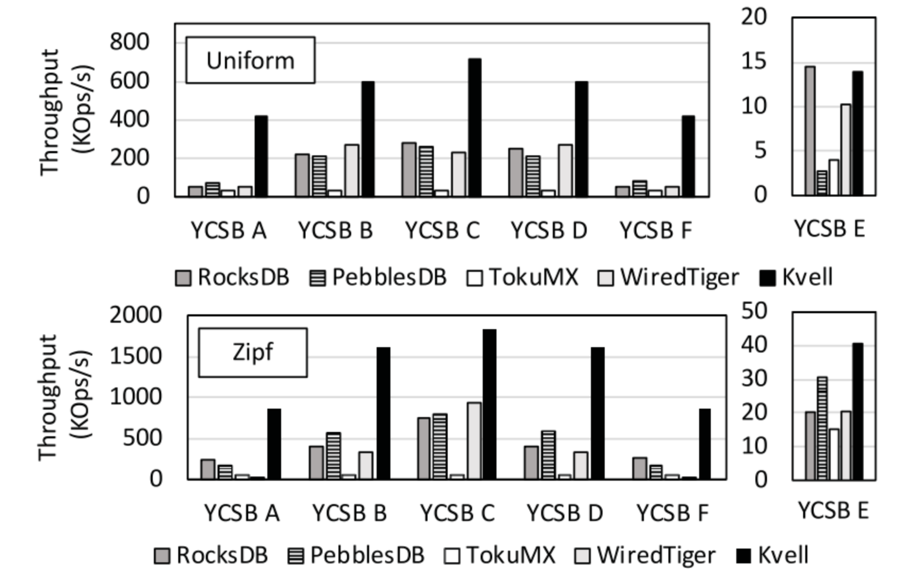

##### 质疑

- 无实用性，自己构建了一套kv系统，不支持事务、无数据维护、gc等等
- KVell这种不支持事务的系统和支持事务的系统比较性能，这种比较的意义有待商榷

#### 3.	SLM-DB: Single-Level Key-Value Store with Persistent Memory 

- (韩国 UNIST 蔚山科学技术院，fast'19，单层 / B+树)

##### B+ tree index

- 构建
  - 当 KV 从 Immutable MemTable 中往 SSTable 刷入时（即 Flush操作），SLD-DB 创建两个后台线程：一个线程用于创建新的 SSTable File，一个用于向 B+ 树中插入索引信息，作为叶子节点
    - File Creation Thread
      - 该线程创建一个新的 SSTable 文件，把 Immutable MemTable 中的数据（K-V）写入到该文件中。
      - 将该文件执行文件系统相关同步操作，如 fsync，同步到磁盘
      - 同步之后，该线程将刚刚存储的 KV 对添加到一个队列中。（由向 B+ 树插入索引的线程创建的队列）
    - B+ Tree insertion thread
      - 创建相应的 KV 索引信息队列
      - 待数据写入线程将该队列填入数据之后，依次处理队列中的每个数据，构建 B+ 树
  - 叶子节点包含的信息有：SSTable File 的标识符，文件内部对应的该 Key 的块的偏移量和数据块的大小
  - B+ Tree 的更新操作：更新已有的 KV 对时，首先创建对应该 Key 的索引对象，然后修改原有的在 B+ 树中的指针，指向新的索引对象。旧的索引信息将会被视为垃圾数据进行统一的垃圾回收
  - B+ Tree 的删除操作：当需要删除指定 Key 的数据时，则将该 Key 在 B+ 树中对应的索引信息删除
  - 垃圾回收时使用 PM 管理器如 PMDK 来进行垃圾回收
- 一致性保证
  - 待 B+ Tree构建完成以后，将 LSM 树中组织结构的变化（例如 SSTable File 的元数据信息）以追加写的方式写入到 MANIFEST 文件中
  - 待完成一致性的日志追加写操作之后，对应的删除PM中的 Immutable Memtable
- 查询
  - SLM-DB 提供了一个迭代器，主要用于扫描存储在磁盘中的 KV 键值对。支持 seek()、value()、next()等操作。
    - seek(k)：让迭代器指向 key 为 k 的键值对或者当 k 不存在时，指向比 k 稍大的 Key
    - next()：将迭代器指针移动到下一个 Key
    - value()：返回该 Key 对应的值
  - 在 SLM-DB 中，实现了 B+ Tree 的迭代器，主要用于扫描存储在 SSTables 中的 Key

##### Selective Compaction 选择性压缩

- compaction的目的
  - 为了回收部分旧数据。（旧数据是由 Update 操作产生的，更新 Key 对应的值时，之前存储的该 Key 的数据就变成了老数据）
  - 提升存储在 SSTables 中的 KV 键值对的顺序性，从而提升 Range Query的性能，以免要查询的 Key 分布散落在多个 SSTable File上
- 选择性compaction
  - 有选择性地选出一些 SSTables 进行压缩
  - SLM-DB 维护一个 候选压缩对象列表。（候选对象为具有一定特性的 SSTables）
- compaction时机
  - 通过启动一个后台的压缩线程来执行：
    - 当 SSTable Files的一些结构性数据发生变化时
    - 针对一个确定的 SSTable File 出现了多次 seek 操作时
    - 当压缩对象候选列表里的文件数量大于一定的阈值时
  - 执行时，从候选列表中根据一定的计算规则选出子集进行压缩。该规则主要是计算 SSTable Files 之间的重叠率，通过计算出和候选列表中的其他 SSTable Files 重叠率最高的 SSTable Files，然后进行压缩合并。
- 如何compaction
  - 同上文一样使用两个线程，一个用于文件创建，一个用于索引的插入。
  - 合并多个 SSTable Files时，需要检查该文件中的每一个键值对是有效数据还是老旧数据。通过查询 B+树中的索引信息来决定是否有效。如果有效，则需要和其他有效的数据进行归并排序，如果是老旧的数据则对应将其删除。
- 选择算法
  - SLM-DB 实现了三种选择算法：
    - Live-Key Ratio Select：有效 Key 比例选择
    - Leaf Node Scan：B+树叶子节点扫描选择
    - Degree of Sequentially per range query：根据顺序程度进行选择
  - Live-Key Ratio Select
    - SLM-DB 统计每个 SSTable File 的有效 Key 比例，并且设定一个阈值，一旦比例低于该阈值，就会被添加到候选压缩对象列表中
    - Live-Key Ratio 是指每个 SSTable File 中有效 Key 的比例。有效 Key 是指仍然维护在 B+ Tree 中的 Key，也就是仍为该 Key 对应的最新值
  - Leaf Node Scan
    - 在执行压缩时，将触发一次 B+ Tree 叶子节点的扫描操作，通过循环扫描的方式，统计出存储了 B+ Tree 上有指定 Key 所对应的 SSTable Files 的文件数量，如果文件数量大于阈值，将这些文件添加到候选队列中进行压缩
    - 文件数量意味着在 LSM 结构中存在多个数据文件存储旧值
  - Degree of Sequentially per range
    - 将 range 操作拆分为多个子范围查询操作，每个子范围查询对应的 Key 数量相等，然后追踪每个子范围查询访问的 SSTable File 的数量，一旦操作完成，找到访问最多文件的子范围查询，如果对应的文件数大于阈值，把这些对应的文件添加到候选人队列中等待压缩
    - 该方法主要是为了提高数据分布式的顺序性

##### 存在的问题

- 额外开销
  - 合并开销，单层合并后，B+ tree 面临大量的修改和更新
  - 保证 B+ tree 和单层数据间的一致性也是一个比较大的开销
  - 为了维持不错的空间利用率还需要额外垃圾回收操作
- 单层结构牺牲了一定的顺序读性能和查找性能
- B+ 树的引入带来的写放大问题
- 针对大量小写的情况，B+ tree是否会成为对应的性能瓶颈
- 理论太多，没有实现（开源），基于leveldb，效果一般

#### 4.	LSM-Trees and B-Trees: The Best of Both Worlds

- (哈佛大学，sigmod'19，LSM / B tree自适应选择和转换)

  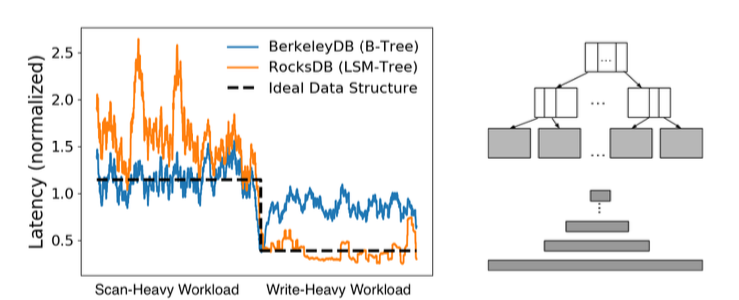

- LSM 树的优点是更新性能和空间放大特性，更新操作和插入一样，以最小化磁盘 IO 的方式记录在内存缓冲区中。

  B 树具有优越的小范围查找性能，但代价是更新速度较慢

  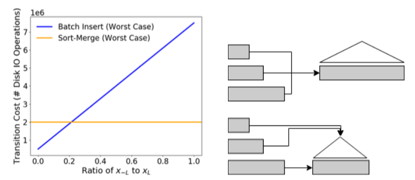

- 相互转换适应不同场景

  - 从 LSM tree到 B tree
    - 第一种，归并排序转换， 通过归并排序可得到密集、有序的数组，变为 B 树的叶子节点
    - 第二种，批量插入转换，当 LSM 树最下层数据比较多的时候，直接将 LSM 树最底层当做叶子节点，再将上层元素插入其中
    - 选择最优转换是通过除最底层的比例来选择的，低于 20%时，批量插入更好，高于该值时， 排序插入更好
  - 从 B tree转换到 LSM tree
    - 第一种，读取叶子节点的内容，构造内存中的布隆过滤器和 fence指针，将有序的数据写入磁盘
    - 第二种，将 b 树本身作为 LSM 树的最底层，逻辑上认为 B 树在磁盘上是有序的，通过构造中 间层，增加布隆过滤器，直接完成转换

- 转换开销和效率（很可能是Lose both），指导性论文，提供一种思路，总共两页，实现测试都没有

#### 5.	其他

- 内存里做文章 （Eurosys‘19、20）

  - FloDB
    - 随着内存中数据量的增长，维护内存排序的命令开销大

  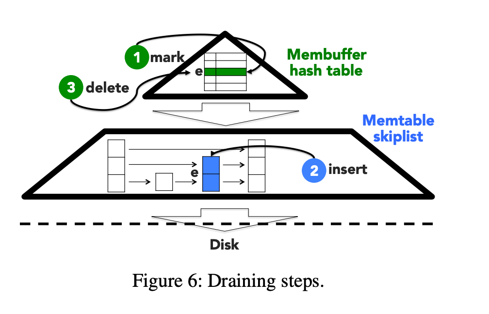

  - EvenDB: optimizing key-value storage for spatial locality

  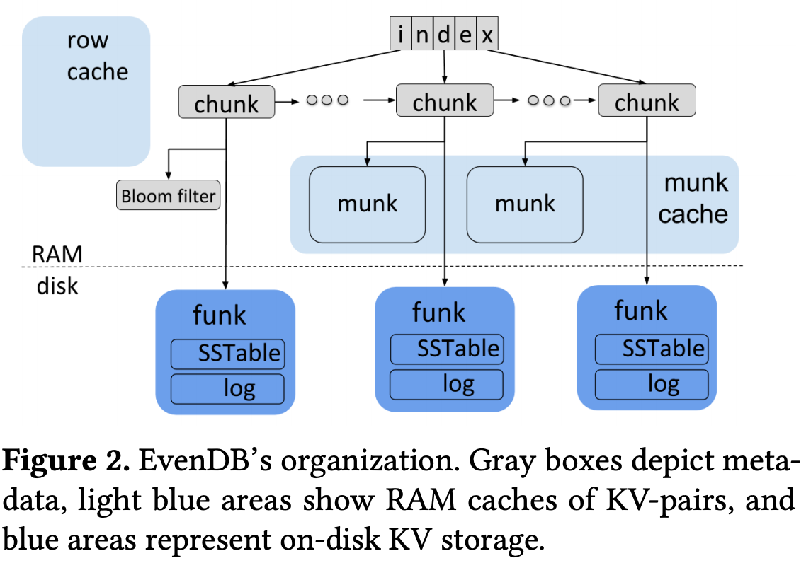

- Kv 分离 

  - gc优化-hashkv（效果一般）

    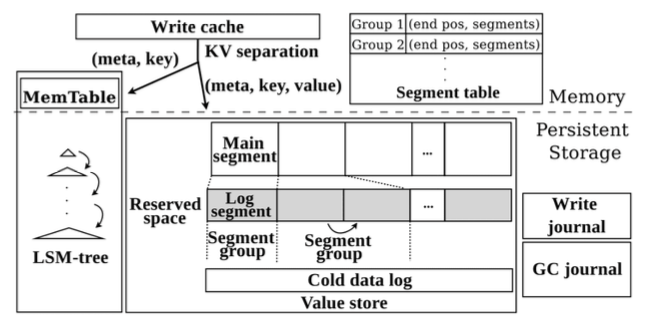

  - titan：使用 RocksDB 的 TablePropertiesCollector 和 EventListener 来收集 GC 所需的统计信息

- filer做文章：bLSM、ElasticBF（根据数据热度动态调整 bloom filter 大小）、surf（支持范围查询的filter）、slimdb（cukoo filter）

- cache做文章：LSbM-Tree、DIDACache

  - Distcache: Provable load balancing for large-scale storage systems with distributed caching （fast‘19 best paper）
    - cache对于通常互联网应用（read: write大致为8:2）读性能提升至关重要，单机看重命中率，分布式要做到负载均衡
    - 大规模的存储系统，分布式Cache，提升Cache的负载均衡将会是关键
    - small cache big effect,   the power of 2 random choices

- KV-SSD：

  - 传统SSD：KV到file, file到LBA, 再从LBA到PBA的数据转换；KV-SSD采用了一种增强的FTL(Flash Translation Layer)

  - 基于hash做的，自然而然想到将hash改为LSM或者B tree

  - ATC2020 Best Paper PinK: High-speed In-storage Key-value Store with Bounded Tails

    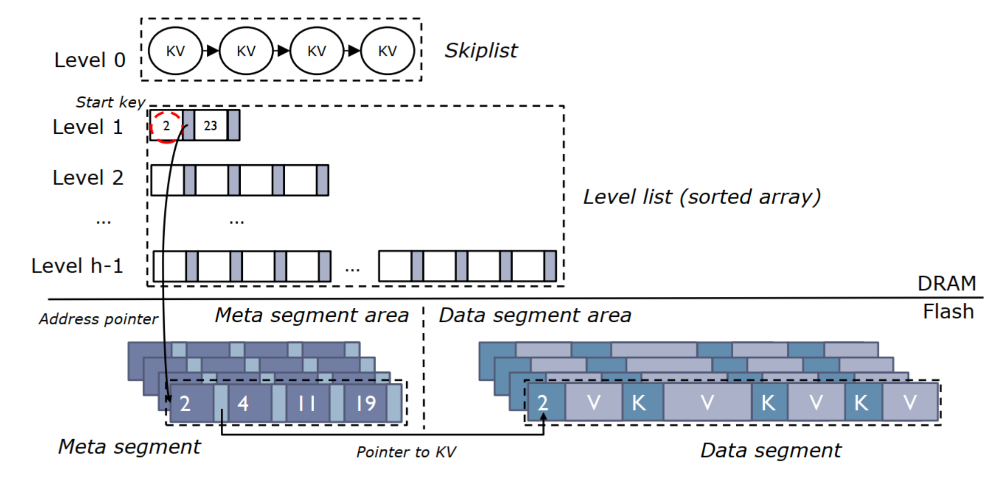

  - 西安三星：KV SSD结合优化过的Ceph应用时也会比传统解决方案有很大的优势。使用优化过的KVSstore替代原生Ceph的blue store后，性能和稳定性方面都有了很显著的提升（2～3倍）

- I/O优化

  - Revisiting I/O Behavior in Large-Scale Storage Systems: The Expected and the Unexpected 

    - 超算中心（国家能源研究科学计算中心 NERSC，2016top5）中的I/O行为分析
    - HPC存储系统可能不再由写I/O主导（长期以来人们普遍认为的HPC工作负载是写密集型的观点），在过去的几年里，NERSC的读I/O已经远远超过了写I/O
    - HPC I/O通常是突发性的，写I/O比读I/O更具突发性
    - OSTs之间在I/O活动方面也存在巨大的负载不平衡
    - 即使是大规模的HPC应用程序也不倾向于利用I/O并行性，即使在高强度I/O阶段，并发使用的OST也不到10
    - 通常与计算节点一样强大的OSSs经常处于闲置状态，CPU利用率非常低

  - End-to-end I/O Portfolio for the Summit Supercomputing Ecosystem 

    - 超算Summit（ORNL的OLCF项目，2019 NO.1）缺乏可用性，针对PFS在随着不断增长的容量下数据调度存在各方面的问题（性能、扩展性、协调容量等等）

    - 基于OLCF的Spectrum和SymphonyFS的I/O子系统体系结构的不足，提出了一种端到端的I/O解决方案

      

### 我们的思路 — IN MEMORY（titan + cache + index）

- Bluestore
  - MemDB、其他换掉RocksDB（读友好MongoDB等）
  - 减少读盘次数，bluestore的必要性，后端直接用rocksdb存储元数据和数据

- titan + cache
  - db_bench测试写性能提高5倍以上，读性能提升跟cache和数据量有关，合理的设置也能达到和写性能相当的提升效果
  - kv分离后，cache可以缓存更多数据，间接提高了读性能
  - 如果cache足够大，titan读性能瓶颈在于cache多线程并发问题
    - Shared-nothing：X-Engine、KVell？
    - RCU
  - 内存受限，cache的设置，存什么，怎么存
    - cache所有元数据（filter、index），不要数据
  - 糟糕的gc和range query
- index：hash & b/b+ tree & skiplist & radix tree & ...
- 改结构：L0不用（memtable和L1直接compaction）、减少level（只要一层，或者较少层可以粗粒度冷热分离）、filter（全缓存，降低误报率，surf支持范围）...

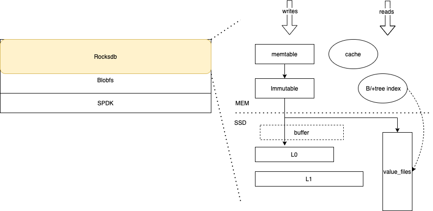

### 我们的打算 — n步走

- 研究一下现有kv分离方案titan / blobdb，尝试优化，包括cache、gc等等
  - ing
  - titan读性能已经很好了，可以尝试一下加入ceph看看其他瓶颈
  - memdb为什么没加速？
  - 愈加繁重的gc（旧数据、无效数据、存储空间等等的处理）、LSM层次设计、compaction设计（可能不需要）
    - kv分离gc优化：HashKV & titan
    - B+ tree KV store：KyotoCabinet、TokuMX、WiredTiger...
    - 深度学习训练场景gc不是很关键？

##### IN memory

***Any problem  in computer science can be solved by anther layer of indirection — The unknown***

- cache方案完善（存什么、怎么存、并发、预取淘汰、基于rocksdb原有cache等等）
  - ing

- 几个问题

  - 大量page fault

  - 有无cache，性能影响不大

  - cache效率低

    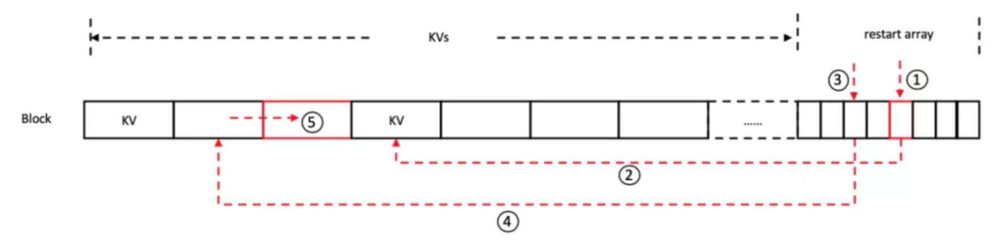

    1. 内存访问在前面的KVs和restart array之间跳跃。restart array中仅存储restart interval的offset，在查找时需要根据offset访问BlockContent的相应位置获得key，这样跳跃的内存访问没有规律（每次restart array和实际key的距离随机）且间隔多个cache line，无法充分利用CPU cache，带来一定的访存开销。
    2. 前后两次比较无法利用CPU cache。除了最后一次比较之外，每次比较的index key和前一次比较的index key间隔都可能超过一个cache line，因此无法利用前一次的CPU cache，导致访存开销很大。

    - 改编码方式（X-Engien）：性能提升13%，增加了查找次数；

    

    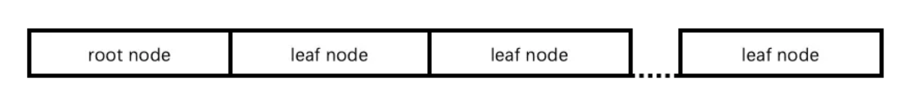

    - 加hash索引：cpu占用率降低了21.8％，在纯缓存的工作负载下，总体吞吐量增加了10％，而空间开销却增加了4.6％

    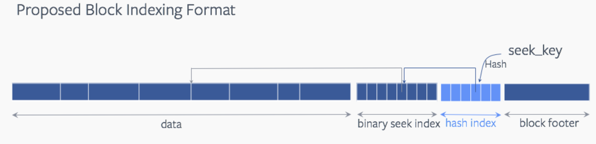

    - TwoLevelIndexSearch
      - 两层索引，每层都是二分查找，只看到rust的实现，c++的没有
    - 更好的解决方式？

  - cache多并发竞争

    - share noting-简单实现，根据PG shards来对cache、rocksdb分区，实现无共享

    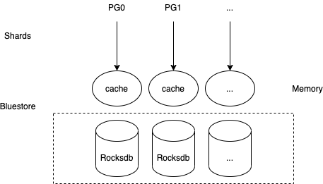

    - pg数量改变，pgid会变

##### No cache（Not enough memory）

***面包会有的，牛奶会有的，一切都会有的 — 阿宁***

- 内存不够，底层来凑，靠高性能底层介质来扛

- 缓存管理
  - bufferpool、in-memory compaction

- 加index，hash & b/b+ tree & skiplist & radix tree & ... 考虑额外的开销、读性能、如何构建和映射等等
- 改结构：L0不用（memtable和L1直接compaction）、减少level（只要一层，或者较少层可以粗粒度冷热分离）、filter（全缓存，降低误报率，surf支持范围）...

- 解决其他问题，cpu、内存等等
- ...

### 可控迁移 & 负载均衡

参见《DDA：A Search Space Odyssey》

- 新：平衡主节点的均衡，还有利于性能提升，但是依旧没有持久化

- 第二大步第一小步：upmap + 持久化 + 主节点平衡

