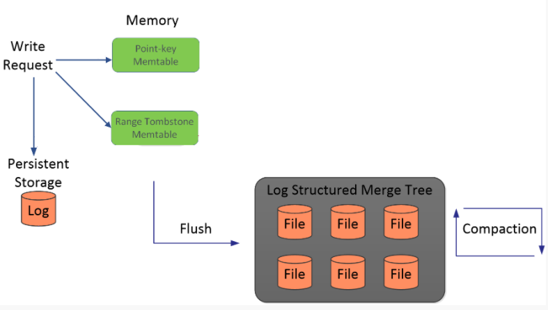
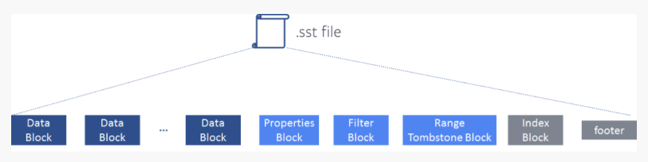
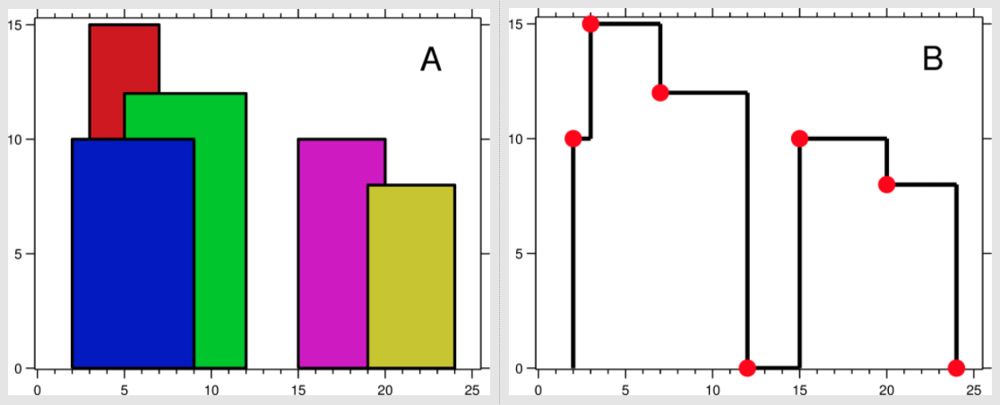
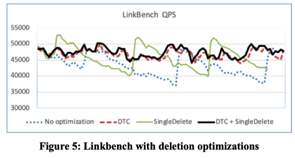
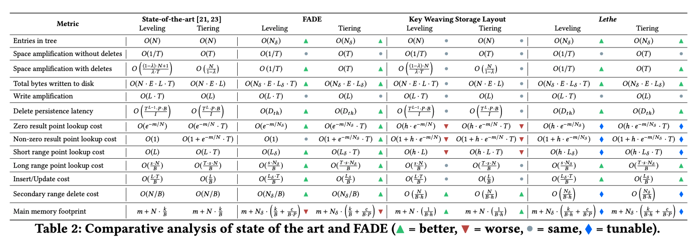
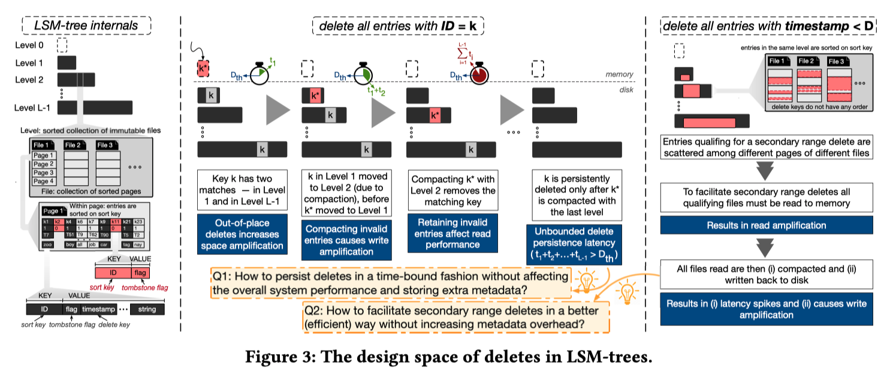
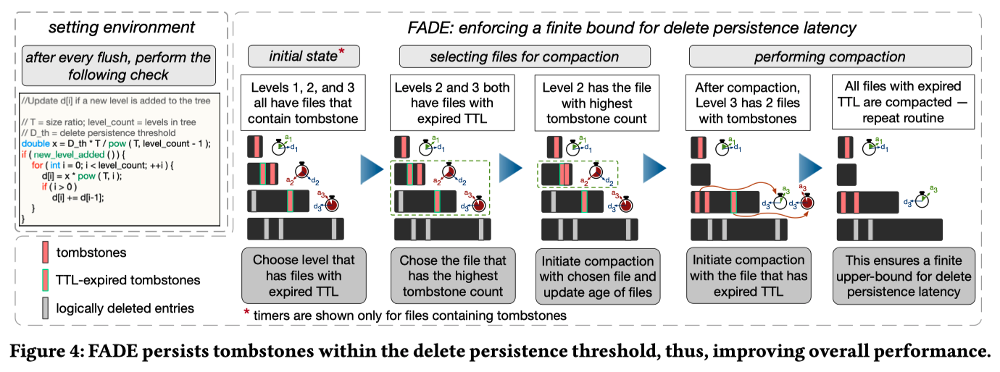
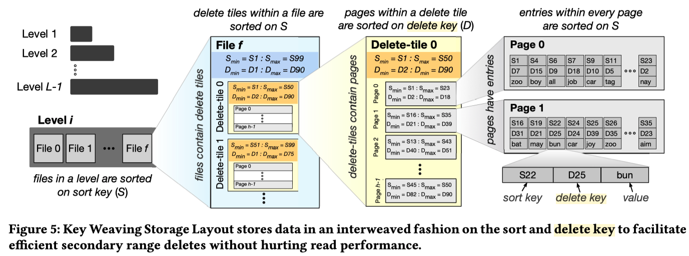

本文主要介绍RocksDB的删除机制和优化策略分析。

## 问题分析

#### tombstone问题

- LSM-Tree 的删除一条记录是通过追加写 tombstone 实现的，这种逻辑删除带来了如下问题 \[[1](https://cs-people.bu.edu/dstara/pdfs/Lethe.pdf)\] ：
  - Read Cost 增加，范围查询需要扫描更多的记录，点查询 Bloom Filter 的 false positive rate 升高
  - 空间放大，tombstone 自己占有空间，被删除的记录没有被实际删除占有空间。作者认为 delete 带来的空间放大比 update 更严重，因为大部分场景下，key 的大小远远小于 value，占有空间很小的 delete，使多个完整的 record 失效。 即 有用字节/全部字节更小
  - 写放大，tombstone 需要一直 compaction 到最底层才能被删除
  - 用户隐私，标记删除没有真正删除数据，有侵犯用户隐私的法律风险
- 当前 LSM-Tree 引擎处理 tombstone 面临的问题 \[[1](https://cs-people.bu.edu/dstara/pdfs/Lethe.pdf)\]  \[[3](https://cs-people.bu.edu/dstara/pdfs/Lethe.pdf)\] ：
  - **tombstone 存在的时长无法控制**，因为 compaction 对用户来说是黑盒，用户很难精确控制compaction过程中的delete key清理时机。决定 tombstone 存在时长的因素包括：workload 的特点和 compaction 策略设计。
  - LSM-Tree 应用的场景非常广泛，包括关系数据库、流式系统、KV Store .... 一来，需要处理的 workload 特别丰富，二来，很多删除不是 User-Driven 的，用户不知道的情况下，可能发生**大范围的删除，例如：数据迁移、索引删除等**
  - **对非连续的key的删除调度代价很大**。比如key的相同前缀是基于table id，删除时则基于某一时间戳进行删除。这个过程需要调度seek进行大量的查找，代价极大。

## 解决

#### RocksDB

- 最彻底解决：full compaction，过多资源消耗、非常昂贵

- 最普通和常用的方法：定期触发compaction

- [Single Delete](https://github.com/facebook/rocksdb/wiki/Single-Delete) [7]

  - 在compact的时候可以直接删除tombstone和以前的版本
  - 有很多限制，实验版本
    - 不能和delete，merge操作混合用
    - 不能在SingleDelete之前write多次，以下例子，原因是compact的时候找到一个以前版本就认为找全了
    - 不能SingleDelete同一个key多次
  - 一次删除一个key，大量删除效果未知

  例子

```c++
  std::string value;
  rocksdb::Status s;
  db->Put(rocksdb::WriteOptions(), "foo", "bar1");
  db->SingleDelete(rocksdb::WriteOptions(), "foo");
  s = db->Get(rocksdb::ReadOptions(), "foo", &value); // s.IsNotFound()==true
  db->Put(rocksdb::WriteOptions(), "foo", "bar2");
  db->Put(rocksdb::WriteOptions(), "foo", "bar3");
  db->SingleDelete(rocksdb::ReadOptions(), "foo", &value); // Undefined result
```

-  [RangeDelete](https://rocksdb.org/blog/2018/11/21/delete-range.html) [4]

  - 性能提升

  传统用法

  ```c++
  for(it ->Seek(start); it->Valid() && it->key().ToString() < end; it->Next()) {
    db->Delete(rocksdb::WriteOptions(), it->key());
  }
  ```

  ​    它会创建许多tombstones，这会减慢迭代器的速度，并且没有提供空间回收的最后期限

  DeleteRange

  ```c++
  s = db->DeleteRange(rocksdb::WriteOptions(),db->DefaultColumnFamily(), start.ToString(), end.ToString());
  ```

  两者相差

  ```c++
  Old Delete Range use 193519us
  DeleteRange use 30us 
  ```

  - 实现  [[4](https://rocksdb.org/blog/2018/11/21/delete-range.html)]

    - 为了保证读性能，写memtable的过程会为该range tombstone创建一个专门的**range_del_table**，使用skiplist来管理其中的数据，当读请求下发时近需要从该range tombstone中索引对应的key，存在则直接返回Not Found

      

    - 写入SST的时候，sst为其同样预留了一段专门的存储区域**range tombstone block**，这个block属于元数据的block。也是为了在读请求下发到sst的时候能够从sst中的指定区域判断key是否在delete range的范围内部

    

  - 缺陷

    - 需要一个Range的批量删除，适用于较大范围，但如果分成很多较小范围，则价格太高
    - sst中单独维护的range tombstone block

- 设置[level_compaction_dynamic_level_bytes](https://kernelmaker.github.io/Rocksdb_dynamic) [5]，主要是解决空间放大

  - 由于层数过多或者每一层之间的放大系数不合理导致上面的层的 tombstone 不能/很慢被推到最底层
  - rocksdb默认是base_level是Level 1，大小上限是256M，然后每一层大小上限基于此乘以10，依次往下，对于上述情况，能否改变思路，**不要从上往下来定每一层的大小上限，而是从下往上来定**，这样倒着搞更有利于整体保持正三角的形状，而正三角的写放大差不多是1.1111，还是十分理想的
  - **原理**：（打开`level_compaction_dynamic_level_bytes`）
    - base_level会从默认的Level 1 变成最高层 Level 6，即最开始Level 0会直接compact到Level 6
    - 如果某次compact后，Level 6大小超过256M(target_file_size_base)，假设300M，则base_level向上调整，此时base_level变成Level 5
    - 而Level 5的大小上限是300M/10 = 30M，之后Level 0会直接compact到Level 5
    - 如果Level 5超过30M，假设50M，则需要与Level 6进行compact，compact后，Level 5恢复到30M以下，Level 6稍微变大，假设320M，则基于320M继续调整base_level，即Level 5的大小上限，调整为320M/10 = 32M
    - 随着写入持续进行，最终Level 5会超过256M(target_file_size_base)，此时base_level需要继续上调，到Level 4，取Level 5和Level 6当前大小较大者，记为MaxSize，则Level 4的大小上限为MaxSize/100，Level 5的大小上限为Level 4大小上限乘以10，依次类推
  -  **实现**：在rocksdb中：每次base_level及其大小上限(base_bytes)的调整发生在LogAndApply之后，根据当前每一层的现状来进行调整，实现逻辑在`VersionStorageInfo::CalculateBaseBytes()`中，大致过程如下：
    - 从first_non_empty_level到最后一层，统计每一层的大小，找出最大者，记为max_level_size，最大者不一定是最后一层，因为有可能在某次compaction后，其他层的大小会大于最后一层
    - 从倒数第二层往上到first_non_empty_level，假设有n层，则cur_level_size = max_level_size/(10^n)，cur_level_size是当前first_non_empty_level的新的大小上限
    - 如果cur_level_size > max_bytes_for_level_base(256M)，则对cur_level_size除以10继续向上调整first_non_empty_level，直到调整到某一层，cur_level_size <= max_bytes_for_level_base(256M)，此时该层为新的base_level，即新的first_non_empty_level，base_size为cur_level_size
    - 然后从base_level开始，往下，每一层对base_size乘以10，当做该层新的大小限制

- Delete-Aware 优化  \[[3](https://cs-people.bu.edu/dstara/pdfs/Lethe.pdf)\] 

  - Rocksdb 在保证不增加LSM 的读代价的情况下 针对delete type的key增加了两方面的优化逻辑：

    - 用户态可配置的delete 密集型 sst文件的compaction优先级调度

      ```c++
      options.table_properties_collector_factories.emplace_back(rocksdb::NewCompactOnDeletionCollectorFactory(10000, 1000));
      ```

      - `NewCompactOnDeletionCollectorFactory`函数声明一个用户配置的sstable属性收集器
      - 该函数需要传入的两个参数`sliding_window_size`和 `deletion_trigger` 表示删除收集器的滑动窗口和触发删除的key的个数
      - 在每个sst文件内维护一个滑动窗口，滑动窗口维护了一个窗口大小，在当前窗口大小内出现的delete-key的个数超过了窗口的大小，那么这个sst文件会被标记为`need_compaction_`，从而在下一次的compaction过程中被优先调度

      ```c++
      #写入1千万的相同前缀且字典序递增的key，删除其中的的9百万，从头遍历直到取得未删除的前500条key
      #优化前：
      Traverse use time :2018292 
      #优化后：
      Traverse use time :674629
      #full compaction
      Traverse use time :364
      ```

    - compaction本身针对delete key逻辑的处理优化

      - compaction:`ProccessKeyValueCompaction`函数中会对key-value一个一个处理，会通过Compaction迭代器的移动（基本的SeekToFirst,Next等）来一个一个处理，其过程通过调用`NextFromInput`函数来进行，这个函数会处理不同的key-type，其中关于delete类型的优化:
      - 现当前delete 的key可能不在最后一层，通过函数`KeyNotExistsBeyondOutputLevel`判断后续的层中没有当前key了， 那么就可以直接删除；这个逻辑会增加一定的CPU比较代价，但是它的收益是可观的，能够在较高的层中将key直接删除

#### MyRocks

- VLDB 2020，Facebook从2017年开始将其内部基于InnoDB的MySQL服务（UDB）迁移到基于RocksDB的MyRocks服务上
- SingleDelete和定期触发compaction

优化措施

- **减少CPU的使用**
  - 内存中的Key比较
    - 在InnoDB中，查找一个Key只需要进行一次二分查找即可，但在LSM-Tree中，可能需要对每个文件进行一次二分查找，并进行归并。（Rocksdb在做iterator时，需要做一次所有文件的堆排，并通过不断的调整堆来找到最新最大/最小的Key，所以其Key的比较次数是相当多的。）。UDB在将MySQL数据转码为RocksDB Key时使用bytewise-comparable的方式，来提升Rokcsdb后续做比较的效率。
  - 反向迭代Key
    - 在Rocksdb中正向迭代Key比反向迭代快的多，一是因为delta encoding，二是由于老版本的数据存在，反向迭代需要再多读一次以获取到最新版本的数据，最后在内存中由于是单向的SkipList，反向迭代也需要额外的查找请求。
    - 对此UDB团队根据他们的业务，自己实现了一个反向的rocksdb比较器，将反向迭代转为了内部的正向迭代。
  - 更快的评估大小
    - Rocksdb通过找到两个Block的最大最小Key来计算两个blocks的距离以返回scan的代价。一个是在有提示情况下完全跳过其代价评估（根据其业务特点），二是改进了Rocksdb的算法，通过评估所有范围内已写完的SST文件的并跳过未写完的sst文件（这些不太影响结果）来大致获得scan代价。

- **降低延迟/范围查询性能**
  - Prefix Bloom Filter 前缀布隆过滤
    - 指定key的前N个字节作为前缀，这样就能跳过没有这个前缀的一些key和文件，以此来加快scan的速度。
  - 减少Tombstone
    - 在Rocksdb中，Tombstone会大大降低scan的性能（包括随机的seek性能也会降低），具体原因就不赘述了，有兴趣的可以研究一下Rocksdb，这里UDB使用**SingleDelete**和**定期触发compaction**来减少Tombstones的量。
    - SingleDelete用处不大，需要强结合业务使用。定期触发compaction是个比较通用且简单的做法。
    - 从benchmark图上看，仅仅采用定期触发compaction（UDB称为DTC），就可以获得较稳定的QPS。



- **存储空间和压缩挑战**
  - 内存使用
    - 布隆过滤器对于RockDB查找很重要，但是其会占用大量的内存。UDB服务使用每key 10 bits，但最后一层不创建布隆过滤器，那么布隆过滤器的大小能减少90%，并且布隆过滤器仍然有效。这个RocksDB本身自带的，通过optimize_filters_for_hits = true 设置。
  - SSD因为compaction变慢
    - 有一些SSD可能会在突增的Trim命令后掉速（就是删除太快了），解决方法就是限制Rocksdb删除文件的速度。
  - 物理移除过期数据：还是定期做compaction，只不过根据数据存在的时间做触发。

#### Lethe: A Tunable Delete-Aware LSM Engine

- sigmod 20，基于X-Engine，详细分析了 LSM-tree 删除的问题，提出 FADE 和 KiWi 两项措施 

- 效果：提供更高的读取吞吐量(1.17-1.4倍)和更低的空间放大(2.1-9.8倍)，写入放大略有增加(4%-25%)

  

- 摘要

  - 这篇论文系统地描述了**标记删除**给 LSM-Tree 引擎带来的问题，和现有的存储引擎很难解决大范围删除问题
  - 大部分篇幅在阐述问题和建模评估，提出两项简单策略：
  - 一是保证标记删除能在 bounded 的时间内被真正删除（FADE）
    - 增加统计信息和 compaction 策略，优化 sort key 大范围删除带来的问题
  - 二是支持较为高效的非 Sorted Key 范围删除（KiWi）
    - 设计新的 storage layout，优化 secondary key 大范围删除带来的问题

- delete in LSM

  - 一是 tombstone 存在的时长无法控制：Lethe保证 tombstone 存在的时间是 bounded 的
  - 二是范围删除非 sort key 很难支持/代价很大



- FADE

  - 为了保证第一点，每个文件（包含 delete）都记录了 TTL，delete 需要在 D 时长之前触及 LSM-Tree 底部。最简单的方法当然是每层每个文件的 TTL 均为 D / (L-1)，但如此，最底层和最上层的数据被 compact 的概率就相等了。显然最底层 compaction 的代价太大，应该相应增长 TTL ，假如层与层之间数据量的倍数为 T，相应地，每一层的 TTL 应该是上一层的 T 倍，既 di = di-1 * T，d0 + d1 + ... + dL = D
  - 为了实现上述目标，FADE 需要的元信息包括：
    - 文件中最旧的 tombstone 的 timestamp a
    - 因 tombstone 而失效的记录个数估算值 b。诸如 RocksDB 等引擎，已经统计了每个文件的 num_deletes，作者给出的 b 估算的方式是：num_deletes + range delete 可能失效的记录个数（根据统计信息估计）
    - *可以看到需要的元信息不多，均在 flush/compaction 产生新文件时计算生成，overhead 很小*

  

  - FADE 主要是根据上面描述的元信息，制定了一些针对 delete 的 Compaction policies。主要涉及两方面：
    - Compaction 触发规则
    - 文件选择规则

  - Compaction 触发规则
    - 当前的 LSM-Tree 引擎，大都是某一层数据量（或文件个数）饱和，触发 Compaction，一般会随机选择文件或选择与目标层 overlap 较小的文件
    - FADE 的 Compaction 触发规则增加了一条：文件的 TTL 满足后，需要触发调度，即使该层还没有满

  - FADE 的文件选择策略有三种模式：
    - The saturation-driven trigger and overlap-driven file selection (SO)，即经典 LSM-Tree 文件选择策略，针对写放大优化
    - The saturation-driven trigger and delete-driven file selection (SD)，选择 b 值（失效估算值）最多的文件，针对空间放大优化
    - The delete-driven trigger and delete-driven file selection (DD)，选择 TTL 到期的文件
      - 如果两个文件在 SD / DD 模式下打成平手（即两个文件 delete 影响 entries 数量接近），则选择有更旧的 tombstone 的文件
      - 如果两个文件在 SO 模式下打成平手，选择 tombstone 更多的文件
      - 如果 level 之间打成平手，优先选择更小的 level

  - 总结：更加激进的 compaction delete 记录，（1）可以较快的清理无用的空间（invalid entries），有利于缓解空间放大，（2）同时可以减少后续 compaction 中 invalid entries 参与的可能，总体上是减少了写放大，（3）最后也有利于读请求（提升 BF 的过滤效率，减少范围查询的需要扫描的个数），（4）并且删除数据存在的时间被严格限定在 D

- KiWi

  

  - LSM-Tree 的分层方式不变，每层文件的排列方式也不变。每个文件的组成，不再是多个 pages，而是加了一层 delete tiles 。同一个文件，delete tile 与 delete tile 之间按照 sort key 排序，delete tile 内部由 h 个 pages 组成，page 与 page 之间按 delete key 排列，page 内按 sort key 排列
    - delete key？
    - Consider the operation “delete all entries that are older than D days”, similar to the second scenario from the introduction. In the left part of Figure 3, we highlight the sort key (ID) and the delete key (timestamp) of a key-value pair. As the entries in a tree are sorted on the sort key, an entry with a qualifying delete key may be anywhere in the tree, and this delete pattern is not efficiently supported.
  - 优势：delete tile 内的 page 与 page 之间是按照 delete key 排序的，因此 delete key 范围删除可以直接移除满足条件的 page，不用读写，效率非常高。对于那些 page 里只有部分记录满足删除条件的，可以读取并重新生成 page。后续 compaction时可以回收这部分空间。这个 in-place delete 的效率是当前任何 LSM-Tree 引擎无法达到的。
  - 代价：读请求定位到 delete tile 后，定位 page 时需要多查询判断几个 page，增加了一些 CPU 的开销，但是由于 Bloom filter 和 fence pointer 的存在，这个代价是较小的。这个设计带来的另一个好处是：在不建二级索引的情况下，可以较为高校的以delete key作为查询条件做查询。
  - 可以通过调整 delete tile 中包含的 page 的个数 h 来调节 read performance 和 secondary range delete 之间的 tradeoff，h=1 时便退化到经典 LSM-Tree 的实现，查询性能最好。

## 优化思考

1. 常规方法：定期compaction，
2. 同pg的key尽量在连续的一片区域，RangeDelete 
3. 同pg的key，secondary key，KiWi
4. 添加额外的索引
5. 

## 参考文献

1. SIGMOD 2020， [Lethe: A Tunable Delete-Aware LSM Engine](https://cs-people.bu.edu/dstara/pdfs/Lethe.pdf) 
2. VLDB 2020，[MyRocks: LSM-Tree Database Storage Engine Serving Facebook's Social Graph](https://research.fb.com/wp-content/uploads/2020/08/MyRocks-LSM-Tree-Database-Storage-Engine-Serving-Facebooks-Social-Graph.pdf)
3. [LSM 优化系列（四） -- Rocksdb和Lethe 对Delete问题的优化](https://blog.csdn.net/Z_Stand/article/details/110270317)
4. [DeleteRange: A New Native RocksDB Operation](https://rocksdb.org/blog/2018/11/21/delete-range.html)
5. [Rocksdb DeleteRange实现原理](https://blog.csdn.net/Z_Stand/article/details/107569986)
6. [Lethe 如何优化 LSM-Tree delete 难题](https://zhuanlan.zhihu.com/p/291135599) 
7. [Single Delete](https://github.com/facebook/rocksdb/wiki/Single-Delete)
8. [level_compaction_dynamic_level_bytes](https://kernelmaker.github.io/Rocksdb_dynamic)

