本文主要介绍OSDI'20的论文，重点介绍存储模块。

***马瘦毛长蹄子肥，儿子偷爹不算贼。瞎大爷娶个瞎大奶奶，老俩口过了多半辈，谁也没看见谁。— 郭儿***

## 目录

- 最新计算机/存储领域论文分享
- Ceph相关论文分享
- Doing and Todo

## 最新论文赏析

***三百诗删麟笔前，周家积累瓞绵绵。 — 小夷***

### [osdi 20](https://www.usenix.org/conference/osdi20/technical-sessions) 

（12专题 70论文/389投稿 ）

- 主要还是一些计算机体系结构相关，涵盖验证、存储、操作系统、网络、一致性、机器学习、测试、调度、隐私安全、集群管理等领域，值得一提的是今年System for ML部分11篇（大部分来自微软，阿里，字节等企业），以前最多4、5篇

#### Correctness

- Theseus: an Experiment in Operating System Structure and State Management.
  - 来自耶鲁大学的工作，本文使用Rust语言设计和实现了一种新的OS结构，Theseus，用于更好地管理操作系统中的各类状态，并且讨论了如何利用Rust的语言特性维护操作系统的状态
- RedLeaf: Isolation and Communication in a Safe Operating System.
  - 来自加州大学尔湾分校（UCI）和VMWare。作者Anton Burtsev是UCI的教授，近来专注于构建安全可验证的操作系统，本篇论文提出用Rust编写的实验性操作系统RedLeaf，它进一步证实了Rust语言在操作系统领域的可用性
- Specification and verification in the field: Applying formal methods to BPF just-in-time compilers in the Linux kernel.
  - 来自华盛顿大学UNSAT研究组，实现了一个自动化验证工具Jitterbug，用于验证Linux kernel中的BPF JIT编译器
- Cobra: Making Transactional Key-Value Stores Verifiably Serializable
  - 来自纽约大学博士生Cheng Tan，论文关注在如何使用黑盒的方式验证键值存储的的可串行化
- Determinizing Crash Behavior with a Verified Snapshot-Consistent Flash Translation Layer
  - 来自我国台湾地区的Academia Sinica（台湾中央研究院），论文实现了SCFTL，为文件系统提供了快照一致性（snapshot-consistent）磁盘模型
- Storage Systems are Distributed Systems (So Verify Them That Way!)
  - 来自卡内基梅隆大学，本文关注点在于分布式系统的正确性验证，针对之前的工作FSCQ (SOSP 15), Perennial(SOSP 19)可扩展性问题进行优化，并实现了VeriBetrKV，一个基于高性能的Be-tree数据结构的键值对存储系统，该数据结构综合了LSM-tree和B-tree的优点，具有低随机写和低磁盘访存次数的性质。该系统还基于copy-on-write实现了崩溃安全。无法支持多线程，性能较差。

#### Storage

- **Fast RDMA-based Ordered Key-Value Store using Remote Learned Cache.** 

  - 来自上交IPADS，XStore，FM，RDMA，KV，learned index

  - Far memory技术在现代数据中心中具有广泛的应用前景，但如何将分布式系统的丰富操作高效地卸载到RDMA网卡上仍面临巨大挑战。当前基于Far memory的分布式键值存储仅能在简单数据结构（如，HashTable）上实现加速，而对于复杂数据结构（如，B+Tree）则存在远程访问复杂度高的问题(O(log(N)))。即，一个键值操作（如Get）需要多次Far memory操作（如one-sided RDMA）来完成。

  - XStore将Learned Index应用到分布式(树结构)键值存储中，同时兼顾功能(支持增/删/改/查)、性能(高吞吐/低时延)、资源(CPU/内存/网络低开销)。它能够将树结构远程遍历的复杂度从O(log(N))降低到O(1)，在获得高网络利用率的同时降低了服务端CPU开销和客户端内存占用。XStore在单张RDMA网卡下吞吐量达到每秒四千万操作(40M ops/s)，且能接近线性地随网卡数和机器数扩展。

    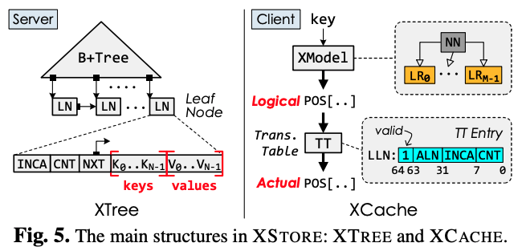

  - 具体来说，XStore在客户端维护了一个learned cache来预测一个键（key）在服务器中值（value）的位置。受learned index的启发，learned cache通过训练机器学习模型来预测键在服务器的位置。通过预测，客户端可以用一次Far memory操作来找到值（value）。同时，机器学习模型所占用内存极少，因此可以全部缓存在客户端本地。

  - 使用learned cache的一个问题是，机器学习模型只能学习一个有序的地址空间。因此，传统的learned index假设所有的值都储存在一个有序数组中（sorted array）。这样，如果XStore依照有序数组来储存，则很难高效支持增加（insert）和删除（delete）操作。

  - 为了解决这一问题，XStore采用一种混合的方法：在客户端利用learned cache支持高效的静态操作（如读、扫描）；在服务器依旧使用B+Tree（XTree）来支持高效的动态操作（如插入、删除）。
  - 使用B树来存储KV对的问题是，由于B树的值地址不一定是连续的，现有模型很难根据键来进行预测。因此，XStore的智能缓存除了使用机器学习模型（XModel）外， 还维护了一个页表（translation table）。页表将值的地址翻译成一个可被学习的有序的地址。这样，模型和页表依旧可以高效预测值在B+树中的位置。
  - 需要注意的是，XStore利用RPC来支持修改操作（如插入和更新）。这是因为现有的Far memory操作很难支持高效的并发控制和复杂的逻辑。
  - 在YCSB测试基准下，一台装备有两张Mellanox ConnectX-4网卡的XStore服务器可以支持40M Get操作，同时不使用任何服务器的处理器。同时，XStore相比较在客户端缓存服务器的B+树，提供了更好的内存-性能trade-off。如下图所示，XStore可以减少99%客户端内存的使用而只带来20%的性能下降。

  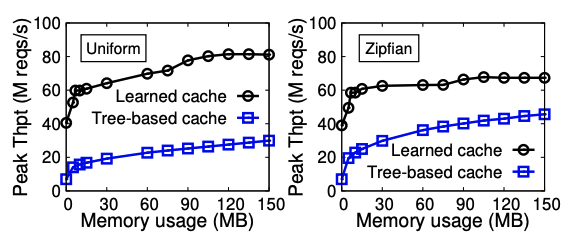

- CrossFS: A Cross-layered Direct-Access File System. 

  - 来自罗格斯大学，随着存储设备性能不断提升，文件系统的系统调用开销、粗粒度并发控制、未利用硬件级别并行机制开始成为性能瓶颈，本文提出了CrossFS，从多个角度对传统文件系统进行优化。

- **From WiscKey to Bourbon: A Learned Index for Log-Structured Merge Trees.** 

  - 来自康斯威星大学，第一作者Yifan Dai，learned index in LSM-tree

- LinnOS: Predictability on Unpredictable Flash Storage with a Light Neural Network.

  - 来自芝加哥大学，本文提出LinnOS，它是一个利用轻量级神经网络来推测SSD性能的操作系统，以非常细（每个I/O）的粒度，帮助并行存储应用实现I/O性能的可预测性。
  - SSD由于内部存在垃圾回收（GC）、写缓存刷新（buffer flushing）和损耗均衡（wear leveling）等任务，I/O的延迟不可预测，对含有相同副本的不同SSD发起同样的I/O，访问延迟可能会不同。

- **A large scale analysis of hundreds of in-memory cache clusters at Twitter.**

  - 来自卡内基梅隆大学、Twitter的研究，第一作者Juncheng Yang，他们开源了twitter内部153个in-memory cache的集群的真实数据，并从中总结了一些在真实场景中的观察，为未来在此领域的研究指明了方向

  - 该工作将In-memory Cache的使用场景一共分为了三类：

    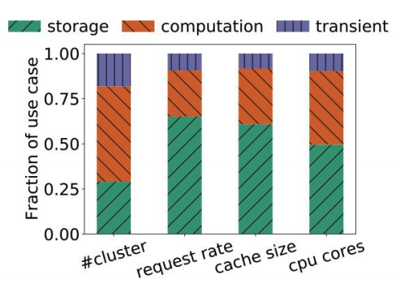

    - Storage：该类将In-memory Cache当成正常的后端数据库的cache服务，其可以提升客户访问热数据的吞吐率、降低访问时延。这也是In-memory Cache最常见的使用场景。
    - Computation：将In-memory Cache当成存储计算相关数据（如中间结果）的服务。特别是随着流服务与ML计算需求的增加，这类服务占比也非常可观。
    - Transient: 这类瞬时数据只存于Cache中，只会存在很短的时间。比如用于Dedup的cache。

  - 本文分析twitter内部153个in-memory cache的集群的真实数据，得到以下观察：

    - 该工作发现在In-memory Caching中，write-heavy（>30%写操作）的场景是非常常见的（>35%的集群）。而之前大部分工作都主要关注read-most场景。write-heavy场景常见于上面说的Computation类型，其需要向cache中存储计算结果。相比于read-most的负载，write-heavy会有更高的时延/更低的吞吐，也比读操作更难scale out。因此，需要后续工作关注write-heavy的场景下如何提供良好的性能与可扩展性。

      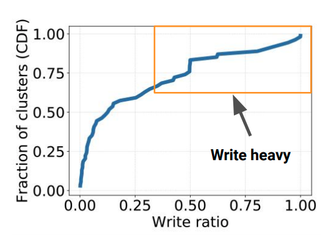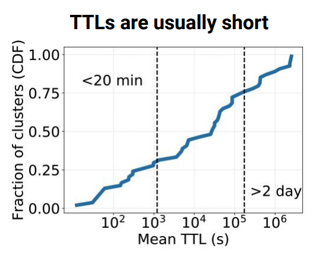

    - 该工作过发现大部分in-memory caching数据存活时间（TTL）都比较短，特别是上面说的瞬时数据类型。如上右图所示，75%的数据存活时间都小于48小时。如果系统能够充分利用这个信息，如下图所示，就可以将整个working set控制在比较小的程度，而不必设计非常复杂的evict算法。因此，设计一个良好的清理过期数据的算法对这种in-memory cache的系统非常的重要。

      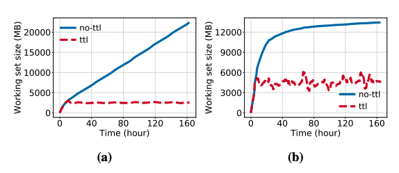

    - 之前Facebook的一篇工作指出in-memory caching不一定遵守齐夫分布（即访问频率与该数据火热程度排名倒数成正比，热的数据访问概率会远远高于冷的数据）。而之前很多工作都是基于此假设基础上设计的。然而从Twitter的测试集中显示，齐夫分布仍然适用，只有部分最热门的数据没有拟合的那么热，最冷的比拟合的更冷，如下图所示。

      

    - 此外，该工作还发现大部分key-value都非常的小（如下图，75%都小于1kb），最终导致CPU性能有可能成为提升吞吐率的瓶颈（大约20%的集群中）。同时，这导致一个比较奇特现象就是，大约有50%的键值对中，value的大小在key大小的5倍以内。导致这个问题的主要原因是key中往往还包含了很多namespace的信息，如NS1:NS2:...:id。而这导致实际有用信息存储的利用率不高。因此，之后的研究同样应该尝试压缩key的大小。

      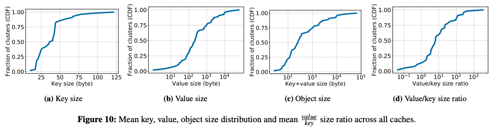

    - 该工作还指出，在部分场景中，需要分配的object的大小并不是固定的。如下图所示，随着时间的变化，request的大小会产生明显变化（图中越亮的代表这一时间大部分request的大小），这将对设计内存分配器也带来新的挑战。

      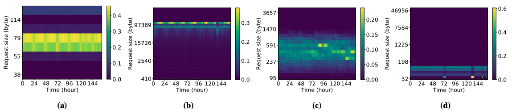

    - 最后，在cache驱逐算法方面，该工作发现在大部分情况下，LRU与FIFO的效果接近。只有在cache大小非常受限的情况下，LRU才会展现出优势。总而言之，这篇工作作为工业界开源真实负载非常难能可贵，其为In-memory cache相关研究提供了良好的参考与导向。

- Generalized Sub-Query Fusion for Eliminating Redundant I/O from Big-Data Queries.
  
  - 来自微软印度研究院、微软公司和英特尔公司，主要讨论如何通过优化 SQL 的执行方案以消除冗余的 I/O 操作，提升性能

#### OS & Networking

- A Simpler and Faster NIC Driver Model for Network Functions
  - 来自EPFL（瑞士洛桑联邦理工学院），Network function(NF)是一种基于通用硬件和操作系统来实现的网络功能（如网桥、路由、防火墙）的方法，本文的工作在于提出一套简单而有效的模型优化NF
- PANIC: A High-Performance Programmable NIC for Multi-tenant Networks
  - 来自威斯康星大学麦迪逊校区，多租户网络的高性能可编程NIC
- Caladan: Mitigating Interference at Microsecond Timescales
  - 来自MIT CSAIL（麻省理工计算机科学与人工智能实验室）三位作者和UC Berkeley一位作者共同完成。CSAIL实验室在OSDI20的这个session里面贡献4篇（其中3篇是主要完成方）
  - 提出Caladan策略，在保证数据中心高资源利用率的同时，严格保证性能隔离
- Overload Control for µs-scale RPCs with Breakwater
  - 来自CSAIL，针对服务器过载问题，论文提出了Breakwater，Breakwater在TCP传输层上实现了一个RPC库，提供了微秒级的RPC过载控制
- AIFM: High-Performance, Application-Integrated Far Memory
  - 来自MIT CSAIL，Brown University和VMware共同完成的，本文提出的新系统AIFM (Application-Integrated Far Memory)对原有的基于分页的远程内存系统做出了改进，选择牺牲一些透明性，来获取接近RDMA方案的性能

#### Consistency

- Performance-Optimal Read-Only Transactions
  
- 来自普林斯顿大学的Haonan Lu团队，他们致力于优化分布式数据库系统中的只读事务，本文是他在16年OSDI发表的The SNOW Theorem and Latency-Optimal Read-Only Transactions之后，又一篇该方向的工作。本文提出了对于只读事务的NOCS理论，阐明了只读事务不能对于最优性能和最强一致性（即事务的隔离级别）兼而有之
  
- Toward a Generic Fault Tolerance Technique for Partial Network Partitioning

  - 来自滑铁卢大学Waterloo Advanced Systems Lab（WASL），聚焦于云系统中一种特殊的网络故障：局部网络分割（Partial Network Partitioning）

- PACEMAKER: Avoiding HeART attacks in storage clusters with disk-adaptive redundancy

  - 来自卡耐基梅隆大学Parallel Data Lab（PDL），关注存储集群如何管理冗余策略（redundancy scheme），以同时兼顾数据可靠性（data reliability）、空间节省（space saving），并规避切换策略导致的数据转移IO过载（transition overload）。这篇工作弥补了先前工作HeART（FAST '19）在动态管理集群冗余策略时发生IO过载、使部分磁盘长时间不可用的缺陷

- **Pegasus: Tolerating Skewed Workloads in Distributed Storage with In-Network Coherence Directories**

  - 来自新加坡国立大学、微软研究院、华盛顿大学和约翰斯·霍普金斯大学。其中约翰斯·霍普金斯大学的 Xin Jin 在可编程网络方向深耕多年，近年持续发表高水平论文。

  - 本文主要关注分布式存储系统如何实现高效的负载均衡的问题。存储系统的工作负载通常是高度偏斜且动态变化的。现有的解决方法主要有缓存（Caching）和选择性复制（Selective Replication）两种，但是他们各有缺点。例如缓存不适用于写操作较多的情况，而选择性复制则不能很好的应对动态变化的负载，且实现强一致性的代价较大。

  - Pegasus 通过利用可编程的数据平面交换机（如Barefoot Tofino），实现了服务器机架（Rack）级别的选择性复制与负载均衡。Pegasus 实现了类似于CPU缓存一致性目录的网络一致性目录（in-network coherence directory），用于跟踪被复制的数据的位置，并置于服务器机架的交换机中。交换机承担转发用户请求，在服务器间移动数据以保证负载均衡等任务。由于所有的数据包本身就要经过交换机，且交换机在数据平面进行操作速度很快，所以带来的开销非常小。

    ​										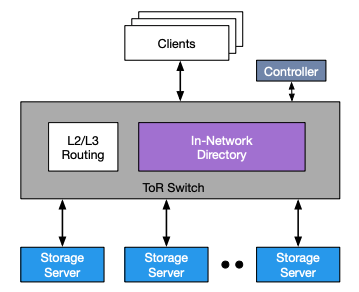v

  - Pegasus 使用了基于版本号的一致性协议，交换机记录哪些服务器存有数据的最新版本，并根据服务器的响应更新版本号。因为所有的数据都要通过交换机，因此 Pegasus 能轻松的实现数据的线性一致性（Linearizability）。交换机会跟踪哪些数据是热点数据，然后将热点数据复制到多个服务器，以实现负载均衡。

  - 下图是一致性目录在交换机的数据平面的具体实现，Pegasus 利用了路由器 ASIC 中的完全匹配查找表（exact-match lookup table）和寄存器数组（register array）两种有状态的内存原语，使得占用交换机的 SRAM 小于 3.5%。

    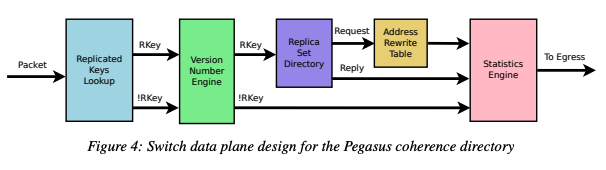

  - 本文通过随机生成的符合 Zipf 分布的数据进行测试，从下左图可以看到，Pegasus 在高度偏斜的负载下仍然保持较高的吞吐量。从下右图可以看到，Pegasus 在写操作较多的情况下也能保持较高的吞吐量。

  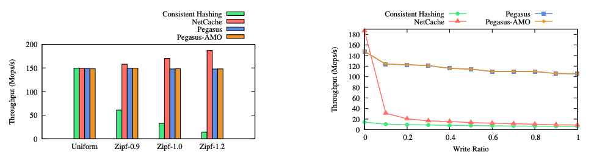

- **FlightTracker: Consistency across Read-Optimized Online Stores at Facebook**

  - 来自Facebook，Facebook在社交网络中为每位用户都提供了个性化的内容定制，这需要读取大量用户数据。因此，数据存储需要提供足够高的读性能、高可用性以及高可扩展性来支持这一功能。
  - 为了满足上述性能和一致性的需求，Facebook的图存储系统TAO，使用了类似下图的分布式架构。它使用多级缓存的方式加速读操作，每个region（地理分布式区域）内有多个L1缓存和一个L2缓存。由于用户的写同样会更新缓存，只要**同一个会话的读写操作沿着固定的路径传播**（如图黑色粗体箭头的路径），就可以保证读操作读到同一个会话之前已经完成的写操作。

  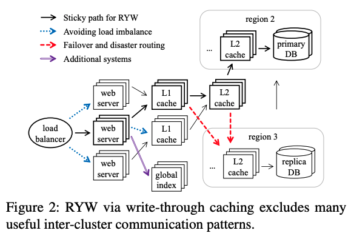

  - 然而，随着数据规模、应用负载的增长以及出于成本的考量，固定每个操作的路径并非是一个明智的选择，操作的路径应该能够随着环境动态变化。例如，出于负载均衡考虑，上图的蓝色箭头会动态地将操作分配给负载低的服务器和缓存；由于缓存服务崩溃，红色箭头会寻找其他地理区域处理读操作。动态路径导致某个客户端后续的读操作无法沿着已完成的写操作的路径传播，进而无法读到自己已完成的修改，所以TAO满足RYW的方法变得不再可行。

  - Facebook的Xiao Shi等人为了解决上述痛点，提出了对应的系统设计和服务FlightTracker，并将之应用在了TAO上，如下图。他们将“为基于动态路径的操作提供RYW语义”这一问题分为了三个部分。其基本思想是：

    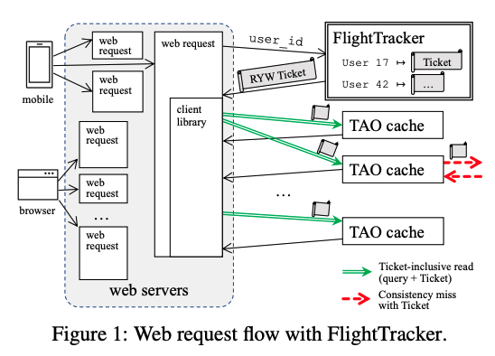

    - 每个客户端会记录最近一段时间内，所有它发起的写操作的元数据（记录写操作对应的key、操作类型、版本等），即Ticket。通过为每个读操作添加对应的Ticket信息，处理该操作的缓存就可以保证RYW的语义。
    - 为了保证Ticket中记录的写操作会被反映在读操作的结果中，在接收到附带有Ticket的读操作时，缓存会比对缓存中的数据版本与Ticket记录的对该数据的写操作版本。如果缓存中数据版本较旧，则代表当前缓存没有存储对应用户的更新。因而当前缓存会继续向后续的缓存或存储系统转发读操作。
    - 由于一个用户的多个读操作可能会走多个路径，需要使用一个独立的高可用服务（FlightTracker）来存储每个用户的Ticket。写操作在返回用户前，它需要将对应的元数据添加到FlightTracker服务存储的对应用户的Ticket中。由于通常一个网络请求会对应大量的读操作，而这些读操作可以共享Ticket，所以FlightTracker服务的引入不会带来显著的性能开销。

  - 通过让读写接口适配FlightTracker的Ticket抽象，任何存储系统（包括缓存，以及用于加速复杂读查询的分布式索引系统）都可以支持FlightTracker。而在客户端，开发者无需修改应用逻辑就能获得RYW语义保证。同时，Ticket这种显式提供写操作可见性的抽象还有更丰富的语义，例如开发者可以轻松指定读操作需要读到具体某些用户会话的最新更新。

  - FlightTracker已经在Facebook中被使用了四年，每天会处理超过1亿的Ticket读操作和2千万Ticket写操作。FlightTracker在真实场景下证明了它可以满足99.9999%的读操作可用性并且对于CPU和内存的开销小于2%。

- **Kvell+: Snapshot Isolation without Snapshots**

  - 来自悉尼大学与云计算厂商Nutanix合作的工作，延续了SOSP2019年的Kvell的工作，Kvell是为快速持久化设备（如NVMe SSD）的单机KV存储系统。而今年的Kvell+工作，延续了在NVMe SSD上KV系统的场景，并且解决的问题是，如何减少对存储空间的浪费

#### Machine Learning 1 && 2

- 3 训练优化；4 调度优化；4 推理与编译优化
- Serving DNNs like Clockwork: Performance Predictability from the Bottom Up
  - 来自MPI SWS和埃默里大学合作的工作，提出了一种性能（时延）可预测的DNN服务系统Clockwork
- A Unified Architecture for Accelerating Distributed DNN Training in Heterogeneous GPU/CPU Clusters
  - 来自字节跳动、清华大学和Google合作的项目，提出一种分布式DNN训练的统一架构BytePS。并且，延续了字节跳动在RDMA方面的研究，利用了RDMA高速网络的特性对集群的通信和算力资源利用率进行优化
- Heterogeneity-Aware Cluster Scheduling Policies for Deep Learning Workloads
  - 来自斯坦福大学和微软研究院，本文提出了Gavel调度器，能够在调度DL training任务时考虑不同加速器的异构性，并且将传统的调度策略建模成一个优化问题，通过求解优化问题得到最优的资源分配方式。
- PipeSwitch: Fast Pipelined Context Switching for Deep Learning Applications
  - 来自约翰·霍普金斯大学Zhihao Bai，PipeSwitch这项工作主要解决了如何在GPU上进行深度学习任务的快速上下文切换，从而使多个深度学习任务在保证推理任务SLO的前提下并发地运行在一个GPU上，提高GPU的利用率。
- HiveD: Sharing a GPU Cluster for Deep Learning with Guarantees
  - 来自北京大学、香港大学和微软，提出了一种GPU集群的资源保留框架HiveD
- AntMan: Dynamic Scaling on GPU Clusters for Deep Learning
  - 来自阿里巴巴，是阿里在Gandiva[OSDI‘16]之后在GPU集群调度上的续作。本项工作与上面介绍的PipeSwitch工作有一样的目标，就是通过多个深度学习任务共享GPU来提高GPU集群资源利用率，不同的是PipeSwitch面向的场景是深度学习推理任务作为高优先级任务，可以用训练任务来填满推理任务使用的GPU资源利用率；而AntMan面向的场景是深度学习训练任务有高低优先级之分，可以用低优先级的训练任务来填满高优先级训练任务的GPU资源利用率。
- Ansor: Generating High-Performance Tensor Programs for Deep Learning
  - 来自加州大学伯克利分校Lianmin Zheng、亚马逊，本文提出了Ansor，一个tensor计算程序自动优化和自动生成的框架。Ansor主要从两个方面去提升tensor计算程序优化的效果，第一是使得优化的搜索空间足够大，第二是提高搜索的效率和优化搜索策略，使得在很大的搜索空间里能够快速正确地搜索到性能较优的计算程序。
- Rammer: Enabling Holistic Deep Learning Compiler Optimizations with rTasks
  - 来自北京大学，上海科技大学，微软研究院，本文提出了Rammer系统，它的核心设计思想就是将操作符间并行与操作符内并行进行整体的调度，使得硬件资源被充分的利用，从而提升整体的模型运行性能。
- A Tensor Compiler for Unified Machine Learning Prediction Serving
  - 来自加州大学圣地亚哥分校、微软，本文提出Hummingbird，它能够在深度学习预测系统中运行传统机器学习模型。
- Retiarii: A Deep Learning Exploratory-Training Framework
  - 来自微软研究院，介绍了一种新的深度学习训练框架Retiarii。Retiarii针对深度学习实践中十分耗费人力与时间的“探索训练”过程，即重复地手动设计或调整模型架构，并使用TensorFLow等训练框架训练新模型，直到模型性能满足需求为止的这个过程。
- KungFu: Making Training in Distributed Machine Learning Adaptive
  - 来自伦敦帝国理工学院，现在有一些工作来尝试在训练过程中自动的去在线调整这些参数，称为Adaptation，这篇工作提出了KungFu这一系统，它的主要思想是将整个Adaptation的流程实现在计算图中。

#### Consensus （2篇best paper）

- Write Dependency Disentanglement with HORA
  - 来自清华大学舒继武团队，他们通过测试发现Write Dependency对现有Linux存储栈的吞吐有很大的影响，本文提出Horae，其主要思路是将控制流与数据流分离。当上层应用发起了两个具有依赖关系的写请求时，Horae将记录有数据流中请求顺序的元数据持久化到存储设备中。等这些元数据持久化完成后，Horae再让数据流充分利用硬件的并发性能地乱序写入到设备中。当从Crash中恢复时，Horae可以根据控制流中的信息，将依赖请求未完成的所有写请求都回滚。
- Blockene: A High-throughput Blockchain Over Mobile Devices
  - 来自微软印度研究院，提出了一种针对区块链的split-trust架构设计，能将参与者的计算、网络、存储方面的成本下降若干数量级，从而可以在移动端设备上支持区块链，并提供每秒1K左右TPS的高吞吐。
- Tolerating Slowdowns in Replicated State Machines using Copilots
  - 来自微软研究院和普林斯顿大学，本文关注于分布式共识协议中容忍慢速结点的研究，提出Copilot系统，它关注于在出现单节点slowdown的情况下保证整个系统的响应时间尽量不受影响。
- Microsecond Consensus for Microsecond Applications
  - 来自VMware、EPFL（瑞士洛桑联邦理工学院）、Oracle的研究，以金融为代表的应用场景对时延等级已经降到了微秒级别。一个微秒级应用，其数据备份也应该是微秒级的。针对这一性能需求，本文提出了基于高性能网络（RDMA）的微秒级别共识算法。
- **Virtual Consensus in Delos （BP）**
  - 来自Facebook，是今年OSDI 3篇Best Paper之一。新的共识算法层出不穷，切换算法开销很大。本文提出VirtualLog，这是Facebook在生产环境中使用的Delos这一数据库中的共识组件。VirtualLog可以快速在不同的共识算法之间快速切换，并且大幅简化了可以接入的共识算法所需要实现的功能。
- **Byzantine Ordered Consensus without Byzantine Oligarchy （BP）**
  - 来自康奈尔大学、微软亚洲研究院的研究，第一作者Yunhao Zhang。在传统分布式环境下，为了在互相之间不信任的节点间达成对共识，会使用经典的“拜占庭共识”（Byzantine Consensus）。给定一个操作的序列，拜占庭共识算法保证该序列上的每个操作，对所有节点来说都是相同的。
  - 本文指出了拜占庭共识应用在区块链场景下的问题。简单来说，每个分布式节点（可以理解为状态机）通过按序执行已经达成共识的操作，可以最终达到一致的状态，不会有恶意节点发起的恶意操作被执行。然而，在某些场景下，恶意节点可能会控制对这些操作的顺序决策（这种行为也被称为Byzantine oligarchy）达到攻击的目的。例如在拍卖场景中，对于竞价的节点来说，显然竞拍操作在前的一方会更有利。遗憾的是，现有拜占庭共识的正确性规范（Correctness Specification）都没有对于操作顺序正确性的相关定义或描述。
  - 为了填补上述研究空白，本文提出了“拜占庭有序共识”（Byzantine Ordered Consensus），在现有的拜占庭共识正确性规范的基础上补充了对于操作顺序正确性的约束。

#### Bugs

- From Global to Local Quiescence: Wait-Free Code Patching of Multi-Threaded Processes
  - 来自德国的汉诺威大学和奥斯纳布吕克大学，论文关注server端应用热修复的性能问题。
- Testing Database Engines via Pivoted Query Synthesis
  - 来自ETH Zurich（苏黎世联邦理工学院），提出了一种简单且有效地检测数据库逻辑问题（logic bugs）的方法。
- Gauntlet: Finding Bugs in Compilers for Programmable Packet Processing
  - 来自纽约大学，本文探究了如何发现网络包处理程序编译器当中存在的Bug。
- Automated Reasoning and Detection of Specious Configuration in Large Systems with Symbolic Execution
  - 来自约翰霍普金斯大学OrderLab，旨在寻找系统中的specious configuration（正确但是会引起性能问题的配置项）。
- Testing Configuration Changes in Context to Prevent Production Failures
  - 来自UIUC（美国伊利诺伊大学香槟分校）和Cornell（康奈尔大学），关注寻找cloud service中由配置项导致的错误。

#### Scheduling

- 主要关注的方向是在大规模的生产环境中的资源、任务等调度的问题。有不少来自工业界的工作。
- Providing SLOs for Resource-Harvesting VMs in Cloud Platforms
  - 来自Microsoft Azure、Microsoft Research研究，本文通过一种叫做Harvest VM的新的虚拟机类型来利用云平台上物理机的未被分配的资源，从而使得云平台用户和服务商都能从中降低成本。
- **The CacheLib Caching Engine: Design and Experiences at Scale**
  - 来自CMU、Microsoft Research、Facebook研究，提出了CacheLib作为一个通用的caching engine，来维护Facebook各种业务形形色色的cache。
  - Facebook各种业务中，有CDN cache、KV cache、Media cache、Graph Cache等等。
    - 不同的cache系统有具有不同的性能目标：如低延迟、高吞吐、大容量、强一致等。
    - 不同的cache的系统结构也不一样：比如应用内部的cache、通过RPC访问的cache等。
    - 面向的workload也不一样、具有业务特点
- Twine: A Unified Cluster Management System for Shared Infrastructure
  - 来自Facebook，Twine是Facebook的集群管理系统（cluster management system），在Facebook的生产环境中已经工作了十年左右的时间。和传统的系统相比，Twine的主要目标是实现一个可扩展的统一的、共享的基础设施架构（unified/ubiquitous shared infrastructure）
- FIRM: An Intelligent Fine-Grained Resource Management Framework for SLO-Oriented Microservices
  - 来自UIUC，提出FIRM，一个资源管理框架，可以用于缓解微服务之间由于资源竞争导致的SLO violation。
- Building Scalable and Flexible Cluster Managers Using Declarative Programming
  - 来自UIUC、VMware、里斯本大学工程学院、加州大学欧文分校，提出了一种使用基于声明式语言（SQL）的集群管理方式，以应用在Kubernetes调度器上为例，能够在Scalability上，决策准确性上，以及对新特性的可扩展性（extensibility）上对现有的Kubernetes调度器进行优化。除了Kubernetes调度器这一个用法，这种新方法可以衍生地用于虚拟机的负载均衡等方面。
- Protean: VM Allocation Service at Scale
  - 来自Microsoft Azure、Microsoft Research研究，本文首次披露了微软Azure服务中，虚拟机的分配机制Protean。Protean实现了高效的资源分配，较低的响应时间与客观的吞吐量，具有较强的可扩展性以及容错的能力。论文中详细介绍了Protean的设计方式与实现细节，以及如何应对COVID-19所带来的流量的峰值的场景。

#### Machine Learning 2 （5）

#### Hardware （1篇best paper）

- 3 FPGA ；nvm评估；可恢复持久性内存；持久性存储测试

- FVM - FPGA-assisted Virtual Device Emulation for Fast, Scalable, and Flexible Storage Virtualization
  - 来自首尔大学与三星，提本文出了FVM，一个新的硬件辅助的存储虚拟化机制来达到高性能和可扩展性，同时保留了灵活性来支持不同的VM特性。
- hXDP: Efficient Software Packet Processing on FPGA NICs
  - 来自Axbryd公司、罗马第二大学、CNIT、德国海德堡研究所的研究，也是今年OSDI的best paper之一，其在FPGA上实现了一个接近CPU性能的eBPF字节码软核，是一项FPGA突破性研究。
- Do OS abstractions make sense on FPGAs?
  - 来自瑞士苏黎世联邦理工大学，FPGA能够提供强大的可定制化加速器，但同时为FPGA编程也十分困难。这个工作构建了一个叫做Coyote的系统。这个系统为FPGA应用提供了一个统一的运行时环境，尝试传统OS的生态迁移到FPGA上。
- **Assise: Performance and Availability via Client-local NVM in a Distributed File System**
  - 来自华盛顿大学、阿卜杜拉国王科技大学、韩国科学技术院、瑞典皇家理工学院、德克萨斯大学奥斯汀分校、皇家理工学院、天主教鲁汶大学的研究，这篇工作就是尝试在分布式文件系统中使用NVM来提升性能与availability（更少的恢复时间）。
- Persistent State Machines for Recoverable In-memory Storage Systems with NVRam
  - 来自伯克利、微软研究院和华盛顿大学，主要介绍了如何以极少的代码修改和性能开销，将现有的内存键值存储系统转换为持久内存上的键值存储系统。
- AGAMOTTO - How Persistent is your Persistent Memory Application
  - 来自密西根大学与韩国科学院，本文建立一个能够更加全面地测试PM程序的系统，AGAMOTTO，能够很快准确的测试PM系统的工作的bug。

#### Security （5）

- Orchard - Differentially Private Analytics at Scale
  - 来自宾夕法尼亚大学，本文针对大规模的用户数据分析查询的差分隐私问题进行分析和方案优化。
- Achieving 100Gbps Intrusion Prevention on a Single Server
  - 来自卡内基梅隆大学的zhipeng zhao，提出用FPGA智能网卡实现高性能入侵检测/防御系统（IDS/IPS）——Pigasus。
- DORY: An Encrypted Search System with Distributed Trust
- SafetyPin: Encrypted Backups with Human-Memorable Secrets
  - 两篇都来自加州大学伯克利分校的Emma Dauterman团队，都和密码学相关。DORY是分布式信任的加密搜索系统；SafetyPin在多HSM上设计了可扩展性：在有更多HSM加入的情况下，可以提供更好的吞吐。其次，因为攻击者的暴力破解需要尝试一定的次数，SafetyPin设计了一种基于Merkle树的分布式日志，将每次密钥恢复都告知用户，从而让用户对这个恢复过程感知。
- Efficiently Mitigating Transient Execution Attacks using the Unmapped Speculation Contract
  - 来自MIT CSAIL的工作。这篇论文主要关注最近内核中，存在诸多针对暂态执行攻击（Transient Execution Attack）的缓解措施，如缓解Meltdown的KPTI、缓解Spectre的retpoline等。

#### Clusters

- **Predictive and Adaptive Failure Mitigation to Avert Production Cloud VM Interruptions**

  - 来自微软（Microsoft Research和Microsoft Azure）的研究，约翰-霍普金斯大学的Peng Huang老师也参与其中，他在大规模分布式系统的可靠性研究领域颇有建树。

  - 在大型分布式系统中，错误是非常常见的情况。一种传统的修复思路是：**识别错误->开发者诊断->写补丁->重新部署**。但是这种思路花费的时间太长了，不管是开发者的人工诊断还是重新部署可能都需要很多时间。因此，系统中一般会采用缓解（mitigation）的方法，比如直接重启，而不是真的去识别和修复错误。但是，研究人员还希望更进一步：他们希望通过预测（predictive）的方法提早发现即将发生错误的节点，并尽早采取措施减轻错误带来的影响。在这篇文章中，影响主要指的是虚拟机服务的中断（VM Interruptions）。

  - 很多错误并不是突然发生的，而是逐步积累，有迹可循的。对于硬件来说，如果硬盘使用时间过长，那么可以预见它很可能即将损坏；对于软件来说，如果通过日志发现资源出现泄漏，那么资源很可能在未来耗尽，导致系统崩溃。通过对软硬件产生的“信号”（通常是日志）进行分析，就可以做出合理预测，并及时采取行动，减轻错误带来的影响。一个比较直接的实现方案是使用一些静态规则来对错误进行预测和处理，这些规则一般是由有经验的开发运维人员总结出来的。但是，由于分布式系统的日志规模大、种类多，静态规则并不能总是得到良好的预测和处理效果。

  - 论文提出了Narya系统，它能够以端到端的方式完成分析、预测、决策、缓解处理。Narya的工作流如下图：

    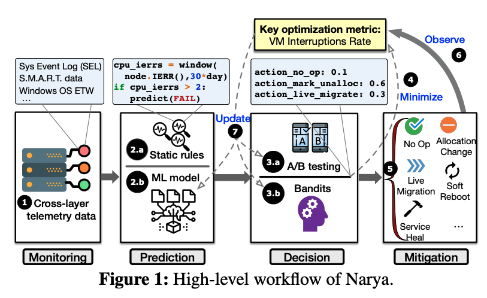

  - 预测

    - Narya的预测模块采取了静态规则和机器学习模型结合的方法。静态规则由有经验的专家编写（通常为json文件或者脚本），它们执行快，也容易理解。但是如上文所说，这些静态规则的适用范围有限，不能覆盖所有的情况。因此，Narya还使用了机器学习的方式来进行预测

      Narya使用了基于神经网络的监督学习进行错误预测。其模型如下图所示。神经网络首先从不同维度获取输入信号，同时还考虑输入信号在时间和空间上的相关性。比如，在一个RAID 0的磁盘阵列中有一个硬盘坏了，那么对于其他硬盘也会造成影响。在用不同的hidden layer对这些相关性进行处理后，神经网络最终会判断是否会出现错误

      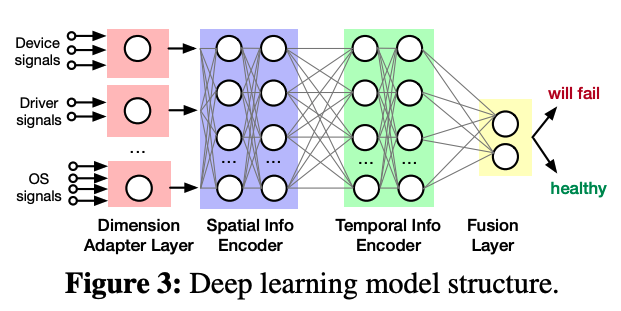

  - 决策
    - Narya采用A/B testing的方法来选择最优的缓解策略。Narya将节点分到不同的组内，每个组对应一种缓解策略。在策略执行之后，Narya会在一定时间内追踪决策对于用户体验的影响（即是否有效减少了VM服务中断的数量），并选出最优的决策。在选出决策之后，Narya会将该决策用于所有的节点，但如果发现该决策不再有效，就会重新开始新一轮的A/B testing。
    - A/B testing的方法能让Narya自适应地根据环境变化选出最优决策，但它也存在一些不足。在A/B testing的过程中，节点被静态分入了不同的测试组，在测试结束前，不管该组的决策效果多差、成本多高，它们都必须使用这种决策。这个问题被称为探索-利用难题（exploration-exploitation dilemma）。为了解决这个问题，Narya进一步将该模型建模为多臂赌博机问题（multi-armed bandits problem），在探索更好的缓解方法的同时也会考虑本次决策的成本，从而达到短期收益（当前决策）和长期收益（未来决策）的平衡。

  - 测试：Narya在微软的云平台Azure上运行了近一年的时间，并收集了足够多的数据。测试表明，Narya相比原先的静态方法，能明显降低VM的年停止服务率（定义详见论文，图中corrected表示消除了一个false positive过高的规则的影响），且对于错误的预测准确率能达到79.49%。论文还提到，随着Azure提供更多的缓解措施和更多的预测规则，Narya还能发挥更多的作用。

    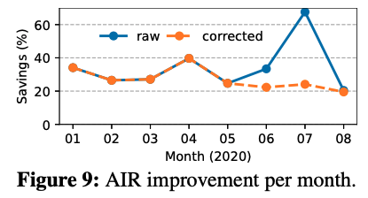

- Sundial: Fault-tolerant Clock Synchronization for Datacenters

  - 来自谷歌、哈佛大学和Lilac Cloud的研究人员共同完成的。第一作者Yuliang Li是哈佛大学的博士，在网络领域发表多篇高水平论文，毕业后去了谷歌。时钟同步是数据中心中异常重要的议题，本文提出了Sundial系统，通过软硬件结合的方式提供高精度的时钟同步，且能容忍温度变化、机器故障等因素。

- Fault-tolerant and Transactional Stateful Serverless Workflows

  - 来自宾夕法尼亚大学和罗格斯大学卡姆登分校的研究人员合作完成，第一作者是宾夕法尼亚大学的二年级博士生Haoran Zhang。Serverless被认为是未来主流的云计算模式，但是它仍然存在一些问题，本文关注的是serverless的容错机制。本文设计实现了一个serverless计算的容错系统Beldi，并支持跨函数的事务操作。

- Unearthing inter-job dependencies for better cluster scheduling

  - 来自卡内基梅隆大学的研究，数据湖（Data Lake）是一种现代的数据处理架构，在数据湖中，从属于不同组织或公司的数据处理任务将使用共享存储来共享数据，并被调度到同一系列计算资源上执行。在加速了数据共享的同时，数据湖这一结构也带来了新的问题，即隐藏的跨任务的数据依赖问题。本文提出Wing系统来解决该问题。

- RackSched: A Microsecond-Scale Scheduler for Rack-Scale Computers

  - 来自约翰-霍普金斯大学、斯坦福大学、威廉玛丽学院和加州大学四个学校共同的研究，第一作者是约翰-霍普金斯大学Hang Zhu。本文针对Scale out的策略难以达到毫秒级的低尾时延的问题，提出了RackSched，第一个在多机环境下仍能保证毫秒级单个用户请求处理延迟的调度系统。

- Thunderbolt: Throughput-Optimized, Quality-of-Service-Aware Power Capping at Scale

  - 来自谷歌的Shaohong Li等研究员的工作，本文工作提出了Thunderbolt，一个将用户需求纳入考虑的功率调控系统，以服务为粒度进行功耗控制，根据用户的设定，降低吞吐服务的计算资源以满足功耗限制，保证时延服务的计算资源以确保满足用户的SLO要求。此外，Thunderbolt还考虑到了实际场景中可能出现的功耗信息不可用的情况，对无功耗信息状况下的功耗控制进行了处理。

### Learned Index

***どこに行くのかわかりませんが、もう道を進んでいます  — 千と千尋の神隠し***

| 论文             | 问题                                     | 方法                            | 团队                                   | 会议时间  |
| ---------------- | ---------------------------------------- | ------------------------------- | -------------------------------------- | --------- |
| Learned Index    | 传统索引不能很好的感知数据特点，性能有限 | 机器学习模型替代传统索引        | Tim Kraska && Jeff Dean                | sigmod‘18 |
| FITing-Tree      | learned index空间优化                    | 分段线性函数结合树结构          | Tim Kraska                             | sigmod‘19 |
| CDFShop          | learned index没提供代码                  | RMI自动构建                     | Tim Kraska                             | sigmod‘20 |
| ALEX             | learned index只支持只读场景              | 每个模型管理自己数据&优化结构   | Tim Kraska                             | sigmod‘20 |
| MultiDimensional | learned index只支持一维数据              | space filling curve             | Tim Kraska                             | sigmod‘20 |
| RadixSpline      | learned index训练复杂                    | 条带点和基表可以一次训练构建    | Tim Kraska                             | sigmod‘20 |
| XIndex           | learned index只支持单线程，不能够并发    | 两层结构，数据分段处理          | 陈海波                                 | PPoPP‘20  |
| Xstore           | learned index在基于RDMA的KVs中缓存应用   | 构建learned cache加速RDMA       | 陈海波                                 | Osdi’20   |
| **Bourbon**      | learned index在基于LSM的KVs中的索引加速  | 用于sstable中来加速二分查找过程 | Andrea C.  &&  Remzi H. Arpaci-Dusseau | Osdi’20   |
{: rules="all"}
- OSDI‘20 两篇kv都是这个方向，侧重于应用
- 方案设计
- XIndex: A Scalable Learned Index for Multicore Data Storage，陈海波，PPoPP‘20，参考《Learned Index调研》
  - 多层次结构，模型分段，支持并行处理

