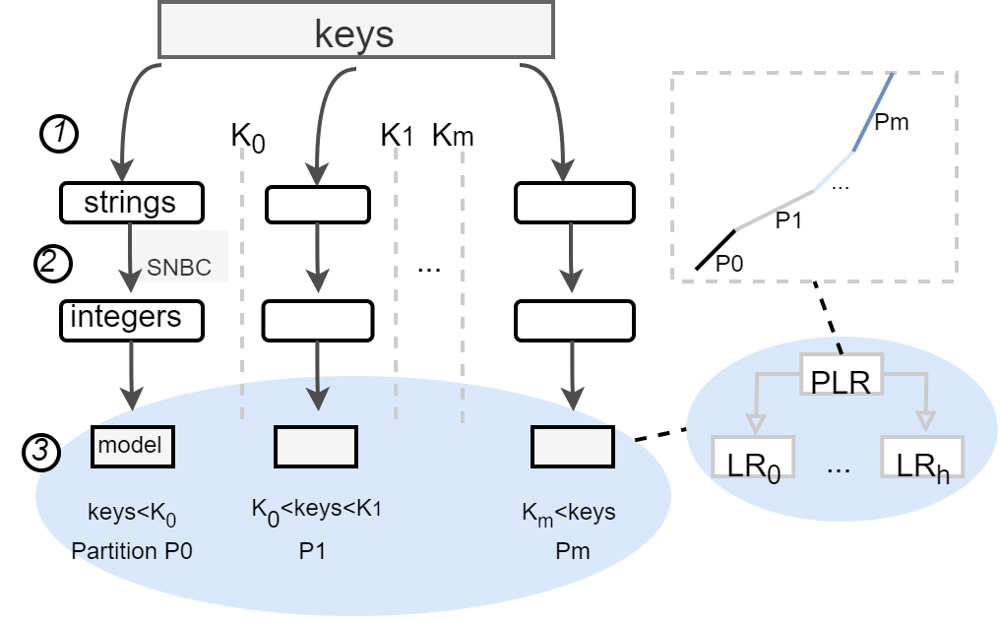

本文介绍Learned index中的string处理方案。

## 其他论文处理

- 在Bourbon的设计中并没有考虑string 的处理，在代码实现中直接使用std::stod()函数转成double类型，这样做我们认为首先效率低，其次是很多非数字字符转换会出错。

- 在google的文章中，他们采用了一套基于基数的转化方式，该方式转化方式比较靠谱，但是存在一个致命缺陷，就是当string差别比较大的时候，转换的数字非常巨大，另外在极端情况下，string长度超过8字节可能就超出double的最大范围。

- 深度学习处理
  - **tf.string**三种方法
    - hash:tf.strings.to_hash_bucket_fast，hash映射，容易冲突
    - tf.lookup:映射层
    -  使用utf-8的编码:tf.strings.unicode_decode
  - sklearn编码
    - LabelEncoder:每个唯一标签都映射到一个整数
    - One-Hot Encoder:每个标签都映射到二进制矢量
    - Learned Embedding:学习类别的分布式表示形式的地方
    - 这个处理是对不同特征之间的处理，和处理sting还是有所差距的；string拆成多个特征？

- 我们认为比较靠谱的方式是直接处理string，不用转换成数字，将string处理成训练合适的形式。分组的rmi模型

- 另外构建成本-效益模型，在模型构建太慢、预测效果很差、存储容量更大、比二分更慢的时候，不构建模型，选择原来的index block

## string的处理

- 掐头去尾，得到，hl、tl，长度len=tl-hl:（计算公共前缀hl，然后计算最长前缀tl）
  - abcd,abcf ,abde ->  cd,cf,de
  - 不定长？

- 分组:设定阈值或者设定分组数量（bl < fl）
  - 一种窗口式的取值方式，一次取fl，计算有效长度len（直到大于阈值），和训练error（直到大于阈值）
  - 倒回去bl，计算有效长度len（直到小于阈值），和训练error（直到小于阈值）

- 是否需要？（SNBC）String-Numerical-Bases  coding
  - 按键值范围区分没意义，不是很符合SNBC，比如ab，abc，bb
  -  和string字典序有悖，abc < dc，转换后num（abc）> num(dc)
  - 掐头去尾没意义
  - 超了（s_error=-1）

- RMI / PLR
- 成本-效益模型。。。。。s_error * t_error / (p_error * size )  < threshold:不使用；否则使用

