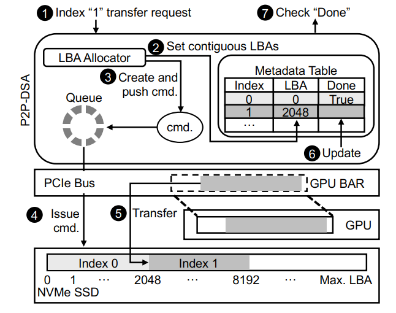

本文主要介绍优化AI的主要方向，包括三个方向:**计算**、**网络**和**存储**。重点分析两个方向:**并行训练优化**和**GPU不足**(**大batch-size**问题)。

## 1. Computation / Training

### 1.1 算法、编译优化

- 机器学习算法

- Compilation
  - [TVM(OSDI 18)](https://www.usenix.org/system/files/osdi18-chen.pdf):深度学习编译优化 

### 1.2 训练优化

- [Echo(2018.5)](https://arxiv.org/pdf/1805.08899.pdf):compiler-based optimization scheme to ensure each feature map recomputation to be effective and efficient 

- [Tofu(EuroSys 19)](https://arxiv.org/pdf/1807.08887.pdf): 自动划分模型并行，减少通信开销和显存占用 

- [ZeRO(2019.10)](https://arxiv.org/pdf/1910.02054.pdf): 主要是一些优化显存占用的方法，将模型、梯度划分到数据并行的卡上 

- [PipeDream(SOSP 19)](https://cs.stanford.edu/~matei/papers/2019/sosp_pipedream.pdf)
  - 自动划分最优的流水并行策略，保留多个版本的权重，通过调度可以填满流水线
  - 通过weight stashing避免权重更新的staleness
  - pipeline能够减少通信量，也能进行计算通信的重叠

- [(SOSP 19 workshop)](http://learningsys.org/sosp19/assets/papers/24_CameraReadySubmission_paper.pdf): a number of techniques that leverage cheap host memory to reduce GPU memory consumption during training in TensorFlow 
### 1.3  框架开发和设计

- [TensorFlow(OSDI 16)](https://www.usenix.org/system/files/conference/osdi16/osdi16-abadi.pdf)

- [Ray(OSDI 18)](https://www.usenix.org/system/files/osdi18-moritz.pdf): 针对RL应用的框架，unify training、simulation、serving

- [AliGraph(SOSP 19 workshop)](http://learningsys.org/sosp19/assets/papers/12_CameraReadySubmission_AliGraph_sosp19_camera_ready.pdf): an industrial distributed computation system for graph neural network (GNN)

- [PyTorch(2020.6)](https://arxiv.org/pdf/2006.15704.pdf)

- [BytePS(OSDI 20)](https://github.com/bytedance/byteps): 设计并实现了理论最优的分布式通信策略，其统一并泛化了PS 与 All-reduce 两种主流通 信架构，同时针对异构集群的特点，合理分配 GPU/CPU 上的工作负载，配合系统中的 RDMA 工程优化，使得实际性能也在各类主流 CV/NLP 模型上全面性能超越传统 PS 或 All-reduce 架构，例如 256 卡训练相比于 All-reduce 最高提速达 84% 

- [KungFu(OSDI 20)](https://github.com/lsds/KungFu): 自适应分布式训练系统，automate the setting of critical performance parameters 

### 1.4 具体应用

- Computation Graph
  - [TASO(SOSP 19)](https://cs.stanford.edu/~padon/taso-sosp19.pdf): 第一个自动化的计算图优化，只考虑了forward的优化 
    - Graph Substitution Generator:根据Operator Specifications枚举自动生成所有可能的图替换
    - Graph Substitution Verifier:验证得到的图替换是正确的
    - 去掉冗余的图替换
    - Graph Substitution & Data Layout Joint Optimizer:对计算图进行优化，通过枚举所有的layout和图替换，找出有优化效果的替换

- AutoML
  - [ASHA(2018.10)](https://arxiv.org/pdf/1810.05934.pdf): exploits parallelism and aggressive early-stopping to tackle large-scale hyperparameter optimization problems 
  - [Tune(ICML 18 workshop)](https://arxiv.org/pdf/1807.05118.pdf): a unified framework for model selection and training that provides a narrow-waist interface between training scripts and search algorithms

- 性能预测
  - [Daydream(2020.6)](https://arxiv.org/pdf/2006.03318.pdf): Daydream models DNN execution with a fine-grained dependency graph based on low-level traces collected by CUPTI, and predicts runtime by simulating execution based on the dependency graph. 能够模拟大多数优化技巧 
  - [Offline Profiling(2020.2)](https://arxiv.org/pdf/2002.06790.pdf): uses operation-level profiling and dataflow based simulation估计速度 

- Prediction Serving System
  - [PRETZEL(OSDI 18)](https://www.usenix.org/system/files/osdi18-lee.pdf)
    - 部署系统是一个黑箱，对可使用的优化技巧有限制，而且在其他方面也有很多限制，比如部署的服务只有在频繁使用时才能盈利
    - A set of design principles for white box model serving allowing pipelines to be optimized for inference and to share resources
  - [NEXUS(SOSP 19)](https://homes.cs.washington.edu/~arvind/papers/nexus.pdf)
    - In order to realize the promise of very low-cost processing made by accelerators such as GPUs, it is essential to run them at sustained high utilization.
    - GPU集群细粒度调度, reasoning about groups of DNN invocations that need to be coscheduled,and moving from the conventional whole-DNN execution model to executing fragments of DNNs
  - [parity models(SOSP 19)](https://dl.acm.org/doi/pdf/10.1145/3341301.3359654)
    - Predication serving systems are prone to slowdowns and failures that inflate tail latency
    - A parity model is a neural network trained to transform erasure-coded queries into a form that enables a decoder to reconstruct slow or failed predictions

- straggler worker
  - Gradient Encoding(ICML 17): 每张卡计算多个梯度，这样对整个系统来说，任意一部分机器都能够获得全局梯度的和
  - [FlexEnt(SOSP 19 workshop)](http://learningsys.org/sosp19/assets/papers/18_CameraReadySubmission_CameraReady_FlexEnt.pdf): identify the entropy present in a training batch using a set of “feature filters” and replicates only a fraction of the training data on a predetermined set of “shadow workers” 

## 2. communication

### 2.1 Algorithm Optimization

- Large Batch Training
	- LR Scaling Rules: Linear/Sqrt
	- Warmup Scheme: Gradual Warmup / LEGW
	- LARS / LAMB

- Periodic Communication
	- [Local SGD(2018.5, ICLR 19)](https://arxiv.org/abs/1805.09767): 通信频率在训练中按一定的scheme调整 
	- [Pipe-SGD(NIPS 18)](http://papers.nips.cc/paper/8028-pipe-sgd-a-decentralized-pipelined-sgd-framework-for-distributed-deep-net-training.pdf): 将gradient delay一轮，形成pipeline 
	- [CoCoD-SGD(2019.6)](https://arxiv.org/pdf/1906.12043.pdf): 解耦参数更新和通信的过程 

- Async Compensation
	- [DC-ASGD(2016.9)](https://arxiv.org/pdf/1609.08326.pdf): 估计hessian矩阵，修正延迟梯度 

### 2.2 Compression

- quantization
	- [QSGD(NIPS 17)](https://papers.nips.cc/paper/6768-qsgd-communication-efficient-sgd-via-gradient-quantization-and-encoding.pdf): 随机舍入到一个离散的值集，同时以最小方差保持期望 
	- [TernGrad(NIPS 17)](https://papers.nips.cc/paper/6749-terngrad-ternary-gradients-to-reduce-communication-in-distributed-deep-learning.pdf): 将梯度量化为-1、0、+1，g˜ = ternarize(g) = s·sign(g)·b 
	- [SignSGD(ICML 18)/ SIGNUM(ICLR 19)](https://arxiv.org/pdf/1810.05291.pdf): 只通信梯度的sign，分布式场景下通过majority vote 
	- [EF-SignSGD(ICML 19)](https://arxiv.org/pdf/1901.09847.pdf): SignSGD加上误差补偿 
	- [Natural(2019.5)](https://arxiv.org/pdf/1905.10988.pdf): 将梯度量化为2的指数倍，相当于看FP32的exponent(8bit)+符号位(1bit)

- Sparsification
	- [TimedDataflow(ICPADS 16)](https://ieeexplore.ieee.org/stamp/stamp.jsp?tp=&arnumber=7823861): PS架构的稀疏通信
	- [DGC(ICLR 18)](https://arxiv.org/pdf/1712.01887.pdf): layer-wise细粒度梯度稀疏 
	- [GradientFlow(2019.2)](https://arxiv.org/pdf/1902.06855.pdf): 块状稀疏通信 
	- [Random-K(NIPS 18)](https://papers.nips.cc/paper/7697-sparsified-sgd-with-memory.pdf): 选取random-k个，theory 
	- [Sketch-SGD(NIPS 19)](https://arxiv.org/pdf/1903.04488.pdf): 用sketch估计top-k 
	- [Variance-based(ICLR 18)](https://arxiv.org/pdf/1802.06058.pdf): 用方差而不是梯度值来稀疏 

- Decomposition
	- [GradientZIP(NIPS 19)](http://learningsys.org/neurips19/assets/papers/1_CameraReadySubmission_mlsys_grz_camera_ready.pdf)
	- [PowerSGD(NIPS 19)](https://arxiv.org/pdf/1905.13727.pdf)

### 2.3 Scheduler

- [Poseidon(ATC 17)](https://www.usenix.org/system/files/conference/atc17/atc17-zhang.pdf)
	- Wait-free Backpropagation，通信计算重叠，避免每一轮最后突发的网络流量
	- Hybrid Communication，在PS架构下选择通过根据梯度matrix选取不同的通信方法，减少通信量

- [TicTac(SysML 19)](https://mlsys.org/Conferences/2019/doc/2019/199.pdf)
	- 为PS架构的TF提出了一个通信调度方法来更smart地对通信计算进行overlap
	- 比较复杂的优先级设置方法，没有考虑TF的global barrier

- [Priority-Based Parameter Propagation(SysML 19)](https://arxiv.org/pdf/1905.03960.pdf)
	- 基于MXNet设计了P3，提高分布式训练的性能
	- Parameter Slicing 和 Priority-based Update

- [iBatch(AAAI 19)](https://www.aaai.org/ojs/index.php/AAAI/article/view/4465): 将pull paramter fuse并和forward进行overlap 

- [Preemptive All-reduce Scheduling(Infocom 20)](https://i2.cs.hku.hk/~cwu/papers/yxbao-infocom20.pdf)
	- 问题:加速DDNN训练，tensor的sub-optimal粒度对训练造成的影响
	- 在MXNet上，AllReduce方式的抢占式调度，tensor partition 和 fusion

- [ByteScheduler(SOSP 19)](https://i.cs.hku.hk/~cwu/papers/yhpeng-sosp19.pdf)
	- 为不同框架(TF、PT、MX)提供统一的调度抽象dependency proxy，layer-wise out-of-engine dependencies
	- 为不同系统架构(PS、AllReduce、不同的DNN、带宽)设置自动最优的参数auto-tuning algorithm based on Bayesian Optimization
	- 优先级设置较为简单

### 2.4 Logical Architecture

- PS / AllReduce / Decentralized

- [GossipGraD(2018.3)](https://arxiv.org/pdf/1803.05880.pdf): 每一轮只进行一次点对点的通信，每一轮改变通信的partner，通过多轮通信将梯度扩散到全局 

- [Prague(ASPLOS 20)](http://alchem.usc.edu/~qinyi/download/prague.pdf): 在异构集群利用partial allreduce通信，每一轮的通信是多个不同的group 

### 2.5 communication library 

- [MLNET(HotCloud 15)](https://www.usenix.org/system/files/conference/hotcloud15/hotcloud15-mai.pdf): 针对PS架构的一个communication layer，traffic reduction和traffic management 

- [Hoplite(2020.3)](https://arxiv.org/pdf/2002.05814.pdf): 一个新的communication layer，主要针对RL应用不同机器完成时间不一样减少通信同步的等待时间 

### 2.6 Software & Hardware/System co-design

- [Parameter hub(SoCC 18)](https://arxiv.org/pdf/1805.07891.pdf): Software & Hardware co-design，通信方面

- [EFLOPS(HPCA 20)](https://sci-hub.tw/10.1109/HPCA47549.2020.00056): Algorithm & System co-design 

## 3. Stoage

### 3.1 Cluster Scheduler

- [CherryPick(NSDI 17)](https://www.usenix.org/system/files/conference/nsdi17/nsdi17-alipourfard.pdf): 通过贝叶斯优化为大数据分析选取最合适的云服务器configuration(cheapest & fastest)

- [Gandiva(OSDI 18)](https://www.usenix.org/system/files/osdi18-xiao.pdf): 针对深度学习训练任务的GPU集群调度器，support neural model exploration in a multi-job, finding accurate neural models，提高集群利用率 

- [Optimus(EuroSys 2018)](https://i.cs.hku.hk/~cwu/papers/yhpeng-eurosys18.pdf): 预测深度学习任务训练完成时间来动态调度资源，减少job completion time 

- [Tiresias(NSDI 19)](https://www.usenix.org/system/files/nsdi19-gu.pdf)
  - Naive scheduling due to unpredictable training time，Over-aggressive consolidation during placement
  - 设置优先级，rofile对网络是否敏感，根据结果设置placement strategy

- [Towards GPU Utilization Prediction(HotCloud 20)](https://eprints.lancs.ac.uk/id/eprint/144290/1/HotCloud20_GPU_Prediction.pdf): 通过模型的计算图预测而不是profile得到训练负载、GPU利用率，进而做调度 

- [JPAS(JNCA 20)](https://www.sciencedirect.com/science/article/abs/pii/S1084804520300643): 通过设置优先级调度任务，减少早期训练时间，加速超参搜索、NAS等可以根据前期结果调整训练过程的任务 

- [THEMIS(NSDI 20)](https://www.usenix.org/system/files/nsdi20-paper-mahajan.pdf): ML任务对GPU位置是敏感的，而且运行时间很长，THEMIS的GPU分配策略确保训练完成时间公平 

### 3.2 显存管理

- [PRmalloc(SOSP 19 workshop)](http://learningsys.org/sosp19/assets/papers/9_CameraReadySubmission_TF_allocator_sosp19_camera_ready.pdf): leverages the domainspecific knowledge to better cache and reuse large memory blocks, cutting down the system overhead of memory allocation and saving memory footprint significantly 

- [Intelligent Store(SOSP 19 workshop)](http://learningsys.org/sosp19/assets/papers/15_CameraReadySubmission_camera-ready.pdf): optimization of the data path with zero-copy messaging, and avoiding suprious copying and locking. 

### 3.3 异构集群

- [OverSeer(SOSP 19 workshop)](http://learningsys.org/sosp19/assets/papers/7_CameraReadySubmission_AI_system_camera_ready_v1.pdf): a topologyand hardware-agnostic end-to-end system, that uses a novel partitioning algorithm to efficiently utilize different computational capabilities present in heterogeneous devices.

### 3.4  容量问题

- Behemoth、FlashNeuron(Fast 21)

## 4. 重点分析

### 4.1 PipeDream: Generalized Pipeline Parallelism for DNN Training 

- 训练优化的典范

- 数据并行和模型并行

  - 数据并行:就是把训练集分成多份，交给多个复制过的神经网络进行训练。每个神经网络训练完一个迭代后，会提交自己对权重的更新(w1、w2、w3)，这些更新会在经过汇总后再发回给各个神经网络(W):

  - 模型并行:由于时下的深度学习对训练的精度要求越来越高，模型的规模本身也在不断增大。于是就出现了将模型本身进行划分，每台机器只负责一部分模型训练的模型并行方法:

    

  

- 咔嚓！

  - PipeDream:两者结合。PipeDream在这两种并行方式的基础上，采取了“流水线并行”(pipeline parallelism)的思路。PipeDream依然把模型按层次分割开来(模型并行)，但会连续发送多组数据(数据并行)，以流水线的形式进行训练。

    

- 问题

  - 问题1:流水线的每个步骤需要具有相近的处理效率，如果有一个步骤处理特别缓慢，就会导致其他步骤被卡住。因此，PipeDream提出了一套划分DNN，使总处理时间最短的算法。假设我们把模型一分为二，那么总处理时间应当等于两部分处理时间之和加上两部分之间传输数据的通信时间。这是个具备最优子结构性质(optimal sub-problem property)的问题，可以用动态规划来解，而每一层的处理时间则可以通过跑一些样本数据来获取。
  - 问题2: DNN与其他场景不同的是，它存在backward和forward两个pass，而这两部分的执行时间往往并不相同。幸运的是，通过考虑总worker数量和第一个划分(接收输入)的worker数量，PipeDream可以简单地计算出流水线可以容纳的数据组数(在上面例子里是4个)。同时，PipeDream采用了1F1B的执行策略，即每个worker交替地执行forward pass和backward pass,这样即使在两个pass执行时间不同的情况下也能维持平衡。
  - 问题3: 由于现在同时有多组数据在流水线中处于活跃状态，PipeDream需要考虑一致性问题。如果不考虑一致性，任由流水线更新权重，那么每个worker的更新就会变得混乱，训练出的模型精度也受到威胁。PipeDream认为，模型训练应该满足一个原则:backward pass和forward pass使用的模型参数应该相等。为了满足这个原则，每个worker会在执行forward pass时存下来当前的模型参数，等执行对应数据组的backward pass时使用已经存好的参数进行计算。这个方法使PipeDream能够在充分并行的情况下保证模型的精度。

- 测试:从结果来看，PipeDream在不损失精度的前提下，能相比传统的DNN系统提高最多5.3倍的性能。总的来说，PipeDream使用了系统中的经典模型流水线来优化深度学习，算是System for AI的代表作品。

### 4.2 FlashNeuron: SSD-Enabled Large-Batch Training of Very Deep Neural Networks  

- Memory Manager

  - **管理GPU内存空间(分配和回收)、避免碎片化、预取、tensor压缩、降低精度**等等
  - 自定义内存分配器首先预留整个GPU内存空间，并自行管理内存分配/重分配
    - 当 i)一个张量在正向传播过程中首次创建或  ii)一个卸载的张量在向后传递过程中从SSD预取到内存时，就会分配张量
    - 另一方面，当i)一个张量完全从内存卸载到SSD，或者 ii)一个张量在迭代期间不再被任何层使用时，张量被重新分配
    - 引用计数for寿命(PyTorch自带)
  - 避免碎片化
    - 如果从一开始就为所有张量分配内存地址，由于只有一些张量被卸载到ssd上，可能会出现严重的内存碎片，从而有效地在GPU物理内存地址空间中制造洞
    - 为了避免这个问题，从内存地址空间的最低端分配内存常驻(即未卸载)张量，从内存地址空间的最高端分配临时(即已卸载)张量。由于临时数据在向前传递期间的生命周期很短，因此只使用了很小一部分内存地址空间
  - Managing Offloading and Prefetching   
  - CSR压缩仅适用于ReLU的输出张量(43%至75%稀疏度)，由于张量是一个多维矩阵，我们把张量转换成一个二维矩阵，它的列是128个条目。将存储每个元素的列索引的向量(通常称为JA向量)替换为一组bits向量，其中每个bit向量表示一行的一组非零元素

   

  

  大小a = 原大小b -  非零个数m * 8 + 总数n * 1

  a < b 需要 m > 1/8 * n，即1/8以上都是零，能够减少空间，ReLU的输出张量大部分都满足

  - 对卸载张量使用半精度浮点数(FP16) 
    - 神经网络可以容忍一定程度的精度损失，而不会显著降低最终模型的精度
    - 在前向传播期间，Memory Manager首先将卸载的张量转换为FP16格式(从FP32)，然后将它们存储在SSD中。稍后，在向后传播过程中，卸载的FP16张量将被预取、填充到FP32

- Offloading Scheduler  

  - 原则

    - 它应该卸载足够的张量，以便GPU能够在目标批处理大小下正确运行，而不会触发内存溢出错误
    - 避免从GPU到SSD的数据传输过多(反之亦然)，从而最大限度地减少张量卸载导致的迭代时间的增加

  - 它首先执行一个分析迭代，在这个迭代中，所有在前向传播过程被缓冲的张量(每一层输入和中间结果)卸载到SSD中，使得系统可以运行大batch-size。分析迭代中收集:

    - i) 每个缓冲张量的大小，
    - ii) 卸载每个缓冲张量所需的时间，
    - iii) 使用CSR的张量的预期压缩比(压缩稀疏行)格式和半精度浮点转换，
    - iv) 前向和后向传播的执行时间(不包括张量卸载时间)，
    - v) 其他内存驻留对象的总大小(例如，权重，临时工作空间)。

  - 此分析迭代完成后，将在此迭代期间收集的信息传递给Offloading Scheduler，

    - 阶段一:Linear Tensor Selection
      - 调度程序将迭代选择一定数量的张量从一开始直到未选择的张量的总大小加上其他驻留内存的对象的总大小(即权重和临时工作空间)变得小于GPU的总内存大小
      - 调度器检查总数据传输时间(通过对单个张量卸载时间的累加计算得出)是否小于向前传递中所有层的总执行时间
      - 如果满足这个条件，调度程序就会采用这个调度并停止，因为它可以通过调度将张量卸载与层计算完全重叠。如果没有，卸载调度程序将进入第二阶段。
    - 阶段二:Compression-aware Tensor Selection
      - 调度程序排除了从阶段1中选择的最后一个不可压缩张量。它被替换为一个或多个在尚未选择的张量中具有最高预期压缩比的张量，这样，新选择的张量的大小就超过了排除的张量的大小
      - 然后，它重新计算预期的总数据传输时间，假设压缩张量取原始卸载时间反比(与压缩比成反比)。如果此总传输时间没有超过正向传递的总执行时间，则调度器将停止
      - 否则，它将重复这个过程，直到条件满足或不存在压缩友好张量为止

    

- Peer-to-Peer Direct Storage Access  

  - P2P-DSA建立在 GDRCopy 和 SPDK 的基础上，GDRCopy是基于NVIDIA GPUDirect技术的GPU内存快速拷贝库，该技术可以让GPU内存直接被其他PCIe外设备访问

  - 为了维护卸载到ssd的每个张量元数据，P2P-DSA包含一个元数据表，该表由一个long LBA值和一个boolean组成，用于检查I/O完成情况 

  - 流程:

    - **1.**P2P-DSA从传输请求中获取索引、缓冲区和方向(写)信息

    - **2.**调用逻辑块地址(LBA)分配器来在单个SSD设备或多个SSD设备(当使用多个SSD块提高卸载/预取带宽)上分配一组连续的，从LBA分配器分配的第一个块的LBA在元数据表的适当位置更新

    - **3.**P2P-DSA为每个逻辑块创建一个命令，然后将其放入命令队列。这里的NVMe命令包含 i)源地址(GPU内存地址由GPUDirect转换为PCIe总线地址)和 ii)设备地址(使用元数据表中的LBA计算)

      

      update:

    - **4.**命令队列中的命令被获取并发给NVMe SSD，只要NVMe设备提交队列有空间

    - **5.**NVMe SSD设备将执行这些请求，并在SSD设备与GPU之间直接进行数据传输。稍后，这些转移请求将被完成，并且它们的状态将在NVMe设备完成队列

      再次update

    - **6.**清除完成队列并通过设置相应的完成位来更新元数据表

    - **7.**如果应用程序调用done，对于已经卸载的张量，它将返回true

    - 反向传播(从SSD预取数据到GPU内存)的操作与此类似，不同的是: i)从元数据表中读取LBAs，而不是分配LBAs;  ii)发出读命令，而不是写命令。在卸载和预取情况下，大多数数据访问都是顺序访问，这在吞吐量和持久时间上比随机访问更有利

- 优化思考

  - 效率是否高？性能如何？:测试验证

  - 选择卸载和预取策略能否优化？

  - 并行化处理，使用更高性能的NVM

  - 如何更好的分配和使用GPU、NVMe