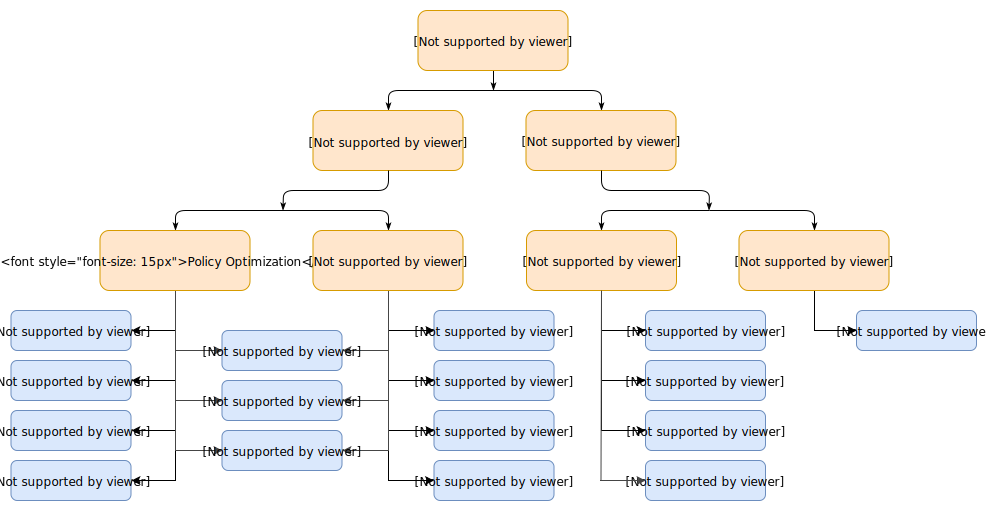
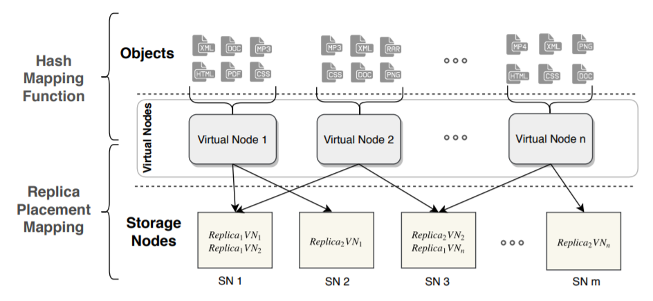

# Replica Placement 

> **不要温顺地走入那个良宵, 老年应当在日暮时分燃烧咆哮。— 迪伦·托马斯**

[TOC]

## 背景

- 问题（Ceph-Crush 问题）
  - 问题1: 不可控迁移, 迁移量是理论下限的h倍（h为分层结构的层数）
  - 问题2: 不够均衡, CRUSH输入的样本容量不够、副本机制的缺陷
  - 问题3: 选择存储节点时, 仅以节点存储容量为唯一选择条件, 并没有考虑其他因素（到网络和节点
    的负载状况等等）

- 方案: 做两套
  - 靠谱的: 真正可控可靠均匀的机制, 额外代价
    - Crush算法优化
    - balancer、upmap研究和优化
  - 不靠谱的: 发论文, 先进算法, 恐有奇效
    - 算法: 分布算法（见[load balancing.md](2021-04-12-数据分布和负载均衡.md)）, 策略调度（图分割、ML、RL）
    - Replica Placement with RL

## RL简介

- **Reinforcement Learning: An Introduction**, 用于解决基于MDPs的序贯决策问题。[OpenAI](https://spinningup.openai.com/en/latest/index.html)

- 强化学习的设置由两部分组成, 一个是智能体（agent）, 另一个是环境（environment）, 智能体在每一步的交互中, 都会获得对于所处环境**状态**的观察（有可能只是一部分）, 然后决定下一步要执行的动作。环境会因为智能体对它的**动作**而改变, 也可能自己改变。智能体也会从环境中感知到**奖励**信号, 一个表明当前状态好坏的数字。智能体的目标是最大化累计奖励, 也就是**回报**。强化学习就是智能体通过学习来完成目标的方法。

  

  

- 基本要素

  - 状态空间（State）: 环境返回的当前情况
  - 动作空间（Action）: 智能体根据当前状态决定下一步动作的策略
  - 奖赏（Reward）: 环境的即时返回值, 以评估智能体的上一个动作
  - 策略、运动轨迹、值函数、Advantage Functions等等

- 发展, 原文总结

  - **ing**
  - 基于Value
    - On-Policy
    - Off-Policy
  - 基于Policy

  

- 分类, OpenAI的总结

  

  - 用的最广的还是Q-Learning、Sarsa、DQN
  
- Q-Learning

  - Q-learning 是一种记录行为值 (Q value) 的方法, 每种在一定状态的行为都会有一个值 Q(s, a)

  - Q table是一种记录状态-行为值 (Q value) 的表

    

  - Q value的更新是根据贝尔曼方程

- Sarsa

- DQN

## 系统结构领域应用

### Park: An Open Platform for Learning-Augmented Computer Systems

- Tim Kraska, NeurIPS 2019, https://github.com/park-project/park

- 背景：计算机系统很多问题本质上是序列决策问题，可以定义成马尔科夫决策过程(MDP)；这样，强化学习就提供了一种解决方案。一个挑战是计算机系统有很多细节。而Park是一个开放平台，用来学习增强的计算机系统；同时，把计算机系统的细节掩盖了起来，这样，机器学习研发人员就可以专注于学习算法

- 类似于Open AI Gym，Park为广泛的计算机系统问题提供了环境，包括：1）自适应视频流 (Adaptive video streaming)；2）Spark集群任务调度 (Spark cluster job scheduling)；3）SQL数据库查询管理 (SQL database query optimization)；4）网络拥塞控制 (Network congestion control)；5）网络主动队列管理 (Network active queue management)；6）Tensorflow设备安排 (Tensorflow device placement)，7）电路设计 (Circuit design)；8）内容分发网络(content delivery networks, CDN)内存高速缓存 (CDN memory caching)；9）多维数据库索引 (Multi-dim database indexing)；10）帐户地区分配 (Account region assignment)；11）服务器负载均衡 (Server load balancing)；以及，12）交换器调度 (Switch scheduling)

- 提供12个计算机系统中应用场景

  | Environment                     | env_id                         | Committers                       |
  | ------------------------------- | ------------------------------ | -------------------------------- |
  | Adaptive video streaming        | abr, abr_sim                   | Hongzi Mao, Akshay Narayan       |
  | Spark cluster job scheduling    | spark, spark_sim               | Hongzi Mao, Malte Schwarzkopf    |
  | SQL database query optimization | query_optimizer                | Parimarjan Negi                  |
  | Network congestion control      | congestion_control             | Akshay Narayan, Frank Cangialosi |
  | Network active queue management | aqm                            | Mehrdad Khani, Songtao He        |
  | Tensorflow device placement     | tf_placement, tf_placement_sim | Ravichandra Addanki              |
  | Circuit design                  | circuit_design                 | Hanrui Wang, Jiacheng Yang       |
  | CDN memory caching              | cache                          | Haonan Wang, Wei-Hung Weng       |
  | Multi-dim database indexing     | multi_dim_index                | Vikram Nathan                    |
  | Account region assignment       | region_assignment              | Ryan Marcus                      |
  | Server load balancing           | load_balance                   | Hongzi Mao                       |
  | Switch scheduling               | switch_scheduling              | Ravichandra Addanki, Hongzi Mao  |
  
- 用强化学习解决计算机系统问题会遇到几个维度的挑战：1）全局或分布式控制；2）快速控制环路或规划；以及，3）真实系统或仿真。有些环境在后台用真实系统。而对于其它环境，在对系统动态深入了解的基础上，设计了仿真程序

- 现成的强化学习算法不一定能直接工作，由于一些挑战：1）输入驱动的变化(input-driven variance)，2）状态表征 (state representation)，3）动作表征 (action representation)，4）无限长的时间范围 (infinite horizon)，5）仿真现实差距 (simulation reality gap)，6）交互时间慢 (slow interaction time)，7）稀疏空间探索 (sparse space for exploration)，8）安全探索 (safe exploration)

- Server load balancing

  - 任务分配给不同服务器, 使得负载均衡, 并且每个任务运行时间短
  - S: 当前服务器的负载, 进来的任务的大小
  - A: 分配给任务的服务器ID
  - R: 每个任务运行时间的惩罚
  - 每步时间: 1ms
  - 挑战: 1、4、8

### 1. 数据库

- 很多过程都可以使用机器学习或者强化学习算法

### An End-to-End Automatic Cloud Database Tuning System Using Deep Reinforcement Learning 

- 数据库数据调参存在的问题

  - 首先，他们采用流水线学习模型，前一阶段的最优解不能保证其后阶段的最优解，并且模型的不同阶段可能无法很好地协同工作，**不能以端到端的方式优化整体性能**
  - 其次，他们依赖**难以获得的大规模高质量培训样本**，云数据库的性能受各种因素的影响，例如内存大小，磁盘容量，工作负载，CPU模型和数据库类型。很难再现所有条件并积累高质量的样本
  - 第三，**在连续空间中有大量的旋钮**，它们之间存在看不见的依存关系，因此无法在这种高维连续空间中推荐合理的配置
    - 不能仅通过使用高斯过程（GP）回归OtterTune之类的回归方法来优化高维连续空间中的旋钮设置，因为旨在在连续空间中找到最佳解决方案的DBMS配置调整问题是NP-hard
    - 而且，旋钮处于连续的空间中并且具有看不见的依赖性，性能不会在任何方向上单调变化。此外，由于参数空间的连续可调，旋钮的组合数不胜数，因此很难找到最佳解决方案。
  - 最后，在云环境中，它们几乎无法应对硬件配置和工作负载的变化，并且**适应性较差**

- CUBTune

  - **深度RL学习**和**推荐数据库配置**的端到端自动数据库调整系统
  - 采用**试错法**来学习有限数量样本的旋钮设置，以完成初始训练，从而减轻了收集大量高质量样本的难度
  - 在RL中设计了有效的**奖励反馈机制**，可启用端到端的调整系统，加快模型的收敛速度，并提高调整效率
  - 利用**深度确定性策略梯度法**（DDPG）在高维连续空间中找到最优配置
    - DDPG 在 DPG 的基础上结合了 DQN 的理念，能够处理高维（high-dimensional）、连续动作空间（continuous action spaces）问题
    - Continuous control with deep reinforcement learning，2015，被引用5654，但未发表

- CDBTune工作机制

  -  Offline Training
    - 训练数据<q,a,s,r>，其中q是一组查询工作负载（即SQL查询），a是一组旋钮及其在处理q时的值，s是数据库状态（这是63个指标的集合）在处理q时，r是处理q时的性能（包括吞吐量和延迟)，所有收集的度量和旋钮数据将存储在内存池中
    - 训练模型：RL模型
    - Training Data Generation，一开始生成一些负载训练，后面在实际使用过程中调整训练
      - Cold Start，由于离线培训过程开始时缺乏历史经验数据，因此我们利用标准的工作负载测试工具（例如Sysbench）来生成一组查询工作负载。然后，对于每个查询工作量q，我们在CDB上执行它并获得初始值。然后，我们使用上述的尝试和错误策略来训练四元组并获得更多的训练数据
      - Incremental Training 增量训练 ，在稍后的CDBTune实际使用期间，对于每个用户调整请求，我们的系统都会根据CDBTune推荐的配置不断从用户请求中获取反馈信息。随着逐渐将更多真实的用户行为数据添加到训练过程中，CDBTune将进一步加强模型并提高模型的推荐准确性
  - Online Tuning
    - 如果用户要调整数据库，则只需向CDBTune提交调整请求，该请求与现有的调整工具（如OtterTune和BestConfig）一致。一旦收到用户的在线调整请求，CDBTune就会在最近约150秒内从用户那里收集查询工作量q，获取当前旋钮配置a，并在CDB中执行查询工作量以生成当前状态s和性能r。接下来，它使用通过离线训练获得的模型进行在线调整。最终，将向用户推荐与在线调整中的最佳性能相对应的那些旋钮。如果调整过程终止，我们还需要更新深度RL模型和内存池

  

- 系统架构

  - Workload Generator：生成标准工作负载测试和重播当前用户的实际工作负载
  - Metrics Collector：在根据调整请求调整CDB时，我们将收集并处理指标数据（目前63个指标），这些数据可以捕获特定时间间隔内CDB运行时行为的更多方面
  - Recommender：当深度RL模型输出推荐的配置时，推荐器将生成相应的执行设置参数命令，并将修改配置的请求发送到控制器。在获得DBA或用户的许可后，控制器将上述配置部署在CDB的实例上
  - Memory Pool：使用内存池来存储训练样本

- RL 模型

  - 刚开始使用Qlearning和DQN模型，但是这两种方法都无法解决高维空间（数据库状态，旋钮组合）和连续动作（连续旋钮）的问题。最终，我们采用了基于策略的DDPG方法，该方法有效地克服了上述缺点
  - agent：可以看作是调优系统CDBTune，它从CDB接收奖励（即性能变化）和状态，并更新策略以指导如何调整旋钮以获得更高的奖励（更高的性能）
  - 环境：环境是调整目标，特别是CDB的实例
  - 状态：指agent的当前状态，即63个指标。具体来说，当CDBTune建议一组旋钮设置并由CDB执行时，内部度量标准（例如一段时间内收集到的从磁盘读取或写入磁盘的页面的计数器）代表CDB的当前状态。通常，我们将时间t处的状态描述为St
  - 奖励：奖励是描述为St的标量，它表示在时间t处的性能与在t-1处的性能（或初始设置）之间的差异，即CDB执行CDBTune在时间t推荐的新旋钮配置之后/之前的性能变化
  - 动作：旋钮配置的空间，通常被称为At。此处的动作对应于旋钮调整操作，CDB在相应状态下根据最新策略执行相应的操作。请注意，操作是一次增加或减少所有可调旋钮的值
  - 策略：策略µ(st) 定义CDBTune在某些特定时间和环境下的行为，这是从状态到操作的映射。换句话说，在给定CDB状态的情况下，如果调用了某个动作（即旋钮调整），则该策略通过将动作应用于原始状态来保持下一个状态。这里的策略是深度神经网络，该网络保留输入（数据库状态），输出（旋钮)以及不同状态之间的转换。 RL的目标是学习最佳策略。
  - RL的训练和调整，理论知识，Q-learning、DQN，两种比较和不足

- DDPG和奖励函数

  - **ing**

  ​	

- 测试

  - 对比Sysbench，MySQL-TPCH和TPC-MySQL

    

- 优势

  - 基于腾讯数据库平台和数据集，实现了完整的系统，已上线
  - 思路清晰，框架简洁，非常完备，实用性强，效果不错

### 2. 集群调度

### Device Placement Optimization with Reinforcement Learning  

### 3. cache

### Learning Cache Replacement with Cacheus  

- 缓存算法面对当前复杂环境并不完美

  - 缓存算法在某些工作负载下表现良好，但在其他工作负载下却表现不佳
  - 缓存算法在某些缓存大小下表现良好，但在其他缓存大小下不一定表现良好

- **工作1：分析负载特征，总结了四种缓存负载类型:** LRU-friendly, LFU-friendly, scan, and churn

  - 5个数据集，329traces

    

    - LRU-friendly: 由访问序列定义的LRU友好型，该访问序列最好由 LRU 缓存算法来处理
    - LFU-friendly: 由访问序列定义的LFU友好型，该访问序列最好由 LFU 缓存算法处理
    - scan: 扫描由访问序列定义，其中存储项的子集只被访问一次
    - churn: 是指重复访问存储的项目子集，并且每个项目都有相同的访问概率
      - 随着缓存大小的变化，单个工作负载的原语类型可能会发生变化。LRU-friendly类型的工作负载在缓存大小C1可以在缓存大小为C2 < C1时转换为Churn类型。当工作负载的lru友好工作集中的项在被重用之前开始从缓存中删除时，就会发生这种情况

  - 图1是来自FIU跟踪收集的topgun(第16天)工作负载的访问模式，图2是各个数据集中四种负载情况

    

  - 图3是各种缓存算法对四种负载的支持，Adaptive Replacement Cache (ARC)  ，Low Interference Recency Set (LIRS)，Dynamic LIRS (DLIRS) ，Learning Cache Replacement (LeCaR)  

- **工作2：提出Cacheus ，adaptive的LeCaR的缓存算法**

  - 现在最先进的缓存算法各种负载下表现性能不一

    

  - LeCaR（HotStorage’18）是一种基于机器学习的缓存算法，使用**强化学习**和**遗憾最小化算法**，动态控制地使用两个缓存替换策略LRU和LFU。在实际工作负载的小缓存大小下，LeCaR的性能优于ARC。然而，LeCaR在适应性、开销和不友好等方面存在缺陷

    - LeCaR **ing**

  - LeCaRe无法很好处理Scan和Churn负载，并且学习率固定

  - Cacheus ：很好的支持四种负载，并且学习率可动态调整

    - **ing**

- **工作3：两个轻量化CR-LFU和SR-LRU的设计**

  - 这些组合在一起可以解决广泛的工作负载原语类型。CR-LFU给LFU加入churn resistance，SR-LRU给LRU加入scan resistance  

- 总结一下

  - 分成四种负载LRU-friendly、LFU-friendly、churn、scan
  - **LRU算法对LRU-friendly、churn负载友好，对LFU-friendly、scan不好；LFU算法相反**
  - **LeCaR控制使用LRU和LFU算法，但是不能很好支持scan和churn**
  - **Cacheus 加入SR-LRU使LRU支持scan，CR-LFU使LFU支持churn，并且可以动态调整学习率**

- 性能表现

### 3. 组合优化-NP难问题

### 4. 芯片设计

### 5. 增强数据, 优化机器学习

## Replica Placement

### An adaptive replica placement approach for distributed key‐value stores

- Concurrency and Computation: Practice and Experience, C类期刊
- 问题抽象

- 方案建模

          

- 要求

  - 第一个要求是它必须健壮地适应不同的工作负载模式
  - 我们的模型必须调整自身以适应当前的硬件设置

- 强化学习模型

  - 状态空间

    

    - SNnget: 当前存储节点n中负载, 将v和s的建立映射表, SNnget等于横向之和

      

    - SNnlatency: 是存储节点n响应一个数据请求所需的平均时间

    - MigrationLoad是一个整数, 表示针对R的Get请求的总和, 其中R是一组要迁移的副本

  - 动作空间

    - 操作集合A由存储节点的索引j2n表示, 当前的MigrationLoad将被分配给该节点

  - 奖励定义

    

### 问题抽象

- 副本放置问题: M个数据存到到N个机器上, 每个数据R个副本在不同机器上, 下图中R=2

  ​	

  - 目标: 1. 每个机器上的数据尽量均匀
  - 后续保证: 2. 每个机器上的主副本尽量均匀；3. 机器异构环境

- 具体到Ceph

  

### 强化学习建模

- **ing**
- 如何建模, 选择模型, 训练加速, 结果调优, 挑战解决
- 组件: 适用各种数据分布场景 /  针对Ceph特定场景
- 基本

## 参考文献

1. Reinforcement Learning: An Introduction
2. Park: An Open Platform for Learning-Augmented Computer Systems
3. 

 A ControlTheoretic Approach for Dynamic Adaptive Video Streaming over HTTP

Neural adaptive video streaming with pensieve. 

Oboe: auto-tuning video abr algorithms to network conditions

RL在存储系统中的研究

- 问题和挑战
  - 输入驱动的变化 (input-driven variance)
  - 状态表征 (state representation)
  - 动作表征 (action representation)
  - 无限长的时间范围 (infinite horizon)
  - 仿真现实差距 (simulation reality gap)
  - 交互时间慢 (slow interaction time)
  - 稀疏空间探索 (sparse space for exploration)
  - 安全探索 (safe exploration)

- RL for sys 框架平台: **Park(NeurIPS'19)**, 12个相关应用
  - 自适应视频流 (Adaptive video streaming)
    - Neural adaptive video streaming with pensieve, SIGCOMM’17
    - Oboe, ACM Special Interest Group on Data Communication'18
  - Spark集群任务调度 (Spark cluster job scheduling)
    - Resource management with deep reinforcement learning, HotNets'16
    - Auto, ACM Special Interest Group on Data Communication'18
    - Learning scheduling algorithms for data processing clusters,18
  - SQL数据查询优化 (SQL database query optimization)
    - Learning to optimize join queries with deep reinforcement learning, 18
    - Learning state representations for query optimization with deep reinforcement learning, 18
    - A learned query optimizer, 19
  - 网络拥塞控制 (Network congestion control)
    - A hierarchical framework of cloud resource allocation and power management using deep reinforcement learning, ICDCS'17
  - 网络主动队列管理 (Network active queue management)
  - Tensorflow设备放置 (Tensorflow device placement)
    - Device placement optimization with reinforcement learning, ICML'17 
    - A hierarchical model for device placement, International Conference on Learning Representations'18
    - Spotlight: Optimizing device placement for training deep neural networks, ICML'18
    - Placeto: Efficient progressive device placement optimization, NIPS'18
  - 电路设计 (Circuit design)
    - Transferable automatic transistor sizing with graph neural networks and reinforcement learning, 19
    - Learning to design circuits, 19
  - CDN内存缓存 (CDN memory caching)
  - 多维数据库索引 (Multi-dim database indexing)
  - 账户地区分配 (Account region assignment)
  - 服务器负载均衡 (Server load balancing)
  - 交换器调度 (Switch scheduling)
    - Heavy traffic queue length behavior in a switch under the maxweight algorithm. Stochastic Systems'16
- 数据库系统调参
  - Auto-Tuning, ATC'18; Online Reconfiguration, SOPHIA (ATC'19)
  - Heterogeneous Configuration Optimization, Selecta (ATC'18); OPTIMUSCLOUD (ATC'20)
  - **Database Tuning System, SIGMOD'19**
- 分布式系统
  - Data Processing Clusters, SIGCOMM'19
  - Device Placement Optimization, ICML'17
  - **Replica Placement in KV stores**, Concurrency and Computation: Practice and Experience'20
- Cache Replacement 
  - LeCaR, HotStorage'18
  - **Cacheus, Fast'21**
  - Deep Reinforcement Learning-Based Cache Replacement Policy, 20
  - An Imitation Learning Approach for Cache Replacement, ICML'20
- 组合优化-NP难问题; 芯片设计: Chip Design, ISSCC'20
- For us
  - 重点：Park, Tuning, Replica Placement, Cacheus....
  - 场景：Replica Placement ?，Others: Cache ?  Auto-tuning ?

结合RL的数据分布算法设计

- 简单实现了两个版本，可以达到不错的均匀分布，支持副本，暂不支持迁移，具体见https://confluence.sensetime.com/pages/viewpage.action?pageId=270923169

- 两种思路：1）RL作为映射算法 和 2）RL作为辅助，调整原有映射算法
- 环境定义（park），模型实现（tensorflow）
- **实现1：RL训练出放置策略，action space即为mapping策略**
  - 简单实现，目前支持映射均匀性、副本机制、增删pg节点（n->m），**一致性 、扩容暂不支持**

    - spcae：各osd的容量状态，{weight0，weight1，...，weightm}
    - action：{osd0，osd1，...，osdm}
    - reward：各osd容量标准 / 前后标准差变化 / 极差
    - policy : 当前状态下选择的action，是训练结果
    - 模型：当前实现Q-learning和DQN
    - 实现和效果
      - 多次迭代训练，选择效果最佳的结果
      - 1000pg，10osd，3副本，mapping选择另存：可以实现多副本的较平均的分布（标准差2左右）
  - 问题1：如何映射？
    - 巨大问题：每次得到状态不一致
    - 方式1：将映射关系建表
    - 方式2：分类问题？区分pg id
  - 问题2：状态过多，空间爆炸；训练精度不足，需要训练很久？

    - n ^ m (1000 ^ 10 = 10 ^ 30)
    - 改善模型、改善状态定义...
    - DQN中模型选择：目前使用的MLP，结合RNN、CNN？
    - 训练参数调整，Offline Training

  - 问题3：如何支持增删osd

    - 减少节点m：控制action不能等于m，就可以均匀分布到其他osd；但是两次映射差距甚大...

    - 增加节点：space和action都要变，模型需要重新训练？另外重新训练和原映射差距甚大...

    - 难点：**增量迁移怎么定义模型？**

      - 想法1：将两次变化量作为reward

        - 训练难收敛，训练效果差
        - 表格 + RL 再训练?
      - 想法2：多agent，每个osd相当于agent，Multi-agent Data Distribution
        - space：weight
        - action：要 / 不要 / 滚；+ 1 / 0 / -1
        - reward：对每个agent 尽量少加 / 尽量少减；所有，标准差
        - 模型学习困难：Actor-Attention-Critic for Multi-Agent Reinforcement Learning，ICML’19
        - 数据集难以构造，有限样本

      - 想法3：动态环境下的强化学习

        - A Survey of Reinforcement Learning Algorithms for Dynamically Varying Environments，2005
        - 多模态强化学习
- **实现2：采用原有的放置策略（hash、crush），RL作为辅助调整，即action调整mapping**
  - 简单实现，mapping=crush，支持所有
    - space：各osd的容量状态，{weight0，weight1，...，weightm}
    - action：crush选出来后左右移动？
    - reward：经过调整后，标准差变化
  - 问题 
    - 只能对均匀进行优化，是否影响性能？
    - 是否可以抽象成ML分类问题，RL作为调整辅助？
      - ML分类器 + RL
    - 是否可以做成一种通用框架，可以适用于各种分布算法？

> **怒斥, 怒斥那光的消逝。— 迪伦·托马斯**