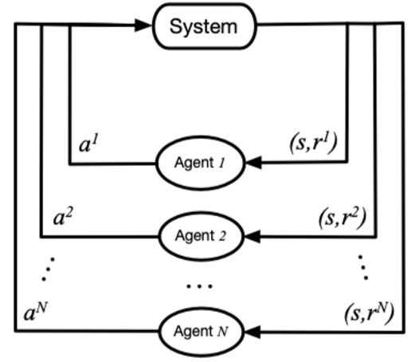

---

title: 'Replica Placement with RL'
tags:
  - Load_Balancing
---

# Learning Replica Placement with RLRP

> **人类总会选择最安全、最中庸的道路前进，群星就会变成遥不可及的幻梦。— 小夫**

[TOC]

## Abstract

## Introduce

1. 分布式/对象存储等等
2. 分布问题：负载均衡、可靠性问题（副本和故障域）、迁移扩容等等
3. 强化学习为解决分布问题带来曙光
4. 我们的方案

## Motivation

#### 强化学习

#### 问题建模

- 副本放置问题: M个数据存到到N个机器上, 每个数据R个副本在不同机器上, 下图中R=2

  ​	
  
- 目标: 1. 每个机器上的数据尽量均匀

- 后续保证: 2. 每个机器上的主副本尽量均匀；3. 机器异构环境

- 具体到Ceph

#### 算法目标

1. 均匀性：分布均匀
2. 一致性：相同输入，相同输出
3. 可靠性/可用性：副本放置，故障域隔离
4. 可扩展性：增/删节点处理，增量迁移
5. 其他：性能指标（负载均衡）、分布式CAP等等

## Design

With RL

- 环境定义（park）+ 模型实现（tensorflow），基本框架：

- 两种思路

  - RL作为映射算法
  - RL作为辅助，调整原有映射算法

#### **实现1：RL训练出放置策略，action space即为mapping策略**

- 简单实现，目前支持映射均匀性、副本机制、增删pg节点（n->m）

  - **一致性 、扩容暂不支持**
  - spcae：各osd的容量状态，{weight0，weight1，...，weightm，}
  - action：{osd0，osd1，...，osdm}
  - reward：各osd容量标准 / 前后标准差变化 / 极差
  - policy : 当前状态下选择的action，是训练结果
  - 模型：当前实现Q-learning和DQN
  - 实现和效果
    - 多次迭代训练，选择效果最佳的结果
    - 1000pg，10osd，3副本，mapping选择另存：

  

- 问题1：如何映射？

  - 巨大问题：每次得到状态不一致
  - 方式1：将映射关系建表
  - 方式2：分类问题？区分pg id

- 问题2：状态过多，空间爆炸；训练精度不足，需要训练很久？

  - n ^ m (1000 ^ 10 = 10 ^ 30)
  - 改善模型、改善状态定义...
  - DQN中模型选择：目前使用的MLP，结合RNN、CNN？
  - 训练参数调整，Offline Training

- 问题3：如何支持增删osd

  - 减少节点m：控制action不能等于m，就可以均匀分布到其他osd；但是两次映射差距甚大...

  - 增加节点：space和action都要变，模型需要重新训练？另外重新训练和原映射差距甚大...

  - 难点：**增量迁移怎么定义模型？**

    - 想法1：将两次变化量作为reward

      - 训练难收敛，训练效果差

        

      - 表格 + RL 再训练 

    - 想法2：多agent，每个osd相当于agent，Multi-agent Data Distribution

      

      - space：weight
      - action：要 / 不要 / 滚；+ 1 / 0 / -1
      - reward：对每个agent 尽量少加 / 尽量少减；所有，标准差
      - 模型学习困难：Actor-Attention-Critic for Multi-Agent Reinforcement Learning，ICML’19
      - 数据集难以构造，有限样本

    - 想法3：动态环境下的强化学习

      - A Survey of Reinforcement Learning Algorithms for Dynamically Varying Environments，2005
      - 多模态强化学习

#### **实现2：采用原有的放置策略（hash、crush），RL作为辅助调整，即action调整mapping**

- 简单实现，mapping=crush，支持所有
  - space：各osd的容量状态，{weight0，weight1，...，weightm}
  - action：crush选出来后左右移动？
  - reward：经过调整后，标准差变化
- 问题 
  - 只能对均匀进行优化，是否影响性能？
  - 是否可以抽象成ML分类问题，RL作为调整辅助？
    - ML分类器 + RL
  - 是否可以做成一种通用框架，可以适用于各种分布算法？

#### 增量迁移设计

- 基本目标：分布均匀，增量迁移

​                                           

- 实现1：增/减节点重新训练
  - state：包括Map
  - Reward: 标准差 && Map变化最少 
  - 训练时间长、训练效果差
- 实现2：增/减节点单独训练模型
  - 模型定义
    - state：每个节点容量
    - action：迁或者不迁
    - reward：最少迁移量 && 标准差
  - 模型得到每个节点应该迁移量，在Map没冲突的情况下，随机选择
  - 两种方式都是扩容一次，训练一次，性能损失严重
    - Attention，记忆RNN？
- 完全RL
  - **可变状态空间或者动作空间**
    - 对深度强化学习算法来说是一个比较棘手的问题。一旦输入空间确定，就意味着神经网络的输入节点个数确定了下来。如果在学习的过程中，输入节点增多或者减少，这对隐层乃至输出层的数据都会产生影响
    - RNN + nas
  - **可变数量的多智能体RL**
    - 结合AtAtention模型，Evolutionary Population Curriculum for Scaling Multi-Agent Reinforcement Learning，2020

#### RLRP（第一阶段，简单Demo）

- 副本放置+强化学习框架，实现**同构环境分布均匀和迁移最小化**

                      

- 均匀分布（Agent1）

  - spcae：各osd的容量状态，{weight0，weight1，...，weightm，}

  - action：{osd0，osd1，...，osdm}

    - 限制：每个PG选三次，每次不一样

  - reward：各osd容量标准 / 前后标准差变化 / 极差

  - policy :  当前状态下选择的action，是训练结果

  - 模型：当前实现Q-learning和DQN

  - 输出：映射表（n->m）

    - 下面是三副本的例子
    - 横向上看：可以得到 PGi —> (OSDk, OSDj, OSDl) 的映射，i = 0 to n；0 <= k, j, l <= m
    - 纵向上看：可以得到每个OSD中PG个数

    |      | OSD0 | OSD1 | OSD2 | OSD3 | ...  | OSDm |
    | ---- | ---- | ---- | ---- | ---- | ---- | ---- |
    | PG0  | 0    | 1    | 0    | 1    | ...  | 1    |
    | PG1  | 1    | 1    | 1    | 0    | ...  | 0    |
    | ...  | 0    | 0    | 0    | 0    | ...  | 0    |
    | PGn  | 0    | 0    | 0    | 1    | ...  | 0    |

- 增量迁移

  - 减少OSD节点（Agent1）

    - 减少OSDm，将OSDm中的节点通过Agent1重新映射
    - 限制1：不能选择action OSDm；限制2：不能选择有副本冲突的
    - 输出：更新映射表

  - 增加OSD节点（Agent2）

    - **action：{0，1，2，3}**

      - 对于每个PG，0、1、2分别表示第1、2、3个副本
      - PGi —> (OSDk, OSDj, OSDl)，0表示从OSDk迁移到新节点，1、2表示迁OSDj、OSDl
      - 3表示不迁

    - 其他都和Agent1一样，效果不错

      

    - 加速收敛：调整学习率、调整网络结构；如果达到某个阈值（比如标准差<=3）,可提前停止训练

- 整体演示：200个PGs，3副本映射到10个OSDs上，再添加一个OSD

  - **Agent1**
    - 输入：PG、OSD个数，副本数；输出：映射表
    - 加速：训练某段时间内std小于阈值，停止训练
    - 主PG：先映射一遍得到主PG，再映射两遍得到两副本

  

  

  - **Agent2**
    - 输入：映射表，新增OSD个数，副本数；输出：映射表
    - 加速：训练某段时间内std小于阈值 / 新增OSD数量最多，停止训练
    - 主PG：设置action 0是迁移主PG，在Reward中添加主PG均衡奖励，暂时**训练不收敛**
      - 先迁移主PG，也就是action只能选择0或者3；再迁移其他，action只能选择1，2，3:**效果没那么好**

  

  

- 模型的比较

  - ing

#### RLRP（第二阶段，模型优化+异构环境）

- 后续

  - 问题
    - 迁出不可能迁回，考虑保留一段时间前映射表
    - **每次增加节点都要重新训练**Agent1和Agent2，费时费力
      - **还是要解决RL环境变化的问题：可变状态和动作空间**
      - Atention模型，结合上一次训练结果
    - 随着PG和OSD数量增加，训练越来越困难，训练时间越来越长
    - 迁移主PG需要重新考虑一下
    - 要考虑其他因素

  - 模型优化
    - **Attention Mechanism**
    - RL: Value: Sarsa\Q-learning\DQN... vs. Policy: Policy Gradients\Actor-Critic\A3C\DDPG\PPO...
    - Multi-Agent\Signle-Agent Dynamically Varying Environments
    - NN: MLP\CNN\DNN\RNN\LSTM...

  - 负载均衡
    - OSD之间不同权重，PG大小不均设计
      - 状态中添加PG大小
      - 改Reward计算方法：单位权重（PG数/权重）方差
    - 异构环境设计（Agent3）
      - OSD权重、硬件性能、负载状况（CPU、IO、网络）等等差异
      - Reward目标可能要改成性能
    - 主PG均衡设计
      - Agent1：每次映射是均匀的，先映射一遍得到主PG，再映射一遍得到两副本
      - Agent2：设置action 0是迁移主PG，在Reward中添加主PG均衡奖励

#### Attention Mechanism

- **从关注全部到关注重点** 
- ing
- Google's Neural Machine Translation System: Bridging the Gap between Human and Machine Translation

## Evaluation

- 测试平台：Cloudsim、COSBench、fio/rados benchmark
- Ceph
- 真实数据

## Related Work

- 分布算法（见[load balancing.md](2021-04-12-数据分布和负载均衡.md)）

- 强化学习（见[RL.md](2021-04-23-replica placement with RL.md)）

- 强化学习存储研究（见[RL.md](2021-04-23-replica placement with RL.md)）

  

#### Towards Self-Managing Cloud Storage with Reinforcement Learning

- 主题Ceph-RL，机构University of Texas at San Antonio，https://ieeexplore.ieee.org/abstract/document/8789906

- IEEE International Conference on Cloud Engineering (IC2E) 2019，未列入ccf推荐，算云计算较好会议

- 提出：In Ceph，**Reinforcement Learning Based Adaptive Load Balancing and Data Migration**

              

- performance hotspots

  - 某些osd比其他性能更差，主要原因是硬件异构性、各种后台干扰
  - Ceph性能下降：由于CPU、磁盘I/O和各种工作负载混合的网络使用不平衡

- 负载分析

  - COSBench的四种不同的工作负载混合

    

  - 性能热点测试

    

    

    - 8节点OSD，2个OSD有后台干扰
    - 从第4个采样间隔开始，后台作业会导致整个Ceph存储节点中CPU，磁盘I / O和网络资源的利用率出现各种程度的不平衡
      - CPU利用率
      - ％iowait：CPU空闲、并且有仍未完成的I/O请求
      - 网络利用率

    

    - 在存储节点之间CPU利用率高度不平衡的情况下，COSBench工作负载的性能基本不受影响
    - **在网络利用率不平衡的情况下，读工作量大的工作负载A的性能下降很大**(平均读响应时间增加了6倍)。但是，其余的工作负载没有受到影响。这是由于工作负载B，C和D中存在大量写操作。由于每个写操作都涉及在网络上所有OSD副本上进行写操作，因此，工作负载B，C和D已经引起Ceph OSD之间的高网络利用率，并且即使没有后台作业的网络干扰，也遭受较大的网络延迟。
    - 在后台作业的I / O干扰的情况下，我们发现，就％iowait而言，即使**少量的存储节点之间的不平衡也会导致所有COSBench工作负载的性能显着下降**。

- 调控负载均衡旋钮

  - primary affinity value：决定成为主OSD的概率

    - 默认情况下，所有的osd主关联值为1，降低一个osd主关联值可以减少它所服务的读工作量。因此，可以利用primary affinity来调整Ceph osd的读工作负载服务比例。
    - 但是只能影响读性能，写性能没影响

  - OSD weights：决定了OSD中pg数量

    - 权重对读写性能都有影响，但改变权重会导致数据在OSD间迁移，带来相关的开销

      

    - 上图可以看出，第二个采样间隔（时间60秒）开始，降低了运行后台作业的两个存储节点的OSD权重

    - 由于OSD重新加权导致数据移动，因此COSBench工作负载A的平均读取响应时间最初会增加

    - 但是，从采样间隔5开始，性能显着提高。这是因为数据从两个性能不佳的OSD迁移到其余OSD，将大部分后续读取请求转移到性能良好的OSD

- 基于强化学习的负载均衡和数据迁移

  - 检测性能指标，通过调整primary affinity和weight来实现负载均衡，提升性能
  - state：st=(iowait,rtps,wtps, net)t
    - %iowait值、每秒磁盘读请求数、每秒磁盘写请求数、网络利用率
  - action：调控
    -  I/O-based affinity control
    - I/O-based OSD reweight
    -  network-based affinity control
    - network-based OSD reweight 
    - take no action (no-op)
  - reward
    - 读heavy负载：平均读响应时间的倒数
    - 写heavy负载：平均写响应时间的倒数
    - 读-写均衡负载：2/（平均读响应时间 + 平均写响应时间)

- 总结&&问题

  - 就是提供了一种类似upmap的工具，来调整集群使得性能最优
  - 数据迁移频繁（论文认为不要紧），未考虑节点容量
  - 本身的数据监控采集，训练，调控会不会占用资源，影响性能
  - 负载类型如何判定

- 负载均衡 

  - 节点磁盘容量（数据均衡），数据访问（read/write）负载（负载均衡）

  - 设计主pg均衡，其实就是在考虑负载均衡

  - 我们在考虑数据均衡时，是否要考虑负载均衡

    - cpu、io、网络等等：这种负载均衡的文章特别多
    - 数据迁移量

  - 分布式异构环境下的负载均衡

    

#### Device Placement Optimization with Reinforcement Learning  

- 主题：RL-Tensorflow中训练操作在各个设备（CPU、GPU）上的分配优化

- ICML'17, Azalia Mirhoseini, MIT/Google；Jeff Dean, Google

- 问题抽象，M->D

  

  - 寻求最小化执行时间r(P)时，对r(P)的直接优化会导致两个主要问题

    - 在训练过程的开始，由于不好的位置采样，r(P)的测量可能是有噪声的，导致不适当的学习信号
    - 随着RL模型的逐渐收敛，被采样的位置变得更加相似，相应的运行时间之间的差异较小，导致训练信号的可分辨性较差。

  - 模型

    - **attentional RNN / LSTM + Policy Gradients**  
    - 学习参数使用 Adam optimizer ,基于通过REINFORCE方程计算的policy gradients 
    - 输入
      - type：MatMul or conv2d  
      - output shapes、adj
    - Attentional LSTM
      - Attention Mechanism：解决变长的输入X映射到一个变长输出Y的问题

    

    - Distributed Training  

      

#### A Hierarchical Model for Device Placement

- ICLR'18,  Hierarchical Attention Mechanism

  

#### Placement Optimization with Deep Reinforcement Learning

- ISPD'20, Azalia Mirhoseini, MIT/Google

> **这朵花的香味，从音乐的音阶上来说，就是尖锐的‘La’。— 小三**

