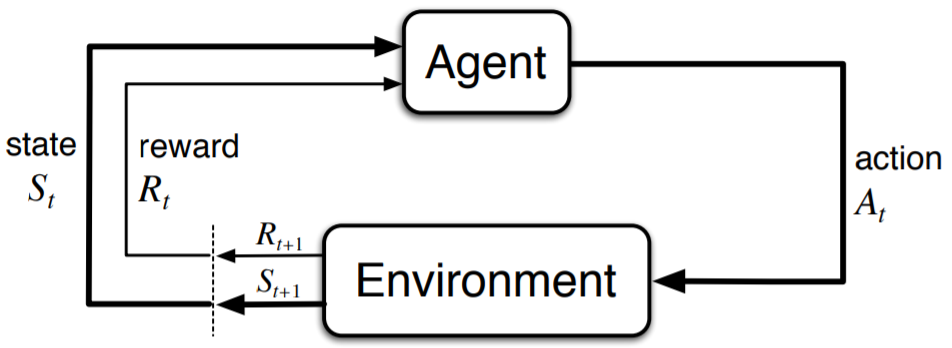

# Learning Replica Placement with RLRP

> **人类总会选择最安全、最中庸的道路前进，群星就会变成遥不可及的幻梦。— 小夫**

## Abstract

## Introduce

- （**副本放置**对分布式系统可靠性非常重要）

Replication remains a key technique to achieve desired data availability and reliability in many storage systems [2], [3], [4], [7], [8].
Its core concept is to automatically replicate data objects and distribute them to multiple devices.   

- （有很多副本放置算法，**存在问题**）

The ever-growing creation of, and demand for, massive amounts of data requires highly scalable storage solutions. The most flexible approach is to use a pool of storage devices  that can be expanded and scaled down as needed by adding new storage devices or removing older ones. This approach, however, necessitates a scalable solution for locating data items in such a dynamic environment, which has led to the proposal of several families of data distribution strategies.

- （**提出基于强化学习的副本放置算法**）

## Motivation

- （**问题抽象**）

Our research is based on an extension of the standard “balls into bins” model [Johnson and Kotz 1977][Mitzenmacher 1996]. Let f0; : : : ; M - 1g be the set of all identifiers for the balls and f0-(n-1) be the set of all identifiers for the bins. Suppose that the current number of balls in the system is m ≤ M and that the current number of bins in the system is n ≤ N. We will often assume for simplicity that the balls and bins are numbered in a consecutive way starting with 0, but any numbering that gives unique numbers to each ball and bin would work for our strategies.

Suppose that bin i can store up to bi (copies of) balls. Then we define its relative capacity as ci = bi= Pn j=0 -1 bj. We require that, for every ball, k copies must be stored in different bins for some fixed k. In this case, a trivial upper bound for the number
of balls the system can store while preserving fairness and redundancy is Pn j=0 -1 bj=k, but it can be much less than that in certain cases. We term the k copies of a ball a redundancy group.

- （**目标**）

Placement schemes for storing redundant information can be compared based on the following criteria (see also [Brinkmann et al. 2002]):

1) Capacity Efficiency and Fairness. A scheme is called capacity efficient if it allows us to store a near-maximum number of data blocks. We will see in the following that the fairness property is closely related to capacity efficiency, where fairness describes the property that the number of balls and requests received by a bin are proportional to its capacity.

2) Time Efficiency. A scheme is called time efficient if it allows a fast computation of the position of any copy of a data block without the need to refer to centralized tables. Schemes often use smaller tables that are distributed to each node that must locate blocks.

3) Compactness. We call a scheme compact if the amount of information the scheme requires to compute the position of any copy of a data block is small (in particular, it should only depend on n—the number of bins).

4) Adaptivity. We call a scheme adaptive if it only redistributes a near-minimum amount of copies when new storage is added in order to get back into a state of fairness.  

5) 对于真实系统中，要考虑各种异构环境和因素，要兼顾性能和均衡性

- （其他分布算法的问题）

**【测试1】**，突出各个算法的问题

table-based

hash-based

1）一致性hash

2）crush

3）。。

4）。。

- （**强化学习**）

Reinforcement Learning (SUTTON; BARTO, 1998) is an area of machine learning concerned with how artificial agents ought to take actions in a certain environment with with goal of maximizing some notion of cumulative reward. The problem, due to its generality, is studied in many other disciplines(e.g. game theory, control theory, etc). In the case of machine learning, the environment is typically formulated as a Markov Decision Process (MDP), as many reinforcement learning algorithms for this context utilize dynamic programming techniques. The main difference between reinforcement learning and the classical dynamic programming methods is that in RL do not assume knowledge of an exact mathematical model of the MDP. An advantage of RL algorithms is that they can target large MDPs where exact methods become impracticable.

Q-learning、DQN...

- （挑战）

1）如何对问题进行建模，如何定义强化学习各要素？

2）如何处理迁移问题？

3）当节点数和数据量比较大的情况下，如何加速训练？

4）异构环境，如何兼顾性能和均衡性？

## Design

- （基本模型）

RLRP adopts a space-efficient parti-tioned store. The data are stored in different partition struc-tures (called Sub-trees) according to any standard, such askey range, secondary (delete) keys and so on. RLRPusesa map to manage the mapping. Each Sub-tree is an LSM-tree structure in a disk. The memory structure in TridentKVis based on Memtable and Immutable just like RocksDB.The difference is that when flushing to the disk, instead offlushing the entire Memtable directly, the KV pairs in theMemtable are stored in buffers through a well-designed Par-tition Scheduler, and then flushed separately. The PartitionScheduler includes data buffers for partitioning and a light-weight L0 index structure to speed up L0 layer lookup. UnlikeRocksDB’s traditional column family partitioning[5], all par-titions of RLRPshare one Memtable, which reducesmemory overhead.

- Environment

Our virtual nodes have the same concept of virtual nodes in Dynamo and partitions in OpenStack-Swift which is an abstract layer for managing all system data into smaller parts, i.e., a set of objects, as it is shown in the hash mapping layer of Figure 6. Each data object on the system is mapped to a virtual node through the consistent hash function mapping. A hash function applies the identification of a data object to calculate the modulo operation using the total number of virtual nodes, defining then which virtual node the object belongs to. The number of objects in every virtual node is balanced due to the hash function of the hash mapping layer that outputs hashed values uniformly distributed. The hash function responsible for mapping data objects to the virtual node is set up only once and remains the same during the entire system operation. At deployment, before system start-up, the system administrator sets the total number of virtual nodes to a large value and never changes it; otherwise, it would break the property of  the consistent hashing technique by creating the side-effect of huge data movements. 

A virtual node can be replicated multiple times on different storage nodes, for example, Virtual Node 2 is replicated to Storage Nodes 1 and 3 in Figure 6. A Replica Placement Scheme (RPS) is responsible for defining the mapping of virtual node replicas to storage nodes. It specifies the replication factor, which happens to be 2 in our example meaning that each virtual node has two copies in our storage system and the placement of every virtual node replica as shown in Figure 6. By modifying the replica placement scheme, the storage system can dynamically manage data through operations of replica creation, migration and deletion. In this work, the RPS is modified in order to achieve load balancing of Get operations.  

- Common Interface
- Memory Pool
- RL Agent
  - Placement Agent
  - Migration Agent

The disk structure of each Sub-treeis based on SStables like RocksDB. But RLRPabandonsthe design of index block in SStable, and uses efficient learnedindex to build a learned index block to improve the SStableread performance. The learned index block includes two mod-ules: String Process and Learned Index. String Process ismainly responsible for efficiently converting strings into inte-ger numbers for model training. For Learned Index, we usea two-layer linear model of RMI[26], which is sufficient tohandle most workloads[26, 45].Different from the traditional binary search, the learnedindex block directly predicts the block where it is locatedthrough the model, which is faster than the binary search.More importantly, the learned index block is much smallerthan the traditional index block, and can be cached more inmemory, which is more conducive to read performance.

As shown inthe left of Figure 6, RLRPuses the high-performanceSPDK interface to manage the NVMe SSDs, avoiding thesystem overhead caused by the Linux I/O path. In addition,RLRP adopts  asynchronous  IO  for  read  process  andprovides asynchronous interfaces for the upper and lowerprocesses. Aynchronous IO makes it possible to reduce thesynchronization control overhead caused by competing I/Oresources, and to coordinate the optimization of front-end andbackground processing speed.Read process.As shown in Figure 6, the read process isas follows: the upper-level program calls the asynchronousinterface to access TridentKV. RLRPfirstly searches theMemtable, Immutable Memtable and Partition Scheduler inturn in the memory. If not found, RLRPfinds in thecorresponding Sub-tree according to the map and searchs theSStable files. For read files, firstly RLRPread the bloomfilter to determine whether it exists. Then quickly locate itsdata block through the learned index block, load it into thememory and find target key

- （迁移模型）

- （训练优化）

            

- （异构场景）

  

## Implementation  

- （In ceph）

## Evaluation

- 测试平台：Cloudsim、COSBench、fio/rados benchmark

  https://github.com/intel-cloud/cosbench

- Ceph

- 真实数据

## Related Work
