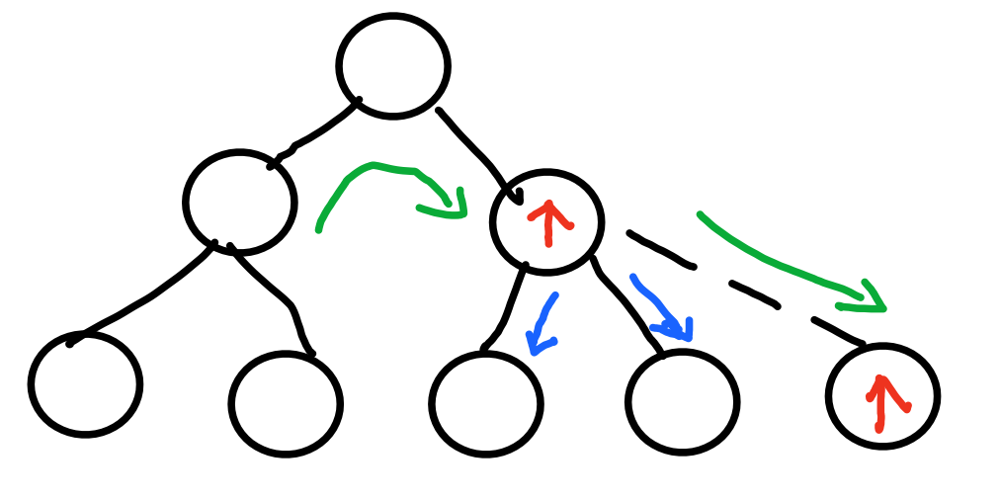
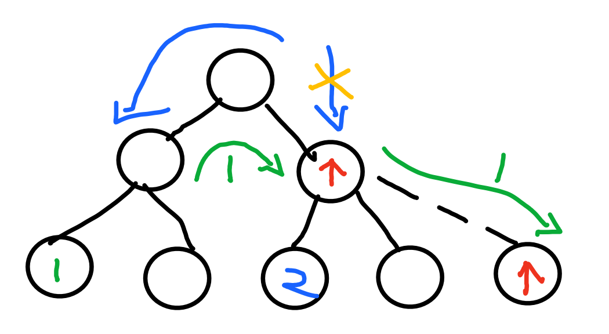
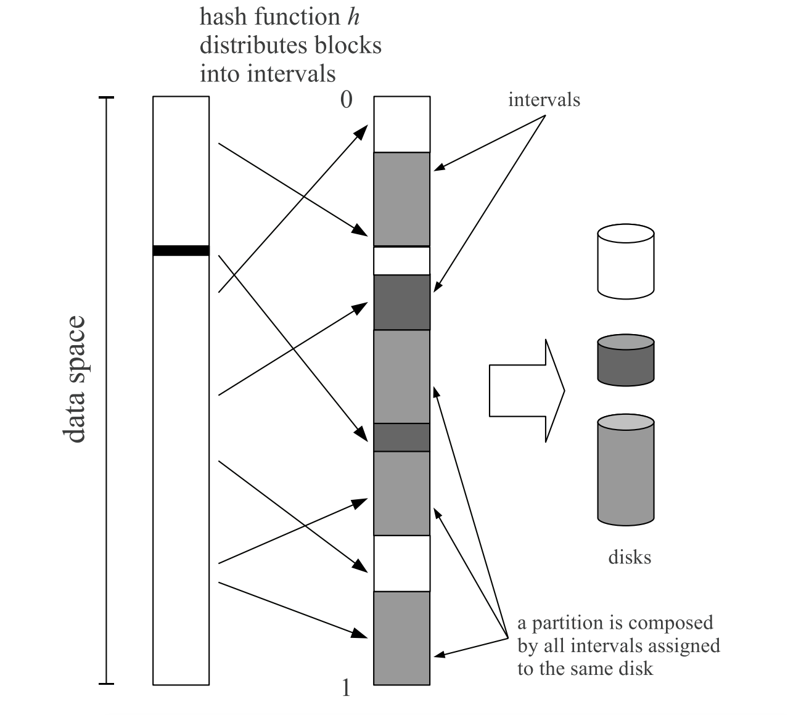

本文主要介绍Ceph数据分布策略研究。

## 背景

### 数据分布

*分而治之*

- 现代系统的数据分布：分（Partition）+放（Placement），面对海量数据的时候，单个节点存放不下，自然需要将数据切成分片 ，存放到多个节点上
- 分区：MongoDB 中被称为分片(shard)，在 HBase 中称之为 区域(Region)，Bigtable中则是 表块（tablet），Cassandra 中是虚节点（vnode) ，Ceph 中则是 Pg
- 切分策略： 那么是 hash 分片，按 range 来；放置策略：一致性hash，crush等等
- 评判指标
  - 负载均衡：节点磁盘容量，数据访问（read/write）负载等均匀分布
  - 可扩展性：能否友好的应对增/删节点，以及日益增长的规模
  - 可靠性：数据分片需要多个副本
  - 可用性：副本放置需要考虑故障域隔离，保证更好的可用性
  - 一致性、性能指标、分布式CAP等等...

### Ceph-CRUSH的问题

*病情探究*

- 迁移不可控（很多理论上不必要或者不应该的），迁移量比理论多很多；理论迁移量是一般理论值的h倍，有文章表明，实际在扩容时，可能达到2~3倍的理论迁移量






- 负载不均衡，原因很多，CRUSH输入的样本容量不够、副本机制的缺陷等等
- 可能具有复杂的拓扑结构，其计算时间复杂度是CRUSH  Map 每一层时间复杂度之和
- 糟糕的流控机制，升级过程中潜在的数据迁移问题有极大可能会影响到正常业务，进而成为在线升级方案中的隐患
- 副本机制的缺陷
  - 导致问题1、2
  - 问题的本质是crush每次选择都是计算单个条目被选中的独立概率，但是CRUSH所要求的副本策略使得针对同一个输入、多个副本之间的选择变成了计算**条件概率**，所以从原理上CRUSH就无法处理好多副本模式下的副本均匀分布问题

## 思路

*内外兼施*

### 内部调理

*自身免疫系统*

- ceph优化
  - list、tree、straw、straw2
  - 可调参数，reweight/compat weight-set机制等等
  - balancer（Luminous版本之后，并不完善）调整映射关系，目前只支持compat weight-set和upmap，都不持久化

*辅助手段*

- 建表保存映射关系
  - 针对不必要的迁移建表，或者结合upmap的表
  - 表越来越大，映射关系越来越复杂？
  - 严重损伤了CRUSH的伪随机性（即公平性）、灵活性
  - 
- 虚节点 & 重映射
  - How？
- 时间戳
  - MapX，额外开销大

*修补部件*

- DPRD
  - 改公式，不仅考虑权重，还要考虑负载占比
  - 将Factor从原来的weight改成partition/weight，代表了每个子节点的重量负担，partition=pgs
  - 这玩意儿随机变？导致选择的结果也会变，这迁移量不会增多？
  - https://www.infoq.cn/article/yHkBk59FX8UUXxm0VNHW
- straw2 改用其他数学算法
  - 贝努利大数定律
  - 随机算法和选择算法
- 副本机制优化
  - How？
  - 不用树形结构，只用一层，副本和容灾另外考虑（笑哭，变成了其他分布算法通用问题）

### 外科手术

*换新部件（万不得已）*

#### 1.	Consistent Hash

- 1997年由麻省理工学院的Karger等人在解决分布式Cache中提出的
- Amazon Dynamo（SOSP07），虚节点、分片、数据复制、冲突故障处理...
- 割环（等分存储拓扑）、随机分片、动态调整...
- 对应于crush树形分支   ——  多层一致性hash划分故障域、提升扩展性？
- [[1]](https://patentimages.storage.googleapis.com/26/2e/86/31451bc1d4259c/CN105450734A.pdf) 提出对象到hash使用一致性hash，

#### 2.	RUSH && CRUSH

- Replication Under Scalable Hashing
- Controlled *Replication Under Scalable Hashing*
- RUSH本身是一个概念意义上的算法，有很多变种RUSHP, RUSHR, and RUSHT等等

#### 3.	Jump Consistent Hash

- A Fast, Minimal Memory, Consistent Hash Algorithm
- Google提出，空间复杂度更低，根本无内存占用，而且算法非常简洁，C++的实现不到10行代码
- 从概率学角度来满足一致性和均匀性
  - 一致性：在这个重新映射的过程中，key要么保留在原来的桶中，要么移动到新增加的桶中
  - 均匀性：key会等概率地映射到每个桶中，不会出现某个桶里有大量key，某个桶里key很少甚至没有key的情况

```c++
int ch(int key, int n)
{
    random.seed(key);
    int b = 0;
    int f = 0;
    while (f < n)
    {
        b = f;
        r = random.next();
        f = floor((b+1)/r)
    }
    return b;
}
```

- 算法分析：http://adam8157.info/blog/2018/06/jump-consistent-hash-explained/
- 致命缺点：不能减少中间节点（减少中间节点将导致后面一系列数据迁移，越前面的节点影响越大）；没有权重和副本机制
- o->pg的映射意义好像不大
- 得另外加映射；分多层，一层映射不会或者说很难发生节点删除，一层节点不多，就算有删除迁移并不多。

#### 4.	Random Slicing

- ACM TOS14

- 分析了十八种不同的伪随机数发生器在多种的策略（Consistent Hashing及变种、Redundant Share、RUSH及变种）研究

- 基于动态区间的对象分布算法：该算法将对象映射到(0,1)区间，并将区间划分为多个子区间，每个节点拥有和其权值成正比的多个子区间，以此为依据进行数据映射

  

- 真实的存储系统节点频繁失效，将会使区间维护变得非常复杂

#### 6.	Others

- 中心化的 master 节点管理数据存储位置
- 哈希槽slots及其变种，分层哈希，矩阵哈希，多维哈希，树形花形哈希（真-玩出花）...
- Redundant Share
- Rendezvous Hashing
  - 计算一个key应该放入到哪个bucket时，它使用哈希函数h(key,bucket)计算每个候选bucket的值，然后返回值最大的bucket
  - 96年提出，分支变种很多，其中一个分支：04年RUSH，06年CRUSH
- Kinesis: A New Approach to Replica Placement in Distributed Storage Systems；ACM TOS‘09
- AnchorHash: A Scalable Consistent Hash；2018
- EFAH hashing、social hash
- Power of two random choices（Cuckoo Hash、BloomFilter）


租房要求

@ 高新南站上班，想租九号线沿线，南油至上下沙区间的，2500-3000，单间或者一室

@ 一个人，房间不用太大，没宠物，需要家电，要有光照，其他都好说

@ 入住时间：本周末或者下周末，最晚七月前


