## Unified Storage

> 与善人居，如入芝兰之室，久而不闻其香，即与之化矣；与不善人居，如入鱼之肆，久而不闻其臭，亦与之化矣。—— 丘子

## 背景

- 传统存储架构问题
  - 冗长存储栈，低效索引，资源分配，新介质...
  - 解耦 vs 聚合，分离 vs 统一...
- 统一存储方式
  - 不同存储格式：表格，对象...
  - 不同存储应用：sql，s3，图...
  - 不同工作负载，业务需求？：OLTP和OLAP 请求，或混合事务/分析处理 (HTAP) 工作负载
- 新索引技术的验证
- 

## 设计

- 分层解耦，统一存储


## 相关论文1 — 统一存储格式

### 论文1 (Microsoft): Windows Azure Storage: A Highly Available Cloud Storage Service with Strong Consistency  

- 微软向全球提供的商业存储平台，旨在为用户提供大容量、高可靠、高可用、强一致的存储服务，WAS存储数据中心分布在全球多地，使得用户数据得到最大限度的可靠性保障，WAS宣称其提供的服务满足CAP三个条件

- 统一存储：基于同一套架构提供了对象存储 (Blob)、结构化存储 (Table) 和队列服务 (Queue)，这三种服务共享了一个提供了强一致、global namespace、多地容灾、支持多租户的存储层

- 三种服务都使用了同一套**global namespace**，格式为：

  ```
  http(s)://AccountName.<service>.core.windows.net/PartitionName/ObjectName
  ```

  - AccountName会作为DNS解析的一部分，来确定这个account对应的primary data center（如果需要跨地域就需要使用多个account）
  - PartitionName是跨对象事务的边界
  - ObjectName是可选的，Blob就没有

- Table的每行的primary key由PartitionName和ObjectName组成。Queue的PartitionName用来标识队列，而ObjectName则用来标识消息。

- WAS的底座是Windows Azure Fabric Controller，负责分配和管理资源，WAS会从它那里获取网络拓扑、集群物理布局、存储节点的硬件信息等

  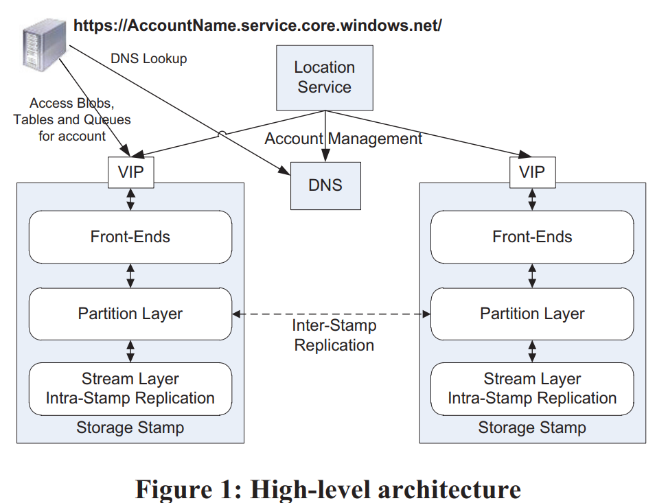

- 一套WAS环境由若干套storage stamp和一套location service组成：

  - 每套storage stamp是一个小集群，典型的大小是10-20个rack，每个rack有18个节点。第一代storage stamp容量是2PB，下一代会提升到30PB。storage stamp的目标是达到70%的使用率，包括了容量、计算、带宽
  - location service负责管理account到storage stamp的映射与迁移（一个account只能有一个primary storage stamp）

- storage stamp内部分为三层：

  - stream层提供类似于GFS的能力。数据组织为extent（类比chunk），extent再组织为stream（类比file）。这一层是三种服务共享的。
  - partition层提供三种服务特有的能力。它负责提供应用层抽象、namespace、事务与强一致的能力、数据的组织、cache。partition和stream的server是部署在一起的，这样最小化通信成本。
  - front-end（FE）负责处理请求。它会缓存partition map从而快速转发请求。另外它还可以直接访问和缓存stream层的数据。

- storage stamp提供了两种replication：

  - stamp内部，在stream层提供同步的replication，提供数据的强一致性
  - stamp之间，在partition层提供异步的replication，提供数据的多地容灾能力

  - 区分两种replication还有一个好处是stream层不需要感知global namespace，只需要维护stamp内的meta，这样metadata就不会那么多，更容易全部缓存到内存中。

- 在stream层数据组织为三层：

  - block是读写的最小单元，但不同block可以有不同大小。每个block有自己的checksum，每次读都会校验。另外所有block定期还会被后台校验checksum

  - extent是stream层replication的单元，它由一系列block组成。每个extent最终会长到1GB大小，partition层可以控制将大量小对象存储到一个extent，甚至一个block中

  - stream类似于一个大文件，但它不拥有extent，只是保存了若干个有序的extent引用。将已有的extent组织起来就可以得到新的stream

    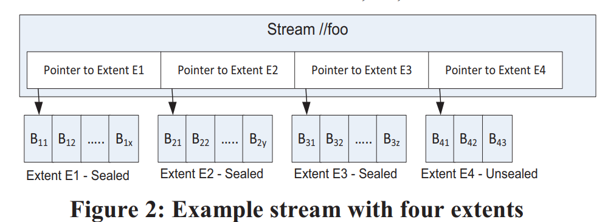

  - stream层是append-only的，每个stream只有最后一个extent可以被写入，其它extent都是不可变的（immutable）

- stamp内部有两类组件：stream manager（SM）和extent node（EN），前者是master，后者是data node（类似于GFS）

  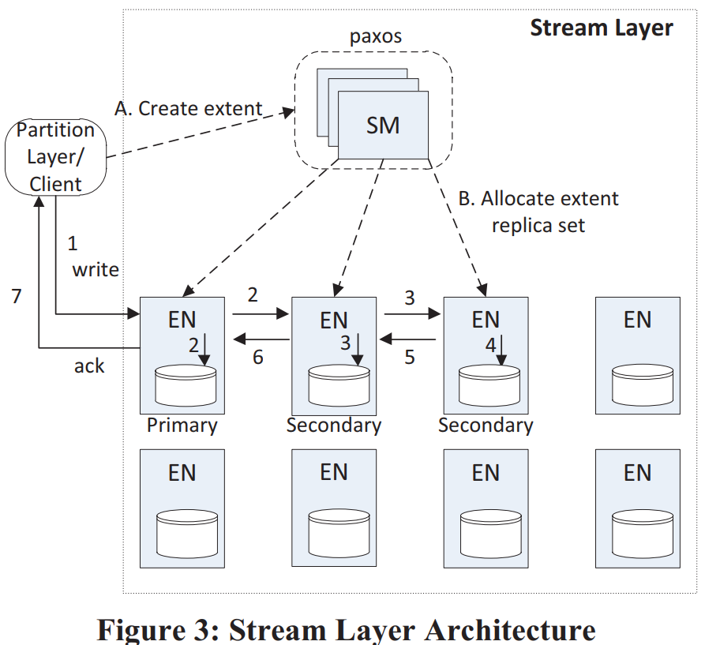

  - extent支持原子append多个block，但因为重试原因可能数据会被写入多次，client要有能力处理这种情况。

  client会控制extent的大小，如果超过阈值则发送seal指令。被seal的extent不可再被写入，stream层会对sealed extent做一些优化，如使用erasure coding等。

- stream层提供的强一致保证：

  - 一旦写入成功的消息告知了client，后续所有replica上这次写入的数据都可见（read committed）
  - 一旦extent被seal了，后续所有已经seal的replica的读保证看到相同内容（immutable）

  - 每个extent有一个primary EN和若干个secondary EN，未被seal的extent的EN是不会变的，因此它们之间不需要有lease等同步协议。extent的写入只能由primary EN处理，但可以读取任意secondary EN（即使未seal）。primary会将所有写入排好序，确定每笔写入的offset，再发给所有secondary EN。所有replica都写成功了之后primary才会告知client。

  - client在写入过程中会本地缓存extent的meta，不需要与SM通信（直到需要分配新extent）。如果某次写入失败了，client可以要求SM来seal这个extent，然后立即开始写新extent，而不需要关心旧extent末尾是否有数据不一致。

  - seal过程中SM会与每个replica EN通信，并使用可用的EN中最小的commit length。这样能保证所有告知过client的数据都不会丢，但有可能会有数据还没来得及告知client。这是client需要自己处理的一种情况。（是不是可以让client缓存一个commit length，seal时告知SM）

  - client在读多副本的extent时可以设置一个deadline，这样一旦当前EN无法在deadline之前读到数据，client还有机会读另一个EN。而在读erasure coded数据时，client也可以设置deadline，超过deadline后向所有fragment发送读请求，并使用最先返回的N个fragment重新计算缺少的数据。

- WAS还实现了自己的I/O调度器，如果某个spindle已经调度的I/O请求预计超过100ms，或有单个I/O已经排队超过200ms，调度器就不再向这个spindle发送新的I/O请求。这样牺牲了一些延时，但达到了更好的公平性

  - 为了进一步加速I/O，EN会使用单独的一块盘（HDD或SSD）作为journal drive，写入这台EN的数据会同时append到journal drive上，以及正常写extent，哪笔写先完成都可以返回。写入journal drive的数据还会缓存在内存中，直到数据写extent成功（阿里云的pangu使用了类似的方案）。journal drive方案的优点：
    - 将大量随机写转换为了顺序写。除了写journal drive天然是顺序的，这种设计还使得写extent时可以使用更倾向batch的I/O调度策略，进一步提高了磁盘带宽的利用率。
    - 关键路径上读写请求分离，前者读数据盘（或cache），后者写journal drive。

  - 使用了journal drive可以极大降低I/O的延时波动率（对在线业务意义重大）。

- Partition层设计类似于BigTable，数据保存在了不同的Object Table（OT）中，每个OT分为若干个RangePartition。OT包括：

  - Account Table，Blob Table，Entity Table，Message Table，Schema Table，Partition Map Table

- Partition层的架构：

  - Partition Manager（PM）：类似于BigTable的Master，管理所有RangePartition
  - Partition Server（PS）：类似于BigTable的Tablet Server，加载RangePartition，处理请求
  - Lock Service：类似于Chubby

  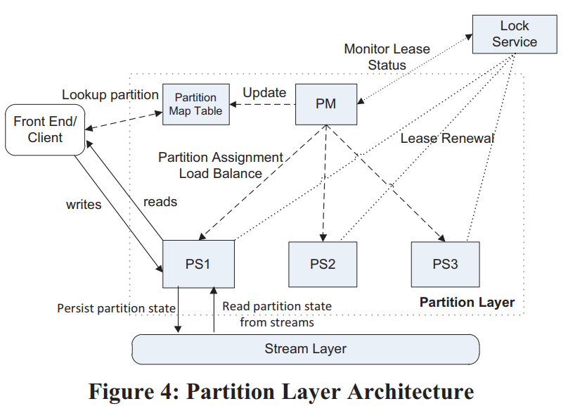                

  

- Blob Table大块数据进commit log，但不进入row data（不进cache、不参与常规compaction等），相反row data中只记录数据的位置（extent+offset），并且在checkpoint的时候直接用commit log的extent拼装成data stream

- RangePartition的分裂（Split）过程：

  - PM向PS发请求，要求将B分裂为C和D
  - PS生成B的checkpoint，然后B停止服务（此时是不是可以不停读）
  - PS使用B的所有stream的extent组装成C和D的stream
  - C和D开始服务（client还不知道C和D，此时应该不会有请求发过来）
  - PS告知PM分裂结果，PM更新Partition Map Table，之后将其中一个新Partition移到另一台PS上（分散压力）

- 合并（Merge）过程类似：

  - PM将C和D移动到相同PS上，之后告知PS将C和D合并为E
  - PS生成C和D的checkpoint，之后C和D停止服务
  - PS使用C和D的stream的extent组装为E的stream，每个stream中C的extent在D之前
  - PS生成E的metadata stream，其中包括了新的stream的名字、key range、C和D的commit log的start和end位置、新的data stream的root index
  - E开始服务
  - PS告知PM合并结果

- 最后是一些经验教训的总结：

  - 计算存储分离：好处是弹性、隔离性，但对网络架构有要求，需要网络拓扑更平坦、点对点的双向带宽更高等
  - Range vs Hash：WAS使用Range的一个原因是它更容易实现性能上的隔离（天然具有局部性），另外客户如果需要hash，总是可以基于Range自己实现，而反过来则不然。
  - 流控（Throttling）与隔离（Isolation）。WAS使用了SimpleHold算法[[2](https://dl.acm.org/doi/abs/10.1145/633025.633056)]来记录请求最多的N个AccountName和PartitionName。当需要流控时，PS会使用这个信息来选择性拒绝请求，大概原则是请求越多，被拒绝概率越大（保护小用户）。而WAS会汇总整个系统的信息来判断哪些account有问题（异常访问），如果LoadBalance解决不了就更高层面上控制这种用户的流量
  - 自动负载均衡（LoadBalancing）：WAS一开始使用单维度“load”（延时*请求速率）来均衡，但无法应对复杂场景。现在的均衡算法是每N秒收集所有Partition的信息，然后基于每个维度排序，找出需要分裂的Partition。之后PM再将PS按各维度排序，找出负载过重的PS，将其中一部分Partition移到相对空闲的PS上（整体思路与Tablestore的LoadBalance差不多，更系统化一些，但Tablestore的LoadBalance策略更多，更灵活）
  - 每个Partition使用自己的log file。这点与BigTable的整个Tablet Server共享log file区别比较大。单独log file在load/unload上更快，且隔离性更好，而共享log file更节省I/O（综合来看单独log file更好一些，尤其是随着存储性能的提升、计算存储分离架构的流行，共享log file的优势越来越小，劣势越来越大了）。
  - Journal drive。它的意义是降低I/O波动。BigTable使用了另一种方案，用2个log来规避长I/O，但导致了更多的网络流量与更高的管理成本
  - Append-only
  - End-to-end checksum
  - Upgrade。重点是在每一层将节点分为若干个upgrade domain，再使用rolling upgrade来控制upgrade的影响。
  - **基于相同Stack的多种数据抽象**。我们的系统支持从同一存储中提取三种不同的数据堆栈：Blob、表和队列（包括块存储）。 这种设计使所有数据抽象来使用相同的内部标记和标记间复制，使用相同的负载均衡系统，并实现受益于流和分区层的改进。 在此外，由于 Blob、Tables 和队列不同，我们的单栈方法使我们能够通过在同一组硬件上运行所有服务来降低成本。Blob 使用大量磁盘容量，表使用 I/O 主轴从节点上的许多磁盘（但不需要那么多容量为 Blob），而队列主要在内存中运行。因此，我们不仅融合了不同客户的共享资源上的工作负载，我们也在混合将 Blob、Table 和 Queue 流量放在同一组存储节点
  - 使用预定义的Object Table，而不允许应用定义自己的Table。意义在于更容易维护
  - 限制每个Bucket大小为100TB。这个是教训，WAS计划增大单个storage stamp
  - CAP。WAS认为自己在实践层面上同时实现了C和A（高可用、强一致），具体策略上是通过切换新extent来规避掉不可访问的节点（实践上有意义，但也不能说是同时实现了C和A）。另外[[3](https://static.usenix.org/events/osdi04/tech/full_papers/renesse/renesse.pdf)]表示使用chain replication就可以同时实现高可用和强一致。
  - 高性能的debug log。这点很重要
  - 压力点测试。WAS可以单独测试多个预定义的压力点（如checkpoint、split、merge、gc等）。（除此之外现在还需要考虑chaos test）

### 论文2 (Facebook) Facebook’s Tectonic Filesystem: Efficiency from Exascale

- 背景

  - 问题1：业务类型需求不一致，有的是IOPS敏感型，有的是吞吐敏感型，当前facebook不同的业务类型使用独立的集群导致不能同时充分利用集群的吞吐和IOPS资源，造成资源浪费
  - 问题2：对于一些数据仓库业务，通常其容量需求巨大，单个集群无法满足，所以一个数据仓库的数据需要存储在多个小集群中，这种方式使得数据处理复杂度提升了。

- Tectonic 主要特点

  - 同一集群可以提供不同业务需求的服务	
  - 单个集群能够达到EB级别的扩展能力

- 资源平衡

  - 资源分类

    - Tectonic将资源划分为： non-ephemeral and ephemeral。可以理解为可重复使用的和不可重复使用的，对于存储资源，一旦分配给一个租户就不能再分配给其他租户了，那么他就是不可重复使用的，是一个长期占用的资源。但是对于IOPS这样的资源，租户只会在发请求的时候使用到，并且这个请求结束后IOPS资源就被释放出来了，他是一个暂时的占用（大多数云厂商通常都是IOPS超售，存储资源不超售）

    - 因此，可以看出我们能够做文章的也就是这些non-ephemeral的资源。这里的挑战在于，首先我们既要满足每个用户的最基本的存储需求，另外还需要给不同类型的用户提供符合其业务类型需求的优化。

  - 用户分类
    - Tectonic服务的application数百个，所以在进行资源调度的时候如果以application为粒度，那么整个调度会异常复杂。所以，为了简化资源调度，不按application分类，按照traffic group分类
    - 同一traffic group里的application其资源需求相似，在单个集群中，tectonic支持50多种traffic group
    - 一个traffic group对应一个trafficClass，trafficClass代表该group对于请求latency的敏感程度，这里分为金、银、铜三个等级，对应的延时敏感性从高到低，同时也对应了其IO优先级。这里需要注意的是，这三个不同等级影响的IO优先级仅限于那些富余的IOPS资源。如果这个集群的在服务当前所有租户没有盈余，这些金银铜等级就没有意义，这点其实很类似mclock的调度模式

  - 调度策略
    - 当一个请求下发时，在client端需要先经过漏桶，告知自己需要多少的资源，client检查自己的trafficgroup的资源够不够这次IO，够的话就将请求下发到底层存储节点(tectonic不仅对存储节点进行了资源平衡调度，同时也对元数据节点也有一致的优化)，存储节点采用权重轮训(WRR)的方式，依次处理到来的请求
    - 在存储节点调度IO时有如下三个优化：
      1. 如果一个低优先级的IO其处理时间足够的情况下，WRR会转让本次执行权限给高优先级的IO，这个策略防止高优先级被低优先级IO阻塞
      2. 对于非金牌优先级的IO，在存储节点会限制其inflight IO数量。在达到非金牌IO inflight上限时，如果有金牌IO需要处理，都会先处理金牌IO，再进来的非金牌IO都会被阻塞
      3. 磁盘本身也可以参与重排请求顺序，如果一个金牌IO已经在磁盘pending太久超出阈值，tectonic会停止调度非金牌IO

- 架构 （略）

  - 对于一个集群提供EB级别的存储能力，在小文件场景下，元数据量会很庞大，需要有能力保证随着存储数据量增加带来的元数据量膨胀，需要元数据存储具备同样的强悍的扩展能力
  - 元数据管理优化

- Design and Deployment Lessons 设计和部署经验总结

  - Achieving high scalability is an iterative process enabled by a microservice architecture. 实现高可扩展性是一个由微服务架构支持的迭代过程
    - 几个构造组件已经通过多次迭代来满足不断增加的可扩展性要求。例如，第一个版本的块存储分组块以减少元数据。若干
      具有相同冗余方案的块被分组并RS编码为一个单元以将它们的块存储在一起。每个块组映射到一组存储节点。这是一种常用技术，因为它显着减少了元数据，但是对于我们的生产环境来说太不灵活了。为了例如，只有 5% 的存储节点不可用，80% 的块组无法写入。这种设计还排除了对冲仲裁写入等优化和法定人数附加（§5）
    - 此外，我们最初的元数据存储架构没有分离名称层和文件层；客户咨询了相同的用于目录查找和在文件中列出块的分片。
      这种设计导致元数据热点不可用，促使我们进一步分解元数据
    - 构造的演变表明尝试新事物的重要性设计以更接近性能目标。我们的发展经验也显示了基于微服务的价值实验架构：我们可以对系统的其余部分透明地迭代组件。内存损坏在规模上很常见。在构造的规模，数千台机器读写大量每天的数据量，内存数据损坏是经常发生的，在其他大规模观察到的现象系统。我们通过执行校验和来解决这个问题检查进程边界之内和之间
    - Tectonic 维护数据完整性的成本。所有涉及移动、复制或转换数据的 API 边界都必须进行改造，以包含校验和信息。客户端在写入时将带有数据的校验和传递给客户端库，Tectonic 需要通过校验和不仅跨越流程边界（例如，在客户端之间库和存储节点）但也在进程内（例如，改造后）。检查转换的完整性可防止损坏传播到重建存储节点故障后的块

- Services that do not use Tectonic，Facebook 中的某些服务不使用 Tectonic 进行存储

  - Bootstrap 引导服务，例如软件二进制包部署系统，必须没有依赖关系，不能使用 Tectonic，因为它依赖于许多其他服务（例如，键值存储、配置管理系统、部署管理系统）
  - Graph存储也没有使用 Tectonic，因为 Tectonic 尚未针对通常需要 SSD 存储提供的低延迟的键值存储工作负载进行优化
  - 许多其他服务不直接使用 Tectonic。 相反，他们通过 Blob 存储或数据仓库等主要租户使用 Tectonic。 这是因为 Tectonic 的核心设计理念是关注点分离。 在内部，Tectonic 旨在建立独立的软件层，每个软件层都专注于存储系统的核心职责（例如，存储节点只知道块而不知道块或文件）。 这种理念延伸到 Tectonic 如何与其他存储基础设施相适应，例如，Tectonic 专注于在数据中心内提供容错； 它不能防止数据中心故障。 异地复制是 Tectonic 委托给其大型租户的一个单独问题，他们解决这个问题，为应用程序提供透明且易于使用的共享存储。租户还应该了解容量管理和存储部署以及跨不同数据中心重新平衡的详细信息。 对于较小的应用程序，以满足其存储需求的方式直接与 Tectonic 交互所需的复杂性和实现将相当于重新实现租户已经实现的功能。 因此，各个应用程序通过租户使用Tectonic

- 相关工作

  Tectonic adapts techniques from existing systems and the literature, demonstrating how they can be combined into a
  novel system that realizes exabyte-scale single clusters which support a diversity of workloads on a shared storage fabric.

  - Distributed filesystems with a single metadata node 
    - HDFS [15], GFS [24], and others [38, 40, 44] are limited by the metadata node to tens of petabytes of storage per instance or cluster, compared to Tectonic’s exabytes per cluster.
  - Federating namespaces for increased capacity
    - Federated HDFS [8] and Windows Azure Storage (WAS) [17] combine multiple smaller storage clusters (with a single metadata node) into larger clusters. For instance, a federated HDFS [8] cluster has multiple independent single-namenode namespaces, even though the storage nodes are shared between namespaces. Federated systems still have the operational complexity of bin-packing datasets (§2). Also, migrating or sharing data between instances, e.g., to load-balance or add storage capacity, requires resource-heavy data copying among namespaces [33, 46, 54]
  - Hash-based data location for metadata scalability
    - Ceph [53] and FDS [36] eliminate centralized metadata, instead locating data by hashing on object ID. Handling failures in such systems is a scalability bottleneck. Failures are more
      frequent with larger clusters, requiring frequent updates to
      the hash-to-location map that must propagate to all nodes.
      Yahoo’s Cloud Object Store [41] federates Ceph instances to
      isolate the effects of failures. Furthermore, adding hardware
      and draining is complicated, as Ceph lacks support for controlled data migration [52]. Tectonic explicitly maps chunks
      to storage nodes, allowing controlled migration.
  - Disaggregated or sharded metadata for scalability
    - Like Tectonic, ADLS [42] and HopsFS [35] increase filesystem capacity by disaggregating metadata into layers in separate sharded data stores. Tectonic hash-partitions directories, while ADLS and HopsFS store some related directory metadata on the same shards, causing metadata for related parts of the directory tree to be colocated. Hash partitioning helps Tectonic avoid hotspots local to part of the directory tree. ADLS uses WAS’s federated architecture [17] for block storage. In contrast, Tectonic’s block storage is flat.
    - Like Tectonic, Colossus [28, 32] provides cluster-wide multi-exabyte storage where client libraries directly access
      storage nodes. Colossus uses Spanner [21], a globally consistent database to store filesystem metadata. Tectonic metadata is built on a sharded key-value store, which only provides within-shard strong consistency and no cross-shard operations. These limitations have not been a problem in practice.
  - Blob and object stores
    - Compared to distributed filesystems, blob and object stores [14, 18, 36, 37] are easier to scale, as they do not have a hierarchical directory tree or namespace to keep consistent. Hierarchical namespaces are required for most warehouse workloadsther large-scale storage systems. Lustre [1] and GPFS [45] are tuned for high-throughput parallel access. Lustre limits the number of metadata nodes, limiting scalability. GPFS is POSIX-compliant, introducing unnecessary metadata management overhead for our setting. HBase [9] is a key-value store based on HDFS, but its HDFS clusters are not shared with a warehouse workload. We could not compare with AWS [2] as its design is not public.
  - Multitenancy techniques
    - Tectonic’s multitenancy techniques were co-designed with the filesystem as well as the tenants, and does not aim to achieve optimal fair sharing. It is thus easier to provide performance isolation compared to other systems in the literature. Other systems use more complex resource management techniques to accommodate changes in tenancy and resource use policies, or to provide optimal fair resource sharing among tenants [25, 48, 49]. Some details of Tectonic have previously been described in talks [39, 47] where the system is called Warm Storage.  

### Design and Implementation of an Object Store with Tiered Storage

- B𝜀-tree 拓展版本

  

- B𝜀-tree 存储堆栈由几个组件构成，如图 2.2 所示，其中大多数实现了一个接口，以允许每个角色的不同实现互操作

  - **数据库层**管理数据集和快照，用用户友好的 API 包装它们，并将其他组件连接到一个功能系统中，包括例如数据库配置和数据库超级块的初始读取
  -  **B𝜀-tree** 上的操作与数据管理层交互以根据需要处理树操作和重塑，在此期间它可以简单地从数据管理层请求数据库对象
  -  **数据管理层**为上层提供大部分不透明的对象，而无需了解其中包含的树节点。它连接到缓存系统以最小化磁盘访问，但会在缓存未命中时查询存储层。在另一个方向上，它能够循环分配段，从这些段请求块范围，然后在通知分配处理程序将分配保存在分配位图中之后指示存储层执行实际写入
  - **存储层**是围绕模块化虚拟设备构建的，也称为 vdevs，可以以树状方式组织。叶 vdev 可以是操作系统文件，其中包括原始块设备，如磁盘分区。然后可以将这些叶 vdev 聚合为两种不同的新 vdev 类型之一：
    - Mirror: 一个镜像vdev 将接收到的数据写入其所有子 vdev，并且可以承受除最后一个 vdev 之外的所有 vdev 的故障。 尽管对最小和最慢设备的容量和写入速度分别有限制，但镜像可以在其子 vdev 之间分配读取以超过单个设备的读取传输速度
    - Parity: 奇偶校验 vdev 将其写入分配给它的子节点，并生成奇偶校验数据以维持任何单个子节点 vdev 的故障。 与可以选择仅从单个磁盘读取的镜像 vdev 不同，奇偶校验 vdev 必须从其多个子磁盘中读取vdevs 来重建请求的数据，同样允许比单个磁盘更高的读取吞吐量

## 相关论文2 — 统一存储应用

### 论文3 (Databricks) Delta Lake: High-Performance ACID Table Storage over Cloud Object Stores

- 核心：用云对象存储作为存储底座来实现数据仓库有两个重要的问题, 一是不支持事务, 二是小文件导致的性能问题。Delta Lake核心其实就是在云对象存储上引入了一个新的中间层, 来解决上述问题
- 背景
  - 云对象存储很适合用来作为数据仓库(Data Warehouse)和数据湖(Data Lake)的存储底座
  - 传统系统和云对象存储并不能实现高效和可变的表格存储, 也就导致了难以在它们之上实现数据仓库功能
    - 这是因为与HDFS等分布式文件系统或DBMS中的自定义存储引擎不同, 大多数云对象存储仅仅是键值存储, 没有跨键一致性保证. 另外它们的性能特征也与分布式文件系统有很大不同
    - 目前在云对象存储中存储关系数据集最常见的方法是使用列式文件格式, 如Parquet和ORC, 其中每个表作为一组对象(Parquet或ORC文件)存储, 可能按某些字段聚集成分区(例如, 每个日期的单独一组对象)
    - 只要目标文件比较大, 这种方法可以为扫描工作负载提供可接受的性能. 但是, 在如下几种复杂的场景中就不行了:
      - 由于云对象存储中多对象更新不是原子的, 所以多个查询之间没有隔离: 例如, 如果一个查询需要更新表中的多个对象(例如, 删除表中所有Parquet文件中关于一个用户的记录), 其他查询将看到部分更新, 因为查询单独更新每个对象. 回滚写操作也很困难:如果更新查询崩溃, 表就处于部分更新的不一致状态
      - 对于拥有数百万个对象的大表, 元数据操作的开销很大. 例如, Parquet文件包括带有最小/最大统计信息的页脚, 可用于在选择性查询中跳过读取它们. 在HDFS上读取这样的页脚可能需要几毫秒, 但云对象存储的延迟要高得多, 这些数据跳过检查可能比实际查询花费更长的时间
- Delta Lake是云对象存储之上具有ACID特性的表格存储层：使用本身存储在云对象存储中的预写日志, 以ACID的方式维护关于哪些对象是Delta表的一部分的信
- Delta Lake除了原表之外, 还新增了一种预写日志(称为Transaction Log), 并以ACID的方式来维护, 这样就可以支持事务。关于Transaction Log的具体内容, 下文会详细分析. 有了事务特性之后, Delta Lake还可以支持许多传统数据湖无法支持的特性, 比如:
  - 时间旅行(Time travel)
  - UPSERT, DELETE和MERGE操作(UPSERT, DELETE and MERGE operations)
  - 高效的流式I/O(Effificient streaming I/O)
  - 缓存(Caching): 因为Delta表及其日志中的对象是不可变的, 所以计算集群节点可以安全地将它们缓存在本地存储中. Databricks云服务中利用它来为Delta表实现一个透明的SSD缓存
  - 数据分布优化(Data layout optimization): 可以自动优化表中对象的大小和数据记录的聚集性(例如, 使用Z-order存储记录, 以实现多个维度的局部性), 而不会影响运行的查询
  - Schema演化(Schema evolution)
  - 审计日志(Audit logging)
- 略...

### 论文4 (Databricks) Photon: A Fast Query Engine for Lakehouse Systems 

- 。。。

## 相关论文3 — 统一存储负载

### 论文5 (SingleStore) Cloud-Native Transactions and Analytics in SingleStore

- 背景

  - SingleStoreDB(S2DB) 是最早支持HTAP (Hybrid Transaction/Analytical Processing） 数据库之一（2012）
  - S2DB 的一个集群有两种 nodes，aggregator nodes (调度) 和 leaf node (分区 + 计算)。
    - 用户提供 shard key (可以是多个 column)，tables 根据 shard key 被 hashed 到 多个 partitions 上。
    - 一个 partition 要么是 master (可以 read/write) 要么是只读 replica。update 信息从 master 到 replica 的同步是实时的
    - query 默认只会用 master partition

- SingleStore database engine主要特点：

  - 计算存储分离架构
  - unified table storage (又称 universal storage)

- 存储格式

  - S2DB 内部包含两种 storage types：an in-memory rowstore backed by a lockfree skiplist，和一个 disk-based columnstore

  - 在内存 rowstore 中，每行 (称为一个 node) 会存一个 linked list of versions 来支持 MVCC。写入 commit 前会写 log。然后也会定期给内存 rowstore 打 snapshot，恢复的时候根据 snapshot + log 恢复
  - columnstore 部分的数据会被切成 segments (存 disjoint subset of rows，以文件的形式存在)。每个 segment 内列数据按行顺序存放但单独压缩。segment 的 metadata 放在 in-memory rowstore 中
  - 每个 segment 还会包含一个 delete bitset，主要为了 OLAP 设计，同时也加入了一些 TP 的考虑，比如 encoding 后要能 "seekable"，这样可以避免解压所有 rows。如果指定了 sort key，segments 内部会排序，segments 之间会使用类似 LSM-tree 的方式进行后台排序。对于每个 columnstore table，S2DB 同时也会开一个 in-memory rowstore table 来支持少量写，并后台定期 merge 到 columnstore (操作类似 LSM L0 到 L1)。columnstore 计算可以使用 vectorized execution，对于部分算子，如 group by 和 hash join，可以直接在未解压的数据上进行

  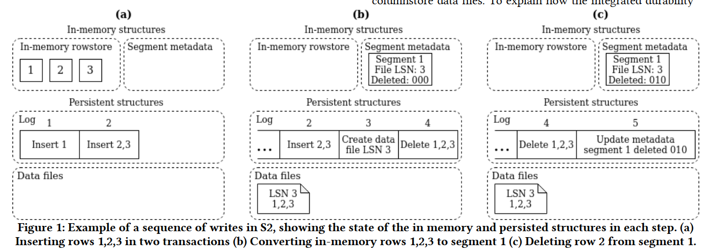

- 计算存储分离

  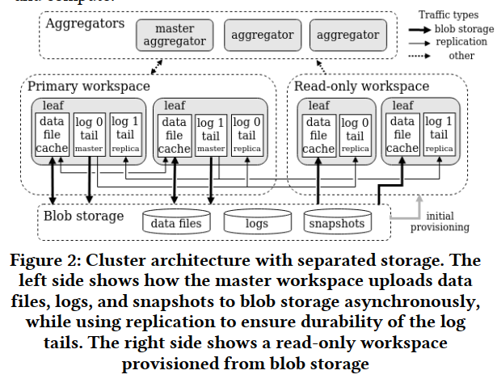

- 统一表存储

  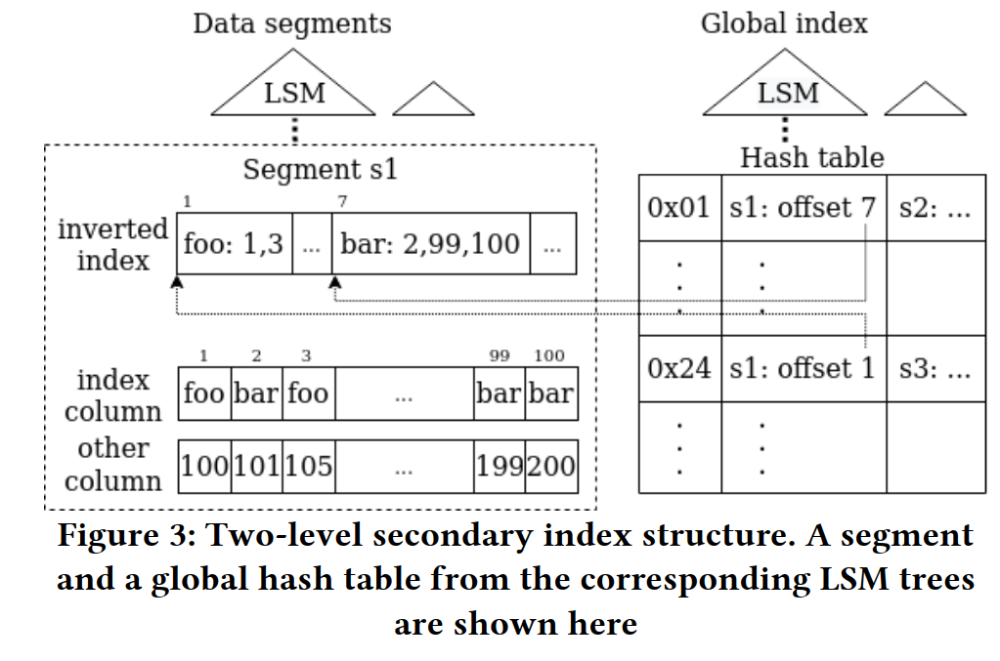

  - 原来的S2DB 需要选择rowstore 还是 columnstore 。这是非常困难的，因为这需要让用户自己去判断涉及这张表的 workload 是更偏向于 TP 还是 AP，如果很均衡那就无了。
  - 为了解决这个问题，S2DB 提出 Unified table storage，将原本的 columnstore 进行优化来支持 AP 和 TP。其采用基于 LSM tree 的方式，将数据写入连续的 chunks 中。为了加速 TP 性能，做了如下优化：
    - 做了个保存在内存中的 delete bitset，而不是像其他 LSM tree 实现（e.g., RocksDB）那样用 tombstone entry 来标记 delete (merge on read，读放大太大)
      - 细读一下...
    - 和其他 LSM tree 实现类似，写入部分依然放在 in-memory 中 (需要额外处理 metadata)
    - 构建了大量支持 LSM tree 的 secondary index 来支持 efficient point access。比如 bloom filter 和 inverted index 来过滤不需要访问的 segments。以及 S2DB 自己的 two-level index structure 来定位 segment 和 offset
    - row-level lock 来避免 blocking

- 相关

  - AnalyticDB: Real-time OLAP Database System at Alibaba Cloud (VLDB 2019
  - [SingleStore并行化](https://link.zhihu.com/?target=https%3A//www.singlestore.com/blog/how-to-process-trillion-rows-per-second-ad-hoc-analytic-queries/)

### 论文6 (ScaleStore) ScaleStore: A Fast and Cost-Efficient Storage Engine using DRAM, NVMe, and RDMA

-  一种新颖的分布式存储引擎，它利用DRAM 缓存、NVMe 存储和 RDMA网络同时实现高性能、成本效益和可扩展性
-  ...

### 论文7 Proteus: Autonomous Adaptive Storage for Mixed Workloads

- 背景：HTAP (Hybrid Transaction/Analytical Processing）
  - 对于数据规模逐步增大的业务来说，分布式数据库很好地满足了它们对 TP 性能水平扩展的需求
  - 但由于存储格式或者设计目标上的差异，这些系统不一定能满足业务对于历史数据的 AP 分析需求
- 核心策略：提出一些根据 workload 自适应存储的策略/算法，包括一些几部分：
  - Format：根据数据被访问的情况决定使用行存/列存
  - Tier：内存/磁盘，选择合适的存储介质，比如冷数据放在磁盘里
  - 排序/压缩：对于列存数据，使用排序可以借助二分查找或者 merge-join 等算法加速，使用压缩有效地减少占用的存储空间
  - Replication：此处侧重的不是我们在分布式存储中为了可靠性做的副本，而是为了加速查询刻意进行的数据冗余以支持类似 local join 之类的场景
- Proteus 根据 workload 的实际情况，可以对系统内实际数据存储做出的调整决策，比如说数据原先是行存的，但经过一段时间的访问后，Proteus 判断列存更为合适，则将在运行时进行相应的调整
- ...

## 相关论文 4 — 虚拟地址空间

- **虚拟内存**是计算机系统内存管理的一种技术。它使得应用程序认为它拥有连续可用的内存（一个连续完整的地址空间），而实际上物理内存通常被分隔成多个内存碎片，还有部分暂时存储在外部磁盘存储器上，在需要时进行数据交换。与没有使用虚拟内存技术的系统相比，使用这种技术使得大型程序的编写变得更容易，对真正的物理内存（例如RAM）的使用也更有效率。此外，虚拟内存技术可以使多个进程共享同一个运行库，并通过分割不同进程的内存空间来提高系统的安全性

                                                

- 能否和我们设计理念相结合？

- 都是基于SCM的文件系统

  - 在虚拟内存空间上构建文件系统，并利用内存管理单元 (MMU) 将文件系统地址映射到 SCM 上的物理地址

### A New Design of In-Memory File System Based on File Virtual Address Framework

- 持久内存的新兴技术，如 PCM、MRAM，为在内存中保存文件提供了机会。传统的文件系统结构可能需要重新研究。尽管针对内存提出了几种文件系统，但它们中的大多数在没有充分利用处理器端硬件的情况下性能有限。本文提出了一个基于新概念“文件虚拟地址空间”的框架。设计并实现了一种文件系统，即可持续内存文件系统（SIMFS），它充分利用了文件访问路径上的内存映射硬件。首先，SIMFS 将打开文件的地址空间嵌入到进程的地址空间中。然后，文件访问由内存映射硬件处理。还为建议的 SIMFS 提出了几种优化方法。进行了广泛的实验。实验结果表明，SIMFS 的吞吐量比最先进的内存文件系统实现了显着的性能提升

- SCMFS : A File System for Storage Class Memory

- Efficient persistent memory file systems using virtual superpages with multi-level allocator
- 

## 相关论文 — 其他

### 论文8 (Google) From GFS to Colossus : Cluster-Level Storage

- 2017，第二代GFS，旨在提升存储效率
  - 元数据伸缩允许对资源进行划分
  - 组合不同大小和不同类型工作负载的磁盘的能力非常强大

### 论文9 XRP: In-Kernel Storage Functions with eBPF

- 背景

  - 随着微秒级的NVMe存储设备的出现，Linux存储软件栈在总访问开销中的占比也随之明显上升。如下图所示，在最新的高速存储设备上，来自软件栈的开销几乎让访问开销翻倍了

    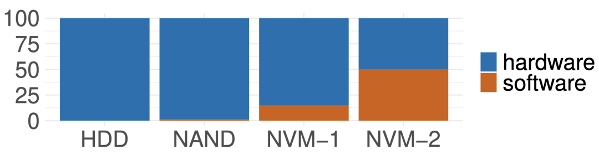

  - 现有的方案都太激进了，它们都需要对应用或是硬件有着侵入性的修改

    - 例如有些kernel bypass的方案如SPDK允许应用去直接访问底下的设备，但是也会强迫应用实现自己的文件系统，同时放弃隔离性和安全性，并且还需要polling导致了CPU资源的浪费（尤其是IO利用率低的时候polling的坏处尤为明显）。测试数据展示出使用SPDK的应用在可调度线程数量大于CPU数量时会导致更差的尾时延，甚至吞吐量都会严重下降。因此，本文希望能够探寻一种既易于部署，又无需对应用有过多侵入修改，能够充分利用现有kernel和文件系统功能的高速存储访问方案。

- 观察：当前部分应用的一些存储IO操作中，**需要用户态去处理大量的中间结果**。如果每个中间结果都需要往返于内核态和用户态才能处理的话，会引入大量的传递开销（如下图所示，开销主要来自于内核上下文切换和文件系统，此外bio层的开销相比于设备驱动也更为明显）

  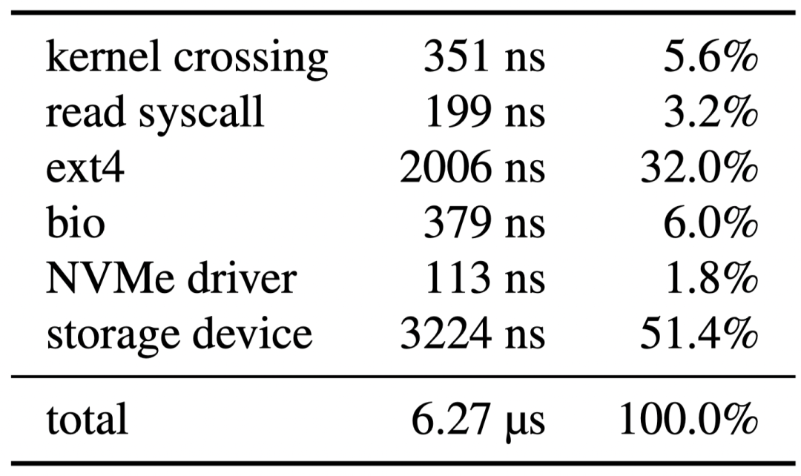

  - 一个典型的例子是当应用进行基于b-tree的索引，应用的最终目的其实是想找到最末端的叶子节点，但是通常的b-tree搜索过程中会将搜索路径上的每一个节点读取到用户态。该过程中就会反复多次触发上图中的各项开销。针对这个场景，本文提出XRP，其核心解决思路（如下图）是将多次应用逻辑在软件栈底层batch起来，消除冗余的上层开销。具体来说，本文利用eBPF技术，将部分原本在用户态执行的应用逻辑放入内核态的NVMe驱动层，从而使该过程中的中间结果不用再返回用户态，而是在内核态中就可以继续下一步处理

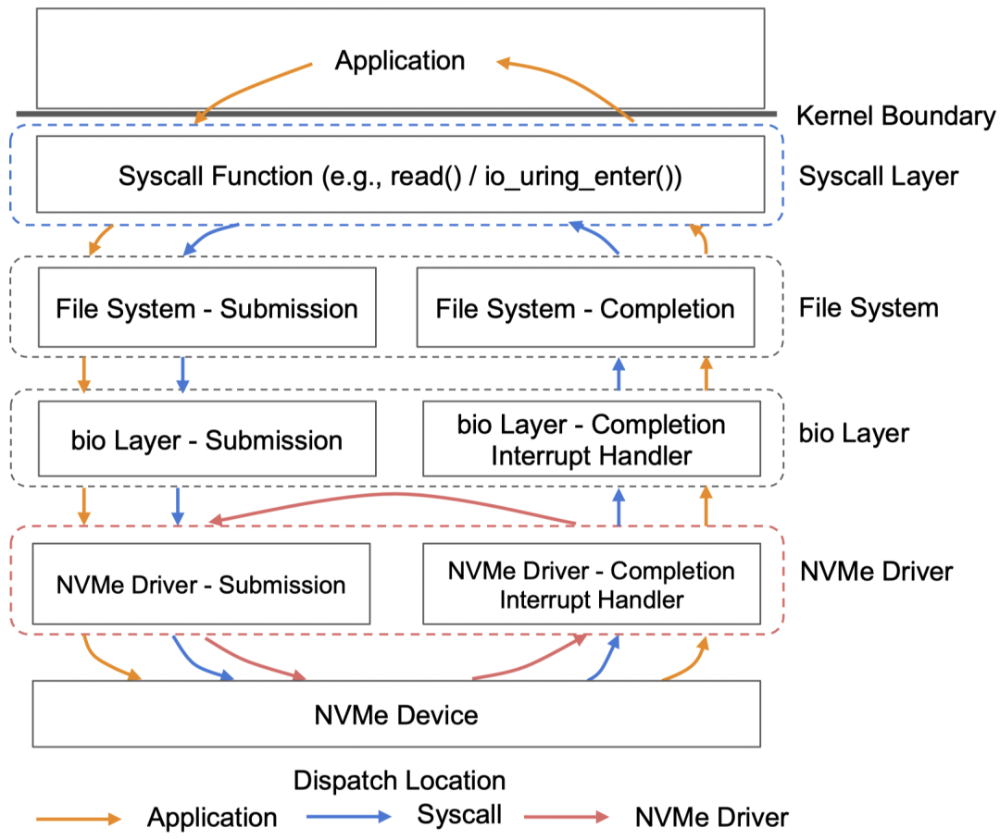

- 之所以选择hook在NVMe驱动层则是因为在内核态的位置也应当尽量能避免经过上图中那些开销较大的步骤（如ext4和bio层）。如下图所示，作者之前的研究中有对深度为10的b-tree进行测试，如果不绕过内核中的syscall和文件系统层，那在延时和吞吐量上的提升并不明显。而在NVMe驱动层则能显著提升这两项性能。

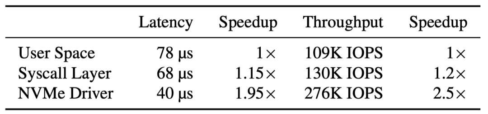

- 尽管这个方法看起来很直观，但是依然存在两个主要挑战：
  - NVMe驱动层目前无法访问文件系统的元数据。例如在索引穿越场景下，NVMe中的XRP在处理一个read操作时会在从当前block中通过offset去提取下一个block。但是它无法获知这个offset所关联的物理block，因为它不知道文件系统的相关元数据
  - XRP系统难以应对由文件系统处理的并发读写操作。如果文件发生改写，NVMe driver层无法观察到缓存在kernel page cache中的文件更改，这可能会导致XRP读取到错误的数据。而用锁来保护文件结构带来的开销则会比较大。

- 针对上述挑战
  - 观察到大部分on-disk的数据结构都非常稳定，常用的数据库大部分采用了index文件创建后不再更改或更改频率较低的索引文件结构，且大部分数据库会选择自行管理page cache而不是使用fs提供的page cache
  - 另一方面，大部分索引都集中在少数几个大文件中，且每个索引都不会跨多个文件
- 因此，本文的解决方式是限定XRP的使用场景为索引文件结构比较稳定和用户管理page cache的场景，同时缓存和维护单个文件所需的logical-to-physical-mapping信息（metadata digest）以供NVMe driver层访问
- 架构如下图所示，当NVMe存储设备发送中断后，中断handler最终会调用hook的BPF函数进行处理。该函数利用metadata digest所提供的接口安全地访问少量ext4文件系统元数据从而绕过NVMe驱动以上所有软件层的介入直到本次resubmission逻辑全部处理完成后返回用户态

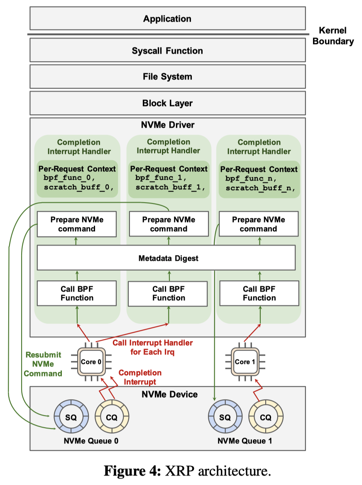

- 本文在Linux上通过eBPF实现了支持ext4文件系统的XRP原型。为了和Baseline（linux的同步与异步syscall以及kernel bypass方案SPDK）进行对比，构建了一个简单的KV存储程序——BPF-KV。在尾延时方面，99th下XRP显著好于linux的同步和异步syscall，而在99.9th下，尽管大部分时候依然是SPDK好于XRP，但是当线程数大于执行的物理核心数（6个）时，SPDK的尾时延会显著上升，而XRP则依然稳定。

## 最新论文

### ATC 22

- 存储3，机器学习3，分离系统2，网络2，部署系统2，容器，bug，安全，编译，NIC

- Storage 1

  - ZNSwap: un-Block your Swap
    Shai Bergman, Technion; Niklas Cassel and Matias Bjørling, Western Digital; Mark Silberstein, Technion

  - Building a High-performance Fine-grained Deduplication Framework for Backup Storage with High Deduplication Ratio
    Xiangyu Zou and Wen Xia, Harbin Institute of Technology, Shenzhen; Philip Shilane, Dell Technologies; Haijun Zhang and Xuan Wang, Harbin Institute of Technology, Shenzhen

  - Secure and Lightweight Deduplicated Storage via Shielded Deduplication-Before-Encryption
    Zuoru Yang, The Chinese University of Hong Kong; Jingwei Li, University of Electronic Science and Technology of China; Patrick P. C. Lee, The Chinese University of Hong Kong

- Containers

  - RunD: A Lightweight Secure Container Runtime for High-density Deployment and High-concurrency Startup in Serverless Computing
    Zijun Li, Jiagan Cheng, and Quan Chen, Shanghai Jiao Tong University; Eryu Guan, Zizheng Bian, Yi Tao, Bin Zha, Qiang Wang, and Weidong Han, Alibaba Group; Minyi Guo, Shanghai Jiao Tong University
  - Help Rather Than Recycle: Alleviating Cold Startup in Serverless Computing Through Inter-Function Container Sharing
    Zijun Li, Linsong Guo, Quan Chen, Jiagan Cheng, and Chuhao Xu, Shanghai Jiao Tong University; Deze Zeng, China University of Geosciences; Zhuo Song, Tao Ma, and Yong Yang, Alibaba Cloud; Chao Li and Minyi Guo, Shanghai Jiao Tong University
  - RRC: Responsive Replicated Containers
    Diyu Zhou, UCLA and EPFL; Yuval Tamir, UCLA

- Distributed Systems 1

  - uKharon: A Membership Service for Microsecond Applications
    Rachid Guerraoui and Antoine Murat, EPFL; Javier Picorel, Huawei Technologies; Athanasios Xygkis, EPFL; Huabing Yan and Pengfei Zuo, Huawei Technologies
  - KRCORE: A Microsecond-scale RDMA Control Plane for Elastic Computing
    Xingda Wei, Shanghai Jiao Tong University, Shanghai AI Laboratory; Fangming Lu, Shanghai Jiao Tong University; Rong Chen, Shanghai Jiao Tong University, Shanghai AI Laboratory; Haibo Chen, Shanghai Jiao Tong University
  - Zero-Change Object Transmission for Distributed Big Data Analytics
    Mingyu Wu, Shuaiwei Wang, Haibo Chen, and Binyu Zang, Shanghai Jiao Tong University
  - Sift: Using Refinement-guided Automation to Verify Complex Distributed Systems
    Haojun Ma, Hammad Ahmad, Aman Goel, Eli Goldweber, Jean-Baptiste Jeannin, Manos Kapritsos, and Baris Kasikci, University of Michigan

- Machine Learning 1

  - Faith: An Efficient Framework for Transformer Verification on GPUs
    Boyuan Feng, Tianqi Tang, Yuke Wang, Zhaodong Chen, Zheng Wang, Shu Yang, Yuan Xie, Yufei Ding, University of California, Santa Barbara
  - DVABatch: Diversity-aware Multi-Entry Multi-Exit Batching for Efficient Processing of DNN Services on GPUs
    Weihao Cui, Han Zhao, Quan Chen, Hao Wei, and Zirui Li, Shanghai Jiao Tong University; Deze Zeng, China University of Geosciences; Chao Li and Minyi Guo, Shanghai Jiao Tong University
  - Serving Heterogeneous Machine Learning Models on Multi-GPU Servers with Spatio-Temporal Sharing
    Seungbeom Choi, Sunho Lee, Yeonjae Kim, Jongse Park, Youngjin Kwon, and Jaehyuk Huh, KAIST
  - PilotFish: Harvesting Free Cycles of Cloud Gaming with Deep Learning Training
    Wei Zhang and Binghao Chen, Shanghai Jiao Tong University; Zhenhua Han, Microsoft Research; Quan Chen, Shanghai Jiao Tong University; Peng Cheng, Fan Yang, Ran Shu, and Yuqing Yang, Microsoft Research; Minyi Guo, Shanghai Jiao Tong University

- Operating Systems 1

  - Privbox: Faster System Calls Through Sandboxed Privileged Execution
    Dmitry Kuznetsov and Adam Morrison, Tel Aviv University
  - BBQ: A Block-based Bounded Queue for Exchanging Data and Profiling
    Jiawei Wang, Huawei Dresden Research Center, Huawei OS Kernel Lab, Technische Universität Dresden; Diogo Behrens, Ming Fu, Lilith Oberhauser, Jonas Oberhauser, and Jitang Lei, Huawei Dresden Research Center, Huawei OS Kernel Lab; Geng Chen, Huawei OS Kernel Lab; Hermann Härtig, Technische Universität Dresden; Haibo Chen, Huawei OS Kernel Lab, Shanghai Jiao Tong University

- Disaggregated Systems

  - Sibylla: To Retry or Not To Retry on Deep Learning Job Failure
    Taeyoon Kim, Suyeon Jeong, Jongseop Lee, Soobee Lee, and Myeongjae Jeon, UNIST
  - Speculative Recovery: Cheap, Highly Available Fault Tolerance with Disaggregated Storage
    Nanqinqin Li, Anja Kalaba, Michael J. Freedman, Wyatt Lloyd, and Amit Levy, Princeton University
  - Direct Access, High-Performance Memory Disaggregation with DirectCXL
    Donghyun Gouk, Sangwon Lee, Miryeong Kwon, and Myoungsoo Jung, KAIST

- Networking 1

  - Not that Simple: Email Delivery in the 21st Century
    Florian Holzbauer, SBA Research; Johanna Ullrich, University of Vienna; Martina Lindorfer, TU Wien; Tobias Fiebig, Max-Planck-Institut für Informatik
  - AddrMiner: A Comprehensive Global Active IPv6 Address Discovery System
    Guanglei Song, Jiahai Yang, Lin He, Zhiliang Wang, Guo Li, Chenxin Duan, and Yaozhong Liu, Tsinghua University; Zhongxiang Sun, Beijing Jiaotong University
  - Co-opting Linux Processes for High-Performance Network Simulation
    Rob Jansen, U.S. Naval Research Laboratory; Jim Newsome, Tor Project; Ryan Wails, Georgetown University, U.S. Naval Research Laboratory
    - **Awarded Best Paper!**

- Finding Bugs

  - KSG: Augmenting Kernel Fuzzing with System Call Specification Generation
    Hao Sun, Yuheng Shen, Jianzhong Liu, Yiru Xu, and Yu Jiang, Tsinghua University
  - DLOS: Effective Static Detection of Deadlocks in OS Kernels
    Jia-Ju Bai, Tuo Li, and Shi-Min Hu, Tsinghua University
  - Modulo: Finding Convergence Failure Bugs in Distributed Systems with Divergence Resync Models
    Beom Heyn Kim, Samsung Research, University of Toronto; Taesoo Kim, Samsung Research, Georgia Institute of Technology; David Lie, University of Toronto

- Security

  - SoftTRR: Protect Page Tables against Rowhammer Attacks using Software-only Target Row Refresh
    Zhi Zhang, CSIRO’s Data61, Australia; Yueqiang Cheng, NIO Security Research; Minghua Wang, Baidu Security; Wei He and Wenhao Wang, State Key Laboratory of Information Security, Institute of Information Engineering, CAS and University of Chinese Academy of Sciences; Surya Nepal, CSIRO’s Data61, Australia; Yansong Gao, Nanjing University of Science and Technology, China; Kang Li, Baidu Security; Zhe Wang and Chenggang Wu, State Key Laboratory of Computer Architecture, Institute of Computing Technology, CAS and University of Chinese Academy of Sciences
  - Hardening Hypervisors with Ombro
    Ethan Johnson, Colin Pronovost, and John Criswell, University of Rochester
  - HyperEnclave: An Open and Cross-platform Trusted Execution Environment
    Yuekai Jia, Tsinghua University; Shuang Liu, Ant Group; Wenhao Wang, Institute of Information Engineering, CAS; Yu Chen, Tsinghua University; Zhengde Zhai, Shoumeng Yan, and Zhengyu He, Ant Group
  - PRIDWEN: Universally Hardening SGX Programs via Load-Time Synthesis
    Fan Sang, Georgia Institute of Technology; Ming-Wei Shih, Microsoft; Sangho Lee, Microsoft Research; Xiaokuan Zhang, Georgia Institute of Technology; Michael Steiner, Intel; Mona Vij, Intel Labs; Taesoo Kim, Georgia Institute of Technology

- Machine Learning 2

  - Tetris: Memory-efficient Serverless Inference through Tensor Sharing
    Jie Li, Laiping Zhao, and Yanan Yang, Tianjin University; Kunlin Zhan, 58.com; Keqiu Li, Tianjin University
  - PetS: A Unified Framework for Parameter-Efficient Transformers Serving
    Zhe Zhou, Peking University; Xuechao Wei, Peking University, Alibaba Group; Jiejing Zhang, Alibaba Group; Guangyu Sun, Peking University
  - Campo: Cost-Aware Performance Optimization for Mixed-Precision Neural Network Training
    Xin He, CSEE, Hunan University & Xidian University; Jianhua Sun and Hao Chen, CSEE, Hunan University; Dong Li, University of California, Merced
  - Primo: Practical Learning-Augmented Systems with Interpretable Models
    Qinghao Hu, Nanyang Technological University; Harsha Nori, Microsoft; Peng Sun, SenseTime; Yonggang Wen and Tianwei Zhang, Nanyang Technological University

- Distributed Systems 2

  - Meces: Latency-efficient Rescaling via Prioritized State Migration for Stateful Distributed Stream Processing Systems
    Rong Gu, Han Yin, Weichang Zhong, Chunfeng Yuan, and Yihua Huang, State Key Laboratory for Novel Software Technology, Nanjing University
  - DepFast: Orchestrating Code of Quorum Systems
    Xuhao Luo, University of Illinois at Urbana-Champaign; Weihai Shen and Shuai Mu, Stony Brook University; Tianyin Xu, University of Illinois at Urbana-Champaign
  - High Throughput Replication with Integrated Membership Management
    Pedro Fouto, Nuno Preguiça, and João Leitão, NOVA LINCS & NOVA University Lisbon

- Operating Systems 2

  - CBMM: Financial Advice for Kernel Memory Managers
    Mark Mansi, Bijan Tabatabai, and Michael M. Swift, University of Wisconsin - Madison
  - EPK: Scalable and Efficient Memory Protection Keys
    Jinyu Gu, Hao Li, Wentai Li, Yubin Xia, and Haibo Chen, Shanghai Jiao Tong University
  - Memory Harvesting in Multi-GPU Systems with Hierarchical Unified Virtual Memory
    Sangjin Choi and Taeksoo Kim, KAIST; Jinwoo Jeong, Ajou University; Rachata Ausavarungnirun, King Mongkut's University of Technology North Bangkok; Myeongjae Jeon, UNIST; Youngjin Kwon, KAIST; Jeongseob Ahn, Ajou University

- Deployed Systems 1

  - Zero Overhead Monitoring for Cloud-native Infrastructure using RDMA
    Zhe Wang, Shanghai Jiao Tong University; Teng Ma, Alibaba Group; Linghe Kong, Shanghai Jiao Tong University; Zhenzao Wen, Jingxuan Li, Zhuo Song, Yang Lu, Yong Yang, and Tao Ma, Alibaba Group; Guihai Chen, Shanghai Jiao Tong University; Wei Cao, Alibaba Group
  - CRISP: Critical Path Analysis of Large-Scale Microservice Architectures
    Zhizhou Zhang, UC Santa Barbara; Murali Krishna Ramanathan, Prithvi Raj, and Abhishek Parwal, Uber Technologies Inc.; Timothy Sherwood, UC Santa Barbara; Milind Chabbi, Uber Technologies Inc.
  - Whale: Efficient Giant Model Training over Heterogeneous GPUs
    Xianyan Jia, Le Jiang, Ang Wang, and Wencong Xiao, Alibaba Group; Ziji Shi, National University of Singapore & Alibaba Group; Jie Zhang, Xinyuan Li, Langshi Chen, Yong Li, Zhen Zheng, Xiaoyong Liu, and Wei Lin, Alibaba Group

- Machine Learning 3

  - Cachew: Machine Learning Input Data Processing as a Service
    Dan Graur, Damien Aymon, Dan Kluser, and Tanguy Albrici, ETH Zurich; Chandramohan A. Thekkath, Google; Ana Klimovic, ETH Zurich
  - CoVA: Exploiting Compressed-Domain Analysis to Accelerate Video Analytics
    Jinwoo Hwang, Minsu Kim, Daeun Kim, Seungho Nam, Yoonsung Kim, and Dohee Kim, KAIST; Hardik Sharma, Google; Jongse Park, KAIST
  - SOTER: Guarding Black-box Inference for General Neural Networks at the Edge
    Tianxiang Shen, Ji Qi, Jianyu Jiang, Xian Wang, Siyuan Wen, Xusheng Chen, and Shixiong Zhao, The University of Hong Kong; Sen Wang and Li Chen, Huawei Technologies; Xiapu Luo, The Hong Kong Polytechnic University; Fengwei Zhang, Southern University of Science and Technology (SUSTech); Heming Cui, The University of Hong Kong

- Storage 2

  - IPLFS: Log-Structured File System without Garbage Collection
    Juwon Kim, Minsu Jang, Muhammad Danish Tehseen, Joontaek Oh, and YouJip Won, KAIST
  - Vigil-KV: Hardware-Software Co-Design to Integrate Strong Latency Determinism into Log-Structured Merge Key-Value Stores
    Miryeong Kwon, Seungjun Lee, and Hyunkyu Choi, KAIST; Jooyoung Hwang, Samsung Electronics Co., Ltd.; Myoungsoo Jung, KAIST
  - Pacman: An Efficient Compaction Approach for Log-Structured Key-Value Store on Persistent Memory
    Jing Wang, Youyou Lu, Qing Wang, and Minhui Xie, Tsinghua University; Keji Huang, Huawei Technologies Co., Ltd; Jiwu Shu, Tsinghua University

- Networking 2

  - Towards Latency Awareness for Content Delivery Network Caching
    Gang Yan and Jian Li, SUNY-Binghamton University
  - Hashing Design in Modern Networks: Challenges and Mitigation Techniques
    Yunhong Xu, Texas A&M University; Keqiang He and Rui Wang, Google; Minlan Yu, Harvard University; Nick Duffield, Texas A&M University; Hassan Wassel, Shidong Zhang, Leon Poutievski, Junlan Zhou, and Amin Vahdat, Google
  - Firebolt: Finding Bugs in Programmable Data Plane Generators
    Jiamin Cao, Tsinghua University; Yu Zhou and Chen Sun, Alibaba Group; Lin He, Zhaowei Xi, and Ying Liu, Tsinghua University

- Compilers and PL

  - Investigating Managed Language Runtime Performance: Why JavaScript and Python are 8x and 29x slower than C++, yet Java and Go can be Faster?
    David Lion, University of Toronto and YScope Inc.; Adrian Chiu and Michael Stumm, University of Toronto; Ding Yuan, University of Toronto and YScope Inc.
  - Automatic Recovery of Fine-grained Compiler Artifacts at the Binary Level
    Yufei Du, University of North Carolina at Chapel Hill; Ryan Court and Kevin Snow, Zeropoint Dynamics; Fabian Monrose, University of North Carolina at Chapel Hill
  - JITServer: Disaggregated Caching JIT Compiler for the JVM in the Cloud
    Alexey Khrabrov, University of Toronto; Marius Pirvu and Vijay Sundaresan, IBM; Eyal de Lara, University of Toronto
  - Riker: Always-Correct and Fast Incremental Builds from Simple Specifications
    Charlie Curtsinger, Grinnell College; Daniel W. Barowy, Williams College
    - **Awarded Best Paper!**

- Storage 3

  - FlatFS: Flatten Hierarchical File System Namespace on Non-volatile Memories
    Miao Cai, Key Laboratory of Water Big Data Technology of Ministry of Water Resources, Hohai University; School of Computer and Information, Hohai University; State Key Laboratory for Novel Software Technology, Nanjing University; Junru Shen, School of Computer and Information, Hohai University; Bin Tang, Key Laboratory of Water Big Data Technology of Ministry of Water Resources, Hohai University; Hao Huang, State Key Laboratory for Novel Software Technology, Nanjing University; Baoliu Ye, State Key Laboratory for Novel Software Technology, Nanjing University; Key Laboratory of Water Big Data Technology of Ministry of Water Resources, Hohai University; School of Computer and Information, Hohai University
  - StRAID: Stripe-threaded Architecture for Parity-based RAIDs with Ultra-fast SSDs
    Shucheng Wang, Qiang Cao, and Ziyi Lu, Wuhan National Laboratory for Optoelectronics, HUST; Hong Jiang, Department of Computer Science and Engineering, UT Arlington; Jie Yao, School of Computer Science and Technology, HUST; Yuanyuan Dong, Alibaba Group
  - Vinter: Automatic Non-Volatile Memory Crash Consistency Testing for Full Systems
    Samuel Kalbfleisch, Lukas Werling, and Frank Bellosa, Karlsruhe Institute of Technology

- NICs

  - AlNiCo: SmartNIC-accelerated Contention-aware Request Scheduling for Transaction Processing
    Junru Li, Youyou Lu, Qing Wang, Jiazhen Lin, Zhe Yang, and Jiwu Shu, Tsinghua University
  - FpgaNIC: An FPGA-based Versatile 100Gb SmartNIC for GPUs
    Zeke Wang, Hongjing Huang, Jie Zhang, and Fei Wu, Zhejiang University; Gustavo Alonso, ETH Zurich
  - Faster Software Packet Processing on FPGA NICs with eBPF Program Warping
    Marco Bonola, CNIT/Axbryd; Giacomo Belocchi, Angelo Tulumello, and Marco Spaziani Brunella, Axbryd/University of Rome Tor Vergata; Giuseppe Siracusano, NEC Laboratories Europe; Giuseppe Bianchi, University of Rome Tor Vergata/CNIT; Roberto Bifulco, NEC Laboratories Europe

- Deployed Systems 2

  - NVMe SSD Failures in the Field: the Fail-Stop and the Fail-Slow
    Ruiming Lu, Shanghai Jiao Tong University; Erci Xu, PDL; Yiming Zhang, Xiamen University; Zhaosheng Zhu, Mengtian Wang, and Zongpeng Zhu, Alibaba Inc.; Guangtao Xue, Shanghai Jiao Tong University; Minglu Li, Shanghai Jiao Tong University & Zhejiang Normal University; Jiesheng Wu, Alibaba Inc.

  - CacheSack: Admission Optimization for Google Datacenter Flash Caches
    Tzu-Wei Yang, Seth Pollen, Mustafa Uysal, Arif Merchant, and Homer Wolfmeister, Google

  - Amazon DynamoDB: A Scalable, Predictably Performant, and Fully Managed NoSQL Database Service
    Mostafa Elhemali, Niall Gallagher, Nicholas Gordon, Joseph Idziorek, Richard Krog, Colin Lazier, Erben Mo, Akhilesh Mritunjai, Somu Perianayagam ,Tim Rath, Swami Sivasubramanian, James Christopher Sorenson III, Sroaj Sosothikul, Doug Terry, Akshat Vig, Amazon Web Services

    

### OSDI 22

- [上交评述](https://mp.weixin.qq.com/mp/appmsgalbum?__biz=MzA5NTExMDc2Ng==&action=getalbum&album_id=2485954006998286337&scene=173&from_msgid=2651380636&from_itemidx=1&count=3&nolastread=1#wechat_redirect)

### SIGMOD 22

### FAST 22

