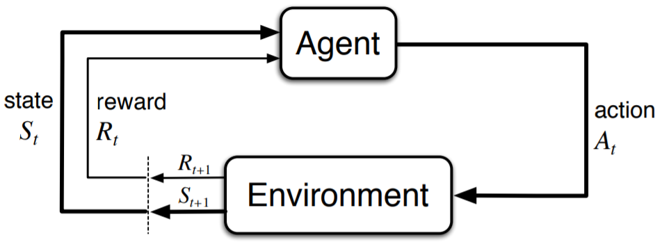
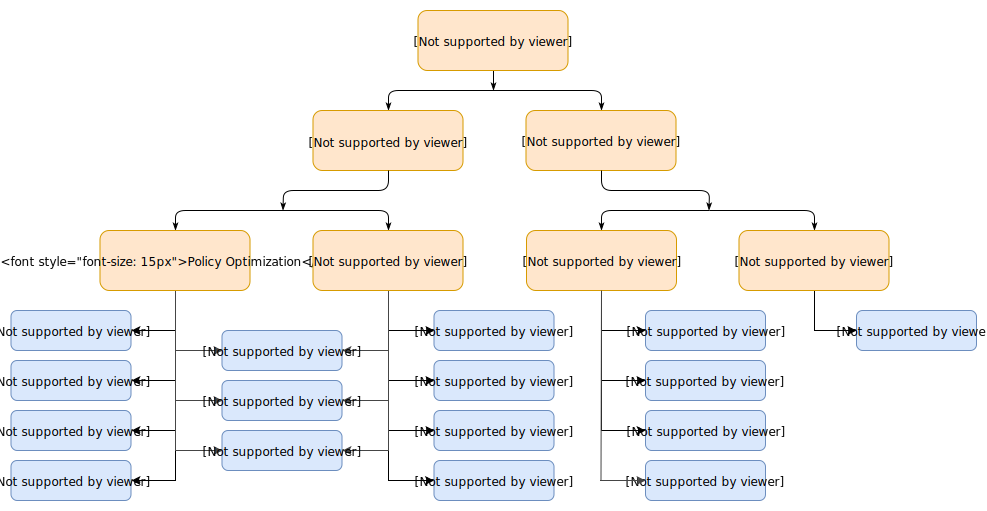
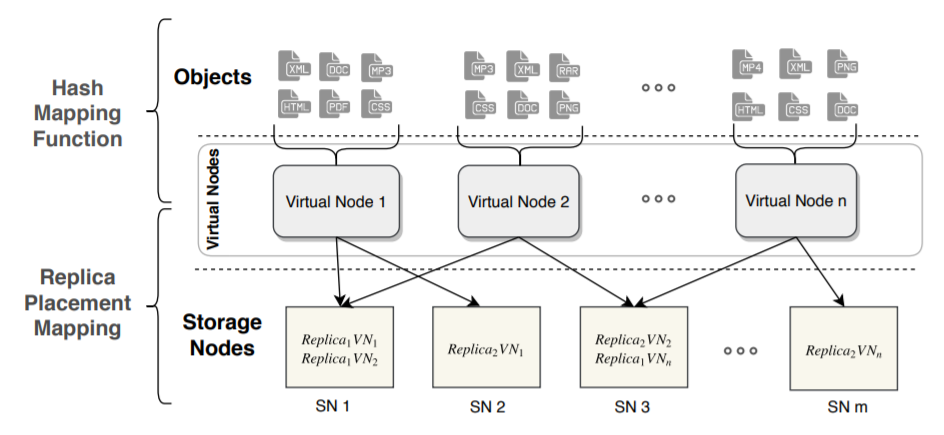

# Replica Placement with RL

> **不要温顺地走入那个良宵，老年应当在日暮时分燃烧咆哮。— 迪伦·托马斯**

[toc]

## RL简介

- **Reinforcement Learning: An Introduction**，用于解决基于MDPs的序贯决策问题。[OpenAI](https://spinningup.openai.com/en/latest/index.html)

- 强化学习的设置由两部分组成，一个是智能体（agent），另一个是环境（environment），智能体在每一步的交互中，都会获得对于所处环境**状态**的观察（有可能只是一部分），然后决定下一步要执行的动作。环境会因为智能体对它的**动作**而改变，也可能自己改变。智能体也会从环境中感知到**奖励**信号，一个表明当前状态好坏的数字。智能体的目标是最大化累计奖励，也就是**回报**。强化学习就是智能体通过学习来完成目标的方法。

  

  

- 基本要素

  - 状态空间（State）：环境返回的当前情况
  - 动作空间（Action）：智能体根据当前状态决定下一步动作的策略
  - 奖赏（Reward）：环境的即时返回值，以评估智能体的上一个动作
  - 策略、运动轨迹、值函数、Advantage Functions等等

- 发展，原文总结

  - **ing**
  - 基于Value
    - On-Policy
    - Off-Policy
  - 基于Policy

  

- 分类，OpenAI的总结

  

  - 用的最广的还是Q-Learning、Sarsa、DQN
  
- Q-Learning

  - Q-learning 是一种记录行为值 (Q value) 的方法，每种在一定状态的行为都会有一个值 Q(s, a)

  - Q table是一种记录状态-行为值 (Q value) 的表

    

  - Q value的更新是根据贝尔曼方程

- Sarsa

- DQN

  - **ing**

## 系统结构领域应用

### Park: An Open Platform for Learning-Augmented Computer Systems

- Tim Kraska，NeurIPS 2019，https://github.com/park-project/park

- **ing**

  | Environment                     | env_id                         | Committers                       |
  | ------------------------------- | ------------------------------ | -------------------------------- |
  | Adaptive video streaming        | abr, abr_sim                   | Hongzi Mao, Akshay Narayan       |
  | Spark cluster job scheduling    | spark, spark_sim               | Hongzi Mao, Malte Schwarzkopf    |
  | SQL database query optimization | query_optimizer                | Parimarjan Negi                  |
  | Network congestion control      | congestion_control             | Akshay Narayan, Frank Cangialosi |
  | Network active queue management | aqm                            | Mehrdad Khani, Songtao He        |
  | Tensorflow device placement     | tf_placement, tf_placement_sim | Ravichandra Addanki              |
  | Circuit design                  | circuit_design                 | Hanrui Wang, Jiacheng Yang       |
  | CDN memory caching              | cache                          | Haonan Wang, Wei-Hung Weng       |
  | Multi-dim database indexing     | multi_dim_index                | Vikram Nathan                    |
  | Account region assignment       | region_assignment              | Ryan Marcus                      |
  | Server load balancing           | load_balance                   | Hongzi Mao                       |
  | Switch scheduling               | switch_scheduling              | Ravichandra Addanki, Hongzi Mao  |
  
- Server load balancing

  - 状态空间（State）

### 1. 数据库

- 很多过程都可以使用机器学习或者强化学习算法

### 2. 集群调度

3. 组合优化-NP难问题
4. 芯片设计
5. 增强数据，优化机器学习

## Replica Placement

### 相关工作

- replica placement in KV-store

### 问题抽象

- 副本放置问题：M个数据存到到N个机器上，每个数据R个副本在不同机器上，下图中R=2

  ​	

  - 目标：1. 每个机器上的数据尽量均匀
  - 后续保证：2. 每个机器上的主副本尽量均匀；3. 机器异构环境

- 具体到Ceph

  

### 强化学习建模

- **ing**

## 参考文献

> **怒斥，怒斥那光的消逝。— 迪伦·托马斯**